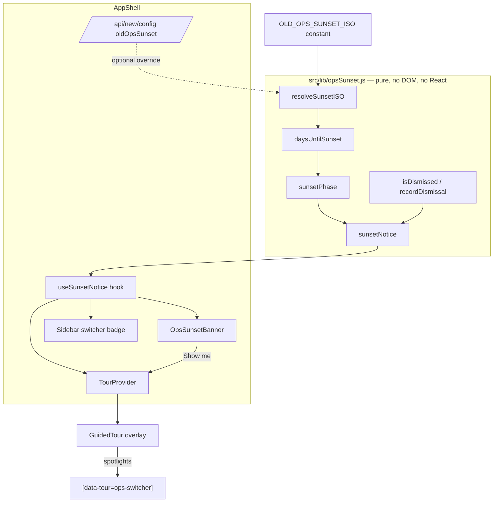
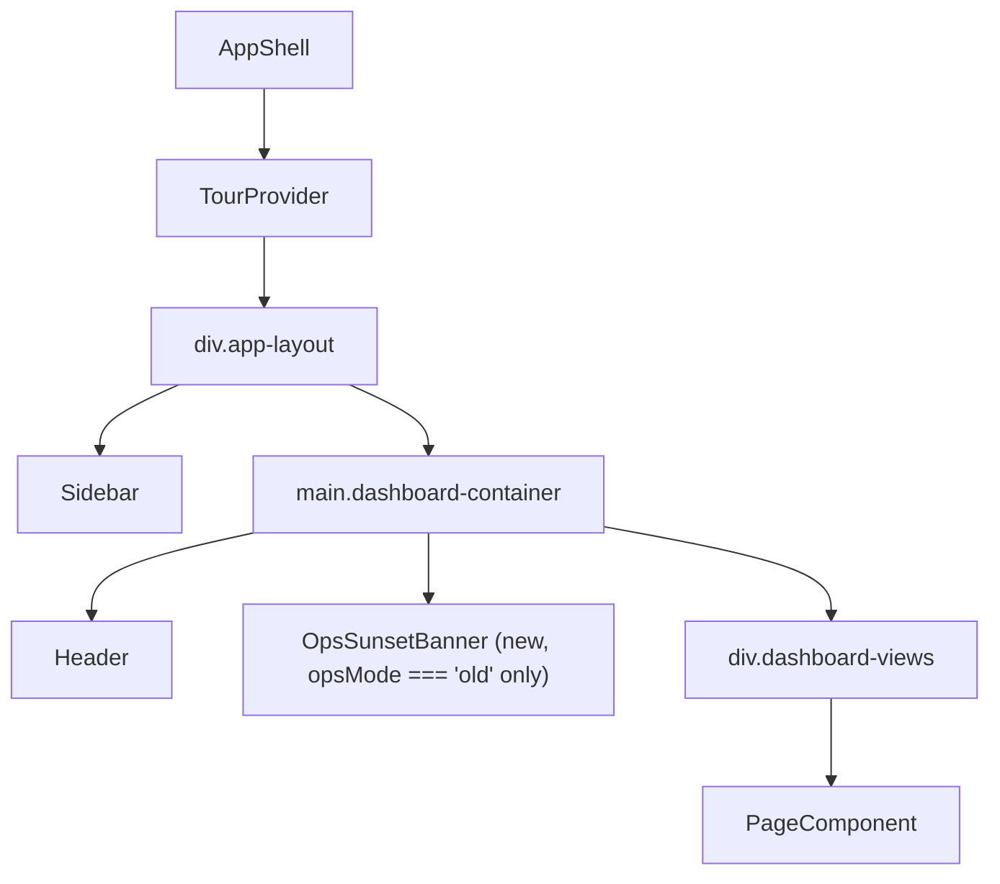
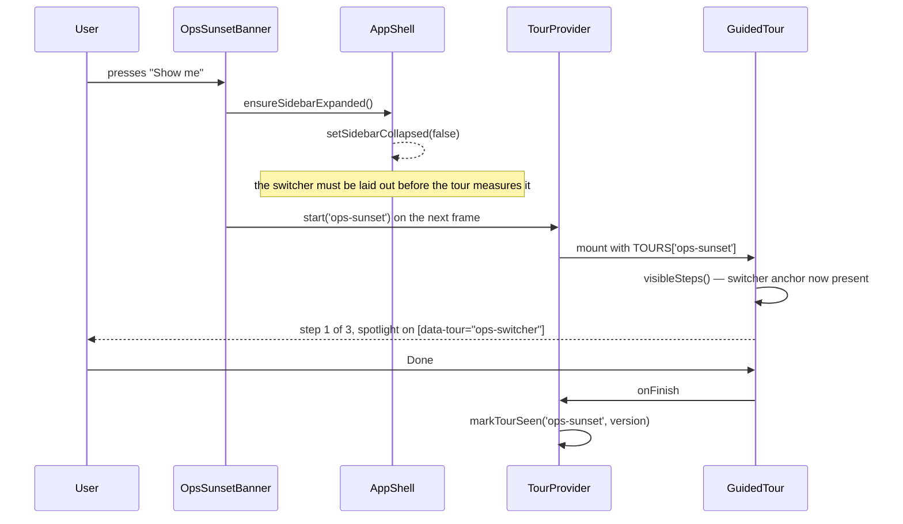
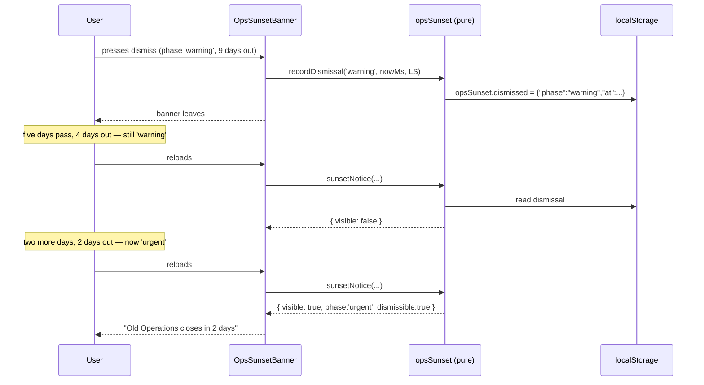

# Design Document: Old Operations Sunset Notice

## Overview

Old Operations and New Operations have run side by side long enough that people
have settled into whichever one they opened first. This feature announces that
Old Operations is being retired on a fixed date, counts the days down to it, and
runs a short guided animation that points at the New Operations tab in the
sidebar and explains that New Operations is where work happens from now on.

Nothing is removed. Old Operations keeps working, its routes keep answering, and
the switcher keeps switching. The whole of this change is the announcement, the
countdown, and the nudge across. The actual removal is a separate piece of work
that this design deliberately does not depend on — the notice has to keep making
sense on the day after the deadline, with none of the removal code written.

Two pieces carry it. A **banner** at the top of the content area, shown only
while the user is in Old Operations, carrying the day count and escalating in
tone as the date approaches. And a **spotlight tour** — `ops-sunset` — built
entirely on the tour system already in `src/lib/tour.js` and
`src/components/tour/`, which points at the switcher pill and hands the user
across. All of the arithmetic that decides what the banner says lives in one new
pure module, `src/lib/opsSunset.js`, so the parts that are easy to get wrong
(day counting across timezones, phase boundaries, dismissal expiry) are testable
without a browser.

---

## Decisions

These are the choices the feature turns on. They are recorded here with the
reasoning, because most of them have a tempting wrong answer.

### D1 — Where the retirement date comes from

**Decision:** a hard-coded constant in `src/lib/opsSunset.js` as the shipped
default, with an optional override through the existing `/api/new/config`
allowlist under a new key, `oldOpsSunset`. Never per-browser.

Per-browser — computing "one month from the first time you saw this" — is the
tempting option and it is wrong on its face. The retirement date is an
organisational fact: the school decided that after some date, Old Operations is
finished. If it were computed per browser, two people sitting next to each other
would be told different deadlines, someone who cleared their site data would get
a fresh month, and the person who logs in for the first time on the last day
would be told they have a month left. A deadline you can reset by clearing
localStorage is not a deadline.

Between constant and config store, the constant wins on the read path and the
config store wins on the change path, so take both:

- The constant means the banner renders on the very first frame with no fetch, no
  spinner, and no failure mode. That matters, because a countdown that sometimes
  fails to appear is worse than no countdown — people conclude the deadline was
  not real.
- The `oldOpsSunset` key means the date can be moved without a deploy. This
  deadline *will* move; "one month" becoming six weeks because a branch is not
  ready is the normal outcome for a migration like this. Requiring a code change
  and a deploy to reflect that is how the app ends up displaying a date everyone
  knows is wrong.
- `/api/new/config` GET is already open to any authenticated caller, so a user
  sitting in Old Operations can read it. Writing is already Admin-only and
  already audited, which is the right permission for "move the deadline".

The reconciliation is one-way and visible: render from the constant, and if
config arrives with a different date, the count updates. The number can therefore
change once, shortly after load. That is accepted over a loading state, because a
banner that appears half a second late reads as a glitch, whereas a number that
corrects itself reads as the page catching up. `resolveSunsetISO` (below) is the
pure function that makes that choice, so the precedence is tested rather than
scattered through a component.

### D2 — Where the countdown lives

**Decision:** a banner strip at the top of the content area, inside
`.dashboard-container` and above `.dashboard-views`, rendered **only when
`opsMode === 'old'`**. Plus a small day-count badge on the Old Operations
switcher tab, visible in both modes.

Someone already working in New Operations has done what the notice is asking
them to do. Showing them a countdown is nagging, and nagging is how a notice
gets tuned out before it matters. So the banner is scoped to Old Operations.

Not the header: it already carries branch selection, sync state and progress,
search, notifications, the help button and the user chip. Adding an escalating
alert to that row means either shrinking it until it is ignorable or pushing
something else off.

Not the sidebar as the primary carrier, because the sidebar can be collapsed —
`AppShell` persists `sidebarCollapsed` in localStorage, so a user who collapsed
it once has collapsed it for good, and the notice would simply never be seen.
The sidebar does get the badge, because a small "28d" beside the words "Old
Operations" is labelling the thing being retired rather than interrupting
anyone, and it is the one place the label belongs. But it is decoration: every
fact the badge carries is also in the banner.

The banner sits above `.dashboard-views` rather than inside the page component,
so it is one mount point instead of fourteen, and so it cannot scroll away from
a user who has already scrolled down a long schedule grid.

### D3 — How urgency escalates

**Decision:** four live phases plus a past phase, computed by a pure
`sunsetPhase(daysRemaining)`. Escalation changes wording, icon and colour weight
only. It never changes what the app lets you do.

| Phase | Days remaining | Tone | Icon | Reads as |
| --- | --- | --- | --- | --- |
| `notice` | 15 or more | informational, blue | `Info` | "Old Operations closes on 1 September." |
| `warning` | 4 to 14 | amber | `AlertTriangle` | "Old Operations closes in 9 days." |
| `urgent` | 1 to 3 | red | `AlertCircle` | "Old Operations closes in 2 days." |
| `final` | 0 | red, not dismissible | `AlertCircle` | "Today is the last day of Old Operations." |
| `past` | below 0 | neutral grey, not dismissible | `Archive` | "Old Operations closed on 1 September." |

Is four tiers worth the complexity? Yes, but only because the complexity is
almost nil: it is one pure function with four comparisons, and every phase is a
lookup into one table of copy. The reason it is worth having at all is that the
escalation *is* the feature. A notice that looks identical on day 28 and day 2
has not communicated a deadline, it has communicated a permanent fixture. The
thing that would not be worth the complexity — and which is therefore excluded —
is making the app behave differently per phase: disabling features, forcing
redirects, blocking the switcher. That multiplies the states the rest of the app
has to cope with, for a change nobody asked for.

`prefers-reduced-motion` and colour-blindness both mean colour cannot be the
only signal, hence the distinct icon and the distinct sentence per phase. The
day count is always spelled out in words.

### D4 — Dismissal

**Decision:** dismissible in `notice`, `warning` and `urgent`. A dismissal is
recorded **against the phase it was made in**, so it lasts until the phase
escalates. Not dismissible in `final` or `past`.

The two obvious options are both wrong. A notice that cannot be dismissed is a
notice people learn to look past — the banner becomes furniture, and by the time
the wording actually changes nobody is reading it. A notice that can be
dismissed forever is a notice, not a deadline; the person most likely to dismiss
it permanently is exactly the person who has not migrated.

Phase-scoped dismissal gets both: it goes away when you have read it, and it
comes back precisely when there is something new to say. Over a 28-day run-up
that means at most four reappearances, each one carrying different words.

Storage is `localStorage`, key `opsSunset.dismissed`, value
`{"phase":"warning","at":1785000000000}`, written and read through the same
pass-in-the-storage pattern as `tour.js` so a private-mode failure cannot throw
out of a render and tests need no browser. Anything unreadable, unparseable, or
recording a phase that no longer exists counts as *not dismissed* — showing the
banner one extra time is a much smaller problem than hiding a deadline.

`at` is stored for one reason: a dismissal timestamped in the future can only
come from a clock that was wrong when it was written, and honouring it would
hide the banner indefinitely on that machine. Those are discarded.

### D5 — What happens at zero, and after

**Decision:** the wording moves to the past tense, the banner becomes permanent
and non-dismissible, and the switcher gains a "retired" label. The switcher is
**not** blocked and Old Operations is **not** made read-only.

Blocking the switcher is tempting and would be a bug. Nothing has been removed
in this change, so a blocked switcher means someone with unfinished work in Old
Operations is locked out of it by a date rather than by a migration — with no
route back, since the pages still exist and still work. The deadline this feature
announces is an organisational one: after it, Old Operations is unsupported and
nothing new should be started there. That is a statement, and the honest way to
make it is in words.

So on and after the day itself the notice stops being a countdown and becomes a
standing statement of fact. It cannot be dismissed, because it is no longer a
reminder about a future event, it is the current status of the screen you are
looking at. It references no code that does not exist: it reads the same date and
the same clock as every other phase.

What the eventual removal would involve is noted at the end of this document, for
whoever writes that spec. It is not a dependency of this one.

### D6 — How the guided animation is triggered

**Decision:** a new tour, `ops-sunset`, registered in `TOURS`. It is offered
automatically at most once, and only once the `welcome` tour is out of the way.
The banner also carries an explicit button that always runs it.

`TourProvider` currently auto-runs `welcome` once after `SETTLE_MS` and never
auto-runs a page tour. Two tours competing for the same moment would mean one of
them silently loses, so the rule is a strict precedence rather than a race:

```
IF welcome is unseen        → offer welcome. Do not consider ops-sunset at all.
ELSE IF opsMode is 'old'
     AND ops-sunset unseen
     AND the sidebar is expanded
     AND the notice is live (not past)   → offer ops-sunset after SETTLE_MS.
ELSE                                     → offer nothing.
```

A first-time user therefore gets `welcome`, which already contains a step about
the two systems, and meets the sunset tour on their next visit. That ordering is
right anyway: `welcome` explains what the switcher *is*, and there is no point
urging someone across a switcher they have not been shown yet.

The sidebar condition exists because the tour's whole subject is a control inside
the sidebar. `visibleSteps` would drop the switcher step when the sidebar is
collapsed and the tour would run without ever showing the thing it is about. For
the automatic offer, deferring to a later visit is better than yanking the
sidebar open unprompted. When the user presses the banner's button they have
asked for it, so that path expands the sidebar first and starts the tour on the
next frame.

Leaving the tour early marks it seen, exactly as `TourProvider.dismiss` already
does for every other tour. The banner's button remains, so it is always
replayable — which is also the answer to "how often": automatically once, and
manually as often as the user likes.

### D7 — Timezone handling

**Decision:** all day counting happens in Asia/Jakarta (WIB, UTC+7, no DST) via
integer day indices. Never by dividing a millisecond difference.

Two separate traps here, and the repo has already been bitten by one of them.

`new Date("2026-09-01")` is parsed as UTC midnight. Rendered or compared in a
local timezone it lands on 31 August in the Americas and 1 September in Jakarta,
so the same deadline is a different day depending on who is looking.
`NewSchedulePage.jsx`'s `dayNameOfISO` already parses field by field for exactly
this reason, and this module follows that precedent.

The second trap is the subtraction itself. `(deadlineMs - nowMs) / 86400000`
gives a fractional number of days, and rounding it makes the displayed count
depend on the time of day — the banner would say "3 days" in the morning and
"2 days" after lunch, and would tick over at midnight in the *viewer's*
timezone rather than the school's.

The fix is to compare calendar days rather than instants. Convert the current
instant to a WIB day index by shifting it seven hours and flooring, derive the
deadline's day index from its date fields through `Date.UTC`, and subtract. Both
are integers, so the result is an integer, it is the same for every instant
within one WIB day, and it does not depend on the viewer's clock offset at all.
A user in London and a user in Jakarta looking at the same moment see the same
number.

---

## Architecture



Everything that decides *what is said* is in the pure module on the left.
Everything on the right measures, fetches or renders. The only new persistent
state is one localStorage key for the dismissal, plus the tour's own
`tour.seen.ops-sunset` which the existing tour code already manages.

### Where the pieces mount



`OpsSunsetBanner` goes between `Header` and `.dashboard-views`. That position is
deliberate: above the scrolling view so it cannot scroll away, below the header
so it does not compete with sync state, and outside `PageComponent` so it is one
mount rather than one per page.

`TourProvider` already wraps all of this, so the new tour needs no new provider —
only two extra rules inside the one that exists.

## Sequence Diagrams

### Arriving in Old Operations, 9 days out, nothing dismissed

```mermaid
sequenceDiagram
    participant U as User
    participant AS as AppShell
    participant API as /api/new/config
    participant SN as opsSunset (pure)
    participant B as OpsSunsetBanner
    participant TP as TourProvider

    U->>AS: opens /home (opsMode 'old')
    AS->>SN: resolveSunsetISO(constant, null)
    SN-->>AS: '2026-09-01'
    AS->>SN: sunsetNotice({ iso, nowMs, dismissal, storage })
    SN-->>AS: { phase:'warning', days:9, dismissible:true, ... }
    AS->>B: render banner (role="status")
    B-->>U: "Old Operations closes in 9 days"

    AS->>API: GET ?key=oldOpsSunset
    API-->>AS: { value: '2026-09-08' }
    AS->>SN: sunsetNotice({ iso:'2026-09-08', ... })
    SN-->>AS: { phase:'warning', days:16 → 'notice' }
    Note over B: count corrects once; no spinner was ever shown

    TP->>TP: welcome seen? yes. ops-sunset unseen, sidebar open, live
    TP->>TP: after SETTLE_MS, start 'ops-sunset'
    TP-->>U: spotlight on the switcher pill
```

### Running the tour from the banner with a collapsed sidebar



### Dismissing, then the phase escalating



---

## Components and Interfaces

### `src/lib/opsSunset.js` — pure sunset arithmetic

**Purpose:** every decision about what the notice says. No DOM, no React, no
`Date.now()` reached for internally — the current instant is always a parameter,
so a test can sit on any day it likes.

```javascript
/** Asia/Jakarta is UTC+7 with no DST, so a fixed offset is correct here. */
export const WIB_OFFSET_MINUTES = 420;

/** The shipped retirement date. Overridable via /api/new/config oldOpsSunset. */
export const OLD_OPS_SUNSET_ISO = '2026-09-01';

/** Phase names, ordered from least to most urgent. `past` is terminal. */
export const SUNSET_PHASES = ['notice', 'warning', 'urgent', 'final', 'past'];

/** localStorage key for the dismissal record. */
export const DISMISS_KEY = 'opsSunset.dismissed';

export function resolveSunsetISO(fallbackISO, configuredISO)  // → ISO string | null
export function wibDayIndex(instantMs)                        // → integer
export function isoDayIndex(iso)                              // → integer | null
export function daysUntilSunset(sunsetISO, nowMs)             // → integer | null
export function sunsetPhase(daysRemaining)                    // → phase | null
export function phaseRank(phase)                              // → 0..4, or -1
export function isDismissible(phase)                          // → boolean
export function readDismissal(storage)                        // → { phase, at } | null
export function recordDismissal(phase, nowMs, storage)         // → boolean
export function clearDismissal(storage)                        // → boolean
export function isDismissed(phase, dismissal, nowMs)           // → boolean
export function sunsetNotice({ sunsetISO, nowMs, storage })    // → notice view model
export function formatSunsetDate(iso)                          // → '1 September 2026'
```

**Responsibilities**

- Convert instants and ISO dates into WIB calendar day indices.
- Decide the phase, and whether the phase may be dismissed.
- Read, write and validate the dismissal record.
- Assemble one view model that a component can render without further logic.

**Explicitly not responsible for:** knowing today's date, reading config,
touching the tour, or knowing which ops mode the user is in.

### `src/components/ops/OpsSunsetBanner.jsx`

**Purpose:** render the notice. Contains no arithmetic.

```javascript
/**
 * @param {object}   notice        the view model from sunsetNotice()
 * @param {Function} onDismiss     called when the user dismisses
 * @param {Function} onShowMe      called to run the ops-sunset tour
 */
export default function OpsSunsetBanner({ notice, onDismiss, onShowMe })
```

**Responsibilities**

- Render nothing at all when `notice.visible` is false.
- Carry `role="status"` and `aria-live="polite"` so the notice is announced once
  when it appears, without stealing focus from whatever the user was doing.
- Show `notice.icon`, `notice.headline`, `notice.detail`, a "Show me New
  Operations" button, and a dismiss button only when `notice.dismissible`.
- Carry `data-tour="sunset-banner"` so a tour step can point at it.
- Never rely on colour alone: icon and wording differ per phase.

### `src/components/ops/useSunsetNotice.js`

**Purpose:** the one impure edge — today's date and the config fetch.

```javascript
/**
 * @param   {string}  opsMode
 * @returns {{ notice: object, dismiss: Function, refresh: Function }}
 */
export function useSunsetNotice(opsMode)
```

**Responsibilities**

- Hold `nowMs` in state, seeded from `Date.now()` and re-read on a coarse
  interval and on `visibilitychange`. A tab left open across midnight WIB must
  not keep showing yesterday's count.
- Fetch `oldOpsSunset` once, tolerate failure silently, and feed the result
  through `resolveSunsetISO`.
- Force `visible: false` when `opsMode !== 'old'`, per D2.
- Call `recordDismissal` and recompute.

### `TourProvider` — two added rules

**Purpose:** unchanged, plus the precedence from D6.

```javascript
export default function TourProvider({
  children, page, opsMode,
  sunsetLive,        // is the notice live (phase other than 'past')?
  sidebarCollapsed,  // suppresses the automatic offer; see D6
})
```

The existing `autoStarted` ref already guarantees at most one automatic offer per
session. The new rule slots in behind the `welcome` check in the same effect, so
there is one place that decides and no possibility of two tours racing.

### `Sidebar` — switcher badge

The Old Operations tab gains a compact day count. Decoration only: it repeats
what the banner says, and it disappears in the `past` phase in favour of the
word "retired".

```javascript
<button className="switcher-tab ...">
  Old Operations
  {sunsetBadge && (
    <span className="ops-sunset-badge" aria-hidden="true">{sunsetBadge}</span>
  )}
</button>
```

`aria-hidden` because the banner already announces the same fact, and hearing it
twice per page is worse than not hearing it here.

---

## Data Models

### Notice view model

Produced by `sunsetNotice`, consumed by the banner and the switcher badge.

```javascript
{
  visible:     true,            // false → render nothing
  phase:       'warning',       // one of SUNSET_PHASES
  days:        9,               // integer; negative once past
  sunsetISO:   '2026-09-01',
  dismissible: true,            // false in 'final' and 'past'
  tone:        'warning',       // maps to a CSS class, never the only signal
  icon:        'AlertTriangle', // lucide-react name
  headline:    'Old Operations closes in 9 days',
  detail:      'New Operations is where work happens from now on. '
             + 'Anything started in Old Operations after 1 September 2026 '
             + 'will not be carried over.',
  badge:       '9d',            // for the switcher tab
}
```

**Validation rules**

- `phase` is always one of `SUNSET_PHASES`, or the whole model is
  `{ visible: false }`.
- `days` is always an integer, never `NaN`, never fractional.
- `dismissible` is false whenever `phase` is `final` or `past`.
- `headline` and `detail` are always non-empty when `visible` is true.
- `detail` is capped at 240 characters, matching the limit the existing
  `tourSteps` test enforces, so the same copy can be reused in a tour step.

### Dismissal record

```javascript
{
  phase: 'warning',    // the phase the user dismissed
  at:    1785000000000 // epoch ms when they did
}
```

Stored as JSON under `opsSunset.dismissed`.

**Validation rules**

- `phase` must be in `SUNSET_PHASES`; anything else means not dismissed.
- `at` must be a finite number no greater than `nowMs`. A future `at` came from a
  wrong clock and is discarded (D4).
- Unparseable JSON, a missing key, a non-object, or a storage that throws all
  mean not dismissed.
- A dismissal only suppresses the phase it names. A record of `warning` has no
  effect once the phase is `urgent`.

### Config entry

One addition to the `SETTINGS` allowlist in `src/app/api/new/config/route.js`:

```javascript
oldOpsSunset: {
  default: null,
  describe: 'Retirement date for Old Operations, as "YYYY-MM-DD" in WIB.',
},
```

**Validation rules** (in that route's `validate`)

- `null` is valid and means "use the shipped constant".
- Otherwise a string matching `/^\d{4}-\d{2}-\d{2}$/` whose fields form a real
  calendar date — `2026-02-30` is refused.
- No range check. Moving the deadline into the past is a legitimate Admin action:
  it is how you say "this is over now".

### Tour entry

One addition to `TOURS` in `src/lib/tourSteps.js`.

```javascript
'ops-sunset': {
  id: 'ops-sunset',
  version: 1,
  title: 'Moving to New Operations',
  steps: [
    {
      id: 'why',
      target: '[data-tour="sunset-banner"]',
      placement: 'bottom',
      title: 'Old Operations is being retired',
      body: 'This strip counts down to the date it closes. It changes wording as the date gets closer, and it only appears while you are in Old Operations.',
    },
    {
      id: 'switch',
      target: '[data-tour="ops-switcher"]',
      placement: 'right',
      title: 'New Operations is the one to use',
      body: 'Press the right half of this pill. The sidebar changes completely — New Operations reads the database rather than the Google Sheet, so it is the side with current data.',
    },
    {
      id: 'where',
      target: '[data-tour="sidebar-nav"]',
      placement: 'right',
      title: 'Everything has a home over there',
      body: 'Schedule, students, report cards and CRM all have New Operations versions. If a screen you use daily looks missing, it is folded into a group with a chevron.',
    },
  ],
}
```

Every `target` is a `[data-tour="..."]` selector, per the check
`tourSteps.test.js` already enforces, and every `body` is under 240 characters
for the same reason. The banner step drops itself through `visibleSteps` when the
banner is not on screen, which is the correct behaviour and needs no new code.

---

## Key Functions with Formal Specifications

### `wibDayIndex(instantMs)`

```javascript
export function wibDayIndex(instantMs)
```

**Preconditions**

- `instantMs` is a finite number of epoch milliseconds.

**Postconditions**

- Returns an integer: the number of whole days from the epoch to `instantMs`
  measured on the WIB calendar.
- Monotonically non-decreasing in `instantMs`.
- Constant across every instant that falls on the same WIB calendar day.
- Independent of the host's local timezone and of DST anywhere.

**Loop invariants:** none; no loops.

### `isoDayIndex(iso)`

```javascript
export function isoDayIndex(iso)
```

**Preconditions**

- `iso` is anything. A non-string is a valid input and yields `null`.

**Postconditions**

- Returns an integer day index for a well-formed `"YYYY-MM-DD"` naming a real
  calendar date, on the same scale as `wibDayIndex`.
- Returns `null` for a malformed string, a non-string, or a date that does not
  exist (`2026-02-30`, `2026-13-01`).
- Never throws. Never returns `NaN`.
- Parsed field by field, so no UTC-versus-local shift can occur (D7).

**Loop invariants:** none.

### `daysUntilSunset(sunsetISO, nowMs)`

```javascript
export function daysUntilSunset(sunsetISO, nowMs)
```

**Preconditions**

- `nowMs` is a finite number; `sunsetISO` is anything.

**Postconditions**

- Returns `isoDayIndex(sunsetISO) - wibDayIndex(nowMs)` when the ISO parses,
  otherwise `null`.
- Always an integer. Never `NaN`.
- `0` on every instant during the deadline's own WIB calendar day.
- `1` throughout the WIB day before, `-1` throughout the WIB day after.
- Non-increasing as `nowMs` increases.

**Loop invariants:** none.

### `sunsetPhase(daysRemaining)`

```javascript
export function sunsetPhase(daysRemaining)
```

**Preconditions**

- `daysRemaining` is an integer, or `null`.

**Postconditions**

- Returns exactly one of `SUNSET_PHASES`, or `null` when the input is `null` or
  not an integer.
- Total over the integers: every integer maps to a phase, including extreme
  values from a badly wrong clock.
- `phaseRank` is non-increasing in `daysRemaining` — as days go down, severity
  never goes down.
- Boundaries: `15 → 'notice'`, `14 → 'warning'`, `4 → 'warning'`,
  `3 → 'urgent'`, `1 → 'urgent'`, `0 → 'final'`, `-1 → 'past'`.

**Loop invariants:** none.

### `isDismissed(phase, dismissal, nowMs)`

```javascript
export function isDismissed(phase, dismissal, nowMs)
```

**Preconditions**

- `phase` is a phase name or `null`; `dismissal` is anything; `nowMs` is finite.

**Postconditions**

- Returns `true` only when `dismissal` is a well-formed record whose `phase`
  equals `phase` and whose `at` is finite and `<= nowMs`.
- Returns `false` for `null`, a non-object, a phase mismatch, a `phase` not in
  `SUNSET_PHASES`, a non-finite `at`, or an `at` in the future.
- Never throws, whatever shape `dismissal` has.
- Pure: reads no storage and no clock.

**Loop invariants:** none.

### `sunsetNotice({ sunsetISO, nowMs, storage })`

```javascript
export function sunsetNotice({ sunsetISO, nowMs, storage })
```

**Preconditions**

- `nowMs` is finite. `storage` may be `null` (SSR, private-mode lockdown).

**Postconditions**

- Returns an object whose `visible` is always a boolean.
- When `visible` is `false`, no other field is relied on by any caller.
- When `visible` is `true`: `phase` is in `SUNSET_PHASES`, `days` is an integer,
  `headline` and `detail` are non-empty, `detail` is at most 240 characters, and
  `dismissible` is `false` whenever `phase` is `final` or `past`.
- `visible` is `false` when `sunsetISO` does not parse — a broken date shows
  nothing rather than "closes in NaN days".
- `visible` is `false` when the current phase has been dismissed.
- Never throws, including when `storage` throws on read.

**Loop invariants:** none.

### `resolveSunsetISO(fallbackISO, configuredISO)`

```javascript
export function resolveSunsetISO(fallbackISO, configuredISO)
```

**Preconditions**

- Both arguments are anything, including `null` and `undefined`.

**Postconditions**

- Returns `configuredISO` when it parses as a real calendar date.
- Otherwise returns `fallbackISO` when *that* parses.
- Otherwise `null`.
- Never throws. A malformed config value can never suppress the notice, because
  it falls through to the constant (D1).

**Loop invariants:** none.

---

## Algorithmic Pseudocode

### Day counting in WIB

```pascal
ALGORITHM wibDayIndex(instantMs)
INPUT:  instantMs — epoch milliseconds
OUTPUT: dayIndex  — integer day number on the WIB calendar

CONSTANT MS_PER_DAY = 86400000
CONSTANT WIB_OFFSET_MS = 420 * 60 * 1000    // UTC+7, no DST

BEGIN
  ASSERT isFinite(instantMs)

  // Shifting the instant by the offset turns "midnight in Jakarta" into
  // "midnight UTC", so flooring gives the WIB calendar day rather than
  // the viewer's.
  shifted ← instantMs + WIB_OFFSET_MS
  dayIndex ← FLOOR(shifted / MS_PER_DAY)

  ASSERT isInteger(dayIndex)
  RETURN dayIndex
END


ALGORITHM isoDayIndex(iso)
INPUT:  iso      — candidate "YYYY-MM-DD"
OUTPUT: dayIndex — integer, or NULL

BEGIN
  match ← REGEX_MATCH(iso, "^(\d{4})-(\d{2})-(\d{2})$")
  IF match = NULL THEN
    RETURN NULL
  END IF

  year  ← NUMBER(match[1])
  month ← NUMBER(match[2])
  day   ← NUMBER(match[3])

  // Field by field, never Date.parse: a bare ISO date is read as UTC and
  // shifts a day either way once compared locally. Same reason as
  // dayNameOfISO in NewSchedulePage.
  utcMs ← DATE_UTC(year, month - 1, day)

  // DATE_UTC normalises overflow silently, so 2026-02-30 becomes 1 March.
  // Round-trip the fields to reject it rather than count down to a date
  // nobody named.
  IF NOT sameFields(utcMs, year, month, day) THEN
    RETURN NULL
  END IF

  // utcMs is midnight, hence an exact multiple of MS_PER_DAY.
  RETURN utcMs / MS_PER_DAY
END


ALGORITHM daysUntilSunset(sunsetISO, nowMs)
INPUT:  sunsetISO, nowMs
OUTPUT: days — integer, or NULL

BEGIN
  target ← isoDayIndex(sunsetISO)
  IF target = NULL THEN
    RETURN NULL
  END IF

  today ← wibDayIndex(nowMs)
  days  ← target - today

  ASSERT isInteger(days)
  RETURN days
END
```

**Preconditions**

- `nowMs` is a finite epoch millisecond value.
- `sunsetISO` may be any value; malformed input is a normal case, not an error.

**Postconditions**

- The result is an integer or `NULL` — never `NaN`, never fractional.
- Every instant within one WIB calendar day yields the same result.
- The result does not depend on the host timezone.

**Loop invariants:** none — the algorithm is branch-only by design, because a
loop over days would reintroduce the drift the day-index approach removes.

### Phase selection

```pascal
ALGORITHM sunsetPhase(days)
INPUT:  days  — integer, or NULL
OUTPUT: phase — one of {notice, warning, urgent, final, past}, or NULL

BEGIN
  IF days = NULL OR NOT isInteger(days) THEN
    RETURN NULL
  END IF

  // Ordered most-past first so the chain is total over the integers: a clock
  // set to 1970 or 2400 still lands in exactly one branch.
  IF days <  0  THEN RETURN 'past'    END IF
  IF days =  0  THEN RETURN 'final'   END IF
  IF days <= 3  THEN RETURN 'urgent'  END IF
  IF days <= 14 THEN RETURN 'warning' END IF
  RETURN 'notice'
END
```

**Preconditions:** none beyond the input being a value.

**Postconditions**

- Exactly one phase is returned for every integer.
- `phaseRank(sunsetPhase(d))` is non-increasing as `d` increases.

**Loop invariants:** none.

### Dismissal

```pascal
ALGORITHM readDismissal(storage)
INPUT:  storage — a localStorage-like object, or NULL
OUTPUT: record  — { phase, at }, or NULL

BEGIN
  IF storage = NULL THEN RETURN NULL END IF

  TRY
    raw ← storage.getItem('opsSunset.dismissed')
  CATCH
    // Private-mode lockdowns throw on read. Treat as never dismissed: showing
    // the banner once more is far cheaper than hiding a deadline.
    RETURN NULL
  END TRY

  IF raw = NULL THEN RETURN NULL END IF

  TRY
    parsed ← JSON_PARSE(raw)
  CATCH
    RETURN NULL
  END TRY

  IF parsed is not an object THEN RETURN NULL END IF
  IF parsed.phase NOT IN SUNSET_PHASES THEN RETURN NULL END IF
  IF NOT isFinite(parsed.at) THEN RETURN NULL END IF

  RETURN { phase: parsed.phase, at: parsed.at }
END


ALGORITHM isDismissed(phase, dismissal, nowMs)
INPUT:  phase, dismissal, nowMs
OUTPUT: dismissed — boolean

BEGIN
  IF dismissal = NULL OR phase = NULL THEN RETURN false END IF
  IF dismissal.phase ≠ phase THEN RETURN false END IF

  // A dismissal stamped in the future can only come from a clock that was
  // wrong when it was written. Honouring it would hide the notice on that
  // machine for good.
  IF dismissal.at > nowMs THEN RETURN false END IF

  RETURN true
END
```

**Preconditions:** `nowMs` is finite. Every other input may be any value.

**Postconditions**

- Neither algorithm throws, for any input.
- A dismissal suppresses exactly one phase, so escalation always re-surfaces the
  notice.
- Storage that throws is indistinguishable from storage that is empty.

**Loop invariants:** none.

### Assembling the notice

```pascal
ALGORITHM sunsetNotice(sunsetISO, nowMs, storage)
INPUT:  sunsetISO, nowMs, storage
OUTPUT: notice — view model

BEGIN
  days ← daysUntilSunset(sunsetISO, nowMs)
  IF days = NULL THEN
    // A broken or missing date shows nothing at all. "closes in NaN days"
    // destroys more trust than silence does.
    RETURN { visible: false }
  END IF

  phase ← sunsetPhase(days)
  ASSERT phase ≠ NULL

  dismissable ← phase NOT IN {'final', 'past'}

  IF dismissable AND isDismissed(phase, readDismissal(storage), nowMs) THEN
    RETURN { visible: false }
  END IF

  copy ← COPY_TABLE[phase]           // headline template, detail, icon, tone

  notice ← {
    visible:     true,
    phase:       phase,
    days:        days,
    sunsetISO:   sunsetISO,
    dismissible: dismissable,
    tone:        copy.tone,
    icon:        copy.icon,
    headline:    FORMAT(copy.headline, days, formatSunsetDate(sunsetISO)),
    detail:      FORMAT(copy.detail,  days, formatSunsetDate(sunsetISO)),
    badge:       badgeFor(phase, days)
  }

  ASSERT notice.headline ≠ '' AND notice.detail ≠ ''
  ASSERT LENGTH(notice.detail) ≤ 240
  ASSERT notice.dismissible = false WHEN phase IN {'final', 'past'}

  RETURN notice
END
```

**Preconditions:** `nowMs` finite; `storage` may be `NULL`.

**Postconditions**

- `visible` is always a boolean.
- When visible, every displayed field is populated and within its limit.
- `final` and `past` are never dismissible, and a stale dismissal record for
  them is ignored rather than honoured.

**Loop invariants:** none.

### Choosing which tour to offer

```pascal
ALGORITHM chooseAutoTour(state)
INPUT:  state — { welcomeSeen, sunsetSeen, opsMode, sidebarCollapsed, sunsetLive }
OUTPUT: tourId — 'welcome' | 'ops-sunset' | NULL

BEGIN
  // Strict precedence, not a race. Two tours wanting the same moment must
  // resolve deterministically or one of them silently loses.
  IF NOT state.welcomeSeen THEN
    RETURN 'welcome'
  END IF

  IF state.sunsetSeen THEN RETURN NULL END IF
  IF state.opsMode ≠ 'old' THEN RETURN NULL END IF
  IF NOT state.sunsetLive THEN RETURN NULL END IF

  // The tour's subject is a control inside the sidebar. With the sidebar
  // collapsed, visibleSteps would drop that step and the tour would run
  // without ever showing the thing it is about. Wait for a visit with the
  // sidebar open rather than opening it uninvited.
  IF state.sidebarCollapsed THEN RETURN NULL END IF

  RETURN 'ops-sunset'
END
```

**Preconditions:** `state` has all five fields.

**Postconditions**

- Returns `'welcome'` whenever `welcome` is unseen, regardless of every other
  field — so the sunset tour can never pre-empt it.
- Never returns `'ops-sunset'` outside Old Operations, after it has been seen, in
  the `past` phase, or with the sidebar collapsed.

**Loop invariants:** none.

---

## Example Usage

```javascript
import {
  OLD_OPS_SUNSET_ISO, daysUntilSunset, resolveSunsetISO,
  recordDismissal, sunsetNotice, sunsetPhase,
} from '@/lib/opsSunset';

// 1. Straight arithmetic. 4 August 2026, 09:00 WIB.
const now = Date.UTC(2026, 7, 4, 2, 0);        // 02:00Z === 09:00 WIB
daysUntilSunset('2026-09-01', now);            // → 28
sunsetPhase(28);                               // → 'notice'

// 2. The same WIB day from a different clock offset gives the same answer.
const lateInJakarta  = Date.UTC(2026, 7, 4, 16, 30); // 23:30 WIB, same day
const earlyInJakarta = Date.UTC(2026, 7, 3, 17, 30); // 00:30 WIB, same day
daysUntilSunset('2026-09-01', lateInJakarta);  // → 28
daysUntilSunset('2026-09-01', earlyInJakarta); // → 28

// 3. Boundaries. The deadline day, and the day after.
daysUntilSunset('2026-09-01', Date.UTC(2026, 7, 31, 20, 0)); // → 0  (1 Sep WIB)
sunsetPhase(0);                                              // → 'final'
daysUntilSunset('2026-09-01', Date.UTC(2026, 8,  1, 20, 0)); // → -1 (2 Sep WIB)
sunsetPhase(-1);                                             // → 'past'

// 4. Config precedence. A malformed override cannot suppress the notice.
resolveSunsetISO(OLD_OPS_SUNSET_ISO, '2026-09-15'); // → '2026-09-15'
resolveSunsetISO(OLD_OPS_SUNSET_ISO, null);         // → '2026-09-01'
resolveSunsetISO(OLD_OPS_SUNSET_ISO, 'soon');       // → '2026-09-01'
resolveSunsetISO(OLD_OPS_SUNSET_ISO, '2026-02-30'); // → '2026-09-01'

// 5. The whole view model, ready to render.
const notice = sunsetNotice({
  sunsetISO: '2026-09-01',
  nowMs: Date.UTC(2026, 7, 25, 3, 0),   // 7 days out
  storage: window.localStorage,
});
// → { visible: true, phase: 'warning', days: 7, dismissible: true,
//     tone: 'warning', icon: 'AlertTriangle',
//     headline: 'Old Operations closes in 7 days', detail: '…', badge: '7d' }

// 6. Dismissal lasts until the phase escalates, and no longer.
recordDismissal('warning', Date.UTC(2026, 7, 25, 3, 0), window.localStorage);

sunsetNotice({ sunsetISO: '2026-09-01', nowMs: Date.UTC(2026, 7, 28, 3, 0),
               storage: window.localStorage }).visible;  // → false ('warning', 4 days)

sunsetNotice({ sunsetISO: '2026-09-01', nowMs: Date.UTC(2026, 7, 30, 3, 0),
               storage: window.localStorage }).visible;  // → true  ('urgent', 2 days)

// 7. Storage that throws is simply "not dismissed".
const hostile = { getItem() { throw new Error('blocked'); },
                  setItem() { throw new Error('blocked'); } };
sunsetNotice({ sunsetISO: '2026-09-01', nowMs: now, storage: hostile }).visible; // → true
```

Wiring, in `AppShell`:

```javascript
const { notice, dismiss } = useSunsetNotice(opsMode);
const { start } = useTour();

const showMeNewOps = useCallback(() => {
  // The tour spotlights a control in the sidebar, so it has to be laid out
  // before GuidedTour measures it. One frame is enough.
  if (sidebarCollapsed) setSidebarCollapsed(false);
  requestAnimationFrame(() => start('ops-sunset'));
}, [sidebarCollapsed, start]);

<TourProvider
  page={currentPage}
  opsMode={opsMode}
  sunsetLive={notice.phase !== 'past'}
  sidebarCollapsed={sidebarCollapsed}
>
  {/* … */}
  <main className="dashboard-container">
    <Header … />
    {opsMode === 'old' && (
      <OpsSunsetBanner
        notice={notice}
        onDismiss={dismiss}
        onShowMe={showMeNewOps}
      />
    )}
    <div className="dashboard-views">…</div>
  </main>
</TourProvider>
```

---

## Correctness Properties

These use **fast-check**, following the conventions already in
`src/lib/__tests__/`: `numRuns: 100` for the pure module, `numRuns: 20` for
anything that renders. Pure tests live in
`src/lib/__tests__/opsSunset.property.test.js`; the rendering ones in
`src/components/ops/__tests__/OpsSunsetBanner.property.test.jsx`.

The reason these are properties rather than examples: the failure modes here are
all boundary conditions crossed with a clock. "Off by one on the day it matters"
and "hidden forever because a laptop's clock was wrong once" are not cases anyone
picks by hand — they are what you find by generating the whole range.

Each property will carry a **Validates: Requirements X.Y** reference once
requirements are derived from this design. They are absent for now because in a
design-first spec there is nothing yet to point at.

**Generators**

```javascript
/** Instants across a decade, so no property can pass by sitting on one date. */
const instant = () => fc.integer({
  min: Date.UTC(2020, 0, 1),
  max: Date.UTC(2030, 0, 1),
});

/** Any offset within one WIB day, for "same day, same answer" properties. */
const withinDay = () => fc.integer({ min: 0, max: 86400000 - 1 });

/** Well-formed ISO dates that name real days. */
const isoDate = () => fc.date({
  min: new Date(Date.UTC(2020, 0, 1)),
  max: new Date(Date.UTC(2030, 0, 1)),
}).map((d) => d.toISOString().slice(0, 10));

/** Junk that a config value or a stored record might actually contain. */
const junk = () => fc.oneof(
  fc.constant(null), fc.constant(undefined), fc.string(),
  fc.integer(), fc.boolean(), fc.object(), fc.array(fc.string()),
  fc.constantFrom('2026-02-30', '2026-13-01', '2026-00-10', '26-09-01', '2026/09/01'),
);

const phase = () => fc.constantFrom(...SUNSET_PHASES);
```

**Group 1 — Day counting** (`numRuns: 100`)

### Property 1: The day count is always a whole number of days

For every ISO date and every instant, `daysUntilSunset` returns an integer.
Never `NaN`, never fractional, never a string.

```javascript
fc.assert(fc.property(isoDate(), instant(), (iso, now) => {
  const d = daysUntilSunset(iso, now);
  expect(Number.isInteger(d)).toBe(true);
}), { numRuns: 100 });
```

### Property 2: Every instant on the same WIB day gives the same count

This is the one that catches counting by millisecond division. Take a WIB
midnight, add any offset inside that day, and the answer must not move.

```javascript
fc.assert(fc.property(isoDate(), instant(), withinDay(), (iso, now, offset) => {
  const wibMidnight = wibDayIndex(now) * 86400000 - WIB_OFFSET_MINUTES * 60000;
  expect(daysUntilSunset(iso, wibMidnight))
    .toBe(daysUntilSunset(iso, wibMidnight + offset));
}), { numRuns: 100 });
```

### Property 3: The count is non-increasing as time passes

Time only moves one way, so neither can the countdown.

```javascript
fc.assert(fc.property(isoDate(), instant(), fc.nat({ max: 4e9 }), (iso, now, dt) => {
  expect(daysUntilSunset(iso, now + dt)).toBeLessThanOrEqual(daysUntilSunset(iso, now));
}), { numRuns: 100 });
```

### Property 4: The deadline's own WIB day is exactly zero, and its neighbours are exactly plus or minus one

Every instant during 1 September WIB reads 0; every instant during 31 August
reads 1; every instant during 2 September reads −1. This is the boundary the
whole feature is about.

### Property 5: The count is independent of the host timezone

`daysUntilSunset` composed only of `Date.UTC` and fixed-offset arithmetic must
give identical answers with `process.env.TZ` set to `Pacific/Kiritimati` (UTC+14),
`Pacific/Niue` (UTC−11) and `Asia/Jakarta`. Run as three parameterised suites over
the same generated inputs.

### Property 6: Malformed dates yield null, not a wrong number

For every junk value, `isoDayIndex` and `daysUntilSunset` return `null` and do not
throw. Includes `2026-02-30` and `2026-13-01`, which `Date.UTC` would otherwise
silently roll forward into a real date nobody named.

**Group 2 — Phase selection** (`numRuns: 100`)

### Property 7: sunsetPhase is total over the integers

Every integer from a clock set to 1970 to one set to 2400 maps to exactly one
member of `SUNSET_PHASES`.

```javascript
fc.assert(fc.property(fc.integer({ min: -100000, max: 100000 }), (d) => {
  expect(SUNSET_PHASES).toContain(sunsetPhase(d));
}), { numRuns: 100 });
```

### Property 8: Severity never decreases as the deadline approaches

For any `a <= b`, `phaseRank(sunsetPhase(a)) >= phaseRank(sunsetPhase(b))`. A
notice that got calmer as the date got closer would be worse than none.

### Property 9: The thresholds sit exactly where the table says

Boundary pairs checked directly rather than generated, because an off-by-one here
is the difference between "urgent on the last three days" and "urgent on the last
two": `(15, 'notice')`, `(14, 'warning')`, `(4, 'warning')`, `(3, 'urgent')`,
`(1, 'urgent')`, `(0, 'final')`, `(-1, 'past')`.

### Property 10: final and past are never dismissible, the other three always are

For every phase, `isDismissible(phase)` equals
`phase !== 'final' && phase !== 'past'`.

**Group 3 — Dismissal and expiry** (`numRuns: 100`)

### Property 11: Recording then reading round-trips

For any live phase and any instant, `recordDismissal` followed by
`isDismissed(phase, readDismissal(storage), nowMs)` is `true` for that phase.

### Property 12: A dismissal suppresses exactly one phase

For any two distinct phases, dismissing one leaves the other visible. This is
what makes escalation re-surface the notice.

```javascript
fc.assert(fc.property(phase(), phase(), instant(), (a, b, now) => {
  const s = fakeStorage();
  recordDismissal(a, now, s);
  expect(isDismissed(b, readDismissal(s), now)).toBe(a === b);
}), { numRuns: 100 });
```

### Property 13: A dismissal from the future is ignored

For any phase and any positive skew, a record written with `at = nowMs + skew` is
not honoured at `nowMs`. Without this, one machine with a clock set forward hides
the deadline permanently.

### Property 14: Junk in storage means not dismissed

For every junk value written raw into the key — and for a storage whose `getItem`
throws — `readDismissal` returns `null`, `isDismissed` returns `false`, and
neither throws.

### Property 15: Dismissal never hides final or past

Even with a hand-written record naming `final` or `past`, `sunsetNotice` still
returns `visible: true` for those phases.

**Group 4 — The assembled notice** (`numRuns: 100`)

### Property 16: A visible notice is always fully populated

For every ISO date, instant and storage state, if `visible` is `true` then
`phase` is in `SUNSET_PHASES`, `days` is an integer, `headline` and `detail` are
non-empty strings, and `dismissible` agrees with `isDismissible(phase)`.

### Property 17: detail never exceeds 240 characters

The same cap `tourSteps.test.js` enforces, so any of this copy can be lifted into
a tour step without breaking the build.

### Property 18: A broken date shows nothing, and never NaN

For every junk `sunsetISO`, `sunsetNotice` returns `visible: false`, and no field
of the returned object stringifies to include `NaN`, `undefined` or `Invalid`.

### Property 19: resolveSunsetISO cannot be sabotaged by config

For every junk `configuredISO` and every valid `fallbackISO`, the result is a
valid ISO date — the fallback. And for every valid `configuredISO`, the result is
the configured value. An Admin cannot accidentally switch the notice off by
typing the date wrong.

### Property 20: sunsetNotice never throws

Over the full cross-product of junk dates, arbitrary instants, and storages that
throw on `getItem`, the call completes and returns an object with a boolean
`visible`. Wrapped in `expect(() => …).not.toThrow()`.

**Group 5 — Tour precedence** (`numRuns: 100`)

### Property 21: The welcome tour always wins

For every combination of the other four state fields, if `welcomeSeen` is
`false` then `chooseAutoTour` returns `'welcome'`. The sunset tour can never
pre-empt the introduction.

### Property 22: The sunset tour is offered only under all four conditions

`chooseAutoTour` returns `'ops-sunset'` if and only if `welcomeSeen` and not
`sunsetSeen` and `opsMode === 'old'` and `sunsetLive` and not
`sidebarCollapsed`. Expressed as one biconditional over generated state, so a
later change to the rule cannot quietly loosen it.

**Group 6 — Rendering** (`numRuns: 20`)

### Property 23: The day count reaches the accessibility tree

For any live phase and day count, the rendered banner contains an element with
`role="status"` whose text content includes the number of days as digits. Colour
is never asserted on, because colour is never the only signal.

### Property 24: The dismiss control exists exactly when the notice is dismissible

For every phase, `queryByRole('button', { name: /dismiss/i })` is present if and
only if `notice.dismissible`. Prevents the `final`-day notice from being closable
through the DOM even if the view model is right.

### Property 25: An invisible notice renders nothing

For any notice with `visible: false`, the container is empty — no empty wrapper
holding a border and a margin.

### Property 26: Reduced motion removes the movement, not the message

With `prefers-reduced-motion: reduce` matched, the banner still renders its
`role="status"` text and its icon. The pulse is decoration; the sentence is the
feature.

---

## Error Handling

### `localStorage` unavailable or throwing

**Condition:** private-mode lockdown, storage quota, or a policy that makes
`getItem`/`setItem` throw.
**Response:** every access goes through the pass-in-the-storage pattern from
`tour.js` and is wrapped. A read failure means "not dismissed"; a write failure
means the dismissal does not stick.
**Recovery:** none needed. The banner reappears on reload, which is the correct
failure direction for a deadline.

### Config fetch fails

**Condition:** `/api/new/config` is down, returns 401 after a session expires, or
returns a malformed value.
**Response:** the fetch failure is swallowed. `resolveSunsetISO` falls through to
`OLD_OPS_SUNSET_ISO`, so the banner is already correct and simply never updates.
**Recovery:** retried on the next mount. No retry loop, no toast — the user
cannot act on it, and the displayed date is right either way.

### Malformed configured date

**Condition:** an Admin writes `oldOpsSunset` as `"1 Sept"` or `2026-02-30`.
**Response:** the route's `validate` refuses the write with a 400 naming the
expected format. If one slipped in before validation existed,
`resolveSunsetISO` rejects it and uses the constant.
**Recovery:** Admin corrects it. The notice was never wrong in the meantime.

### Host clock badly wrong

**Condition:** a machine set years behind or ahead.
**Response:** `sunsetPhase` is total, so the result is a real phase — `notice`
for a clock in the past, `past` for one in the future. Nothing throws and no
`NaN` reaches the screen.
**Recovery:** out of scope. Deliberately not corrected against server time: one
extra request on every load, to fix a case where the user's whole session is
already showing wrong dates everywhere else in the app, is not a good trade.
Noted so it is a decision rather than an oversight.

### Tour anchor missing

**Condition:** the sidebar is collapsed, or the banner has been dismissed, when
the tour runs.
**Response:** `visibleSteps` drops the step, exactly as it already does for every
other tour. The tour runs with the remaining steps rather than spotlighting empty
space.
**Recovery:** the automatic offer is suppressed while the sidebar is collapsed
(D6); the manual path expands it first, so the important step is never the one
dropped.

### Page changes mid-tour

**Condition:** the user navigates, or flips the switcher, while the tour is up.
**Response:** already handled — `TourProvider` stops a running tour when `page`
or `opsMode` changes. Flipping to New Operations mid-tour is in fact success, and
stopping is the right response to it.

---

## Testing Strategy

### Unit tests

`src/lib/__tests__/opsSunset.test.js` — the worked examples from this document,
as executable assertions. Purpose is documentation: the properties prove the
invariants, the examples show a reader what the numbers actually are on the
dates that matter.

- 4 August 2026 → 28 days, `notice`.
- 18 August → 14 days, first day of `warning`.
- 29 August → 3 days, first day of `urgent`.
- 1 September, at 00:01 and 23:59 WIB → 0 both times, `final`.
- 2 September → −1, `past`, not dismissible.
- The four `resolveSunsetISO` precedence cases.

`src/lib/__tests__/tourSteps.test.js` — no new test file. The existing checks
already cover `ops-sunset`: every `target` a `data-tour` selector, every `body`
under 240 characters. Adding the tour makes them cover it for free, which is the
point of having them.

### Property-based tests

**Library:** fast-check 4.9.0, already a devDependency.

`src/lib/__tests__/opsSunset.property.test.js` — groups 1 to 5 above,
`numRuns: 100`. Timezone independence (Property 5) runs the same generated inputs
under three `TZ` values.

`src/components/ops/__tests__/OpsSunsetBanner.property.test.jsx` — group 6,
`numRuns: 20`, jsdom, `@testing-library/react`. Twenty runs because each one is a
mount and a teardown; the surface being explored is five phases crossed with a
day count, which is small.

### Integration tests

One test in the existing `AppShell`/layout suite: the banner is present when
`opsMode === 'old'` and absent when `opsMode === 'new'`. That is the assertion
D2 turns on, and it is the one thing a unit test of the pure module cannot see.

Not tested end to end: the config round-trip. `/api/new/config` already has route
tests for its allowlist and its validation; adding `oldOpsSunset` is a table entry
plus a regex, and it is covered by the same shape of test that covers
`featureToggles`.

---

## Accessibility

Not a section to skim. The notice is time-sensitive information, so it has to
reach everyone.

- The banner is `role="status"` with `aria-live="polite"`. It is announced when it
  appears, and it does not steal focus from whatever the user was typing.
  `role="alert"` was considered and rejected: `assertive` interrupts, and a
  deadline four weeks out does not warrant interrupting.
- The day count is always in the text, in digits, inside the live region. It is
  never conveyed by bar length, colour or the badge alone.
- Each phase has a distinct icon *and* a distinct sentence. Someone who cannot
  distinguish amber from red still gets "closes in 9 days" versus "closes in 2
  days" versus "today is the last day".
- The dismiss button has an explicit `aria-label` naming what it dismisses, since
  an unlabelled × in a live region is announced as nothing useful.
- The "Show me New Operations" button is a real `<button>`, reachable by tab, and
  the tour it starts already has a focus trap, Escape to leave and arrow-key
  navigation from `GuidedTour`.
- The switcher badge is `aria-hidden="true"`. It duplicates the banner, and
  hearing the same countdown twice per page load is worse than not hearing it in
  the sidebar.
- Contrast: each tone's text colour is checked against `--panel-bg` for at least
  4.5:1. The amber `warning` tone reuses `#b45309`, which the notification
  severity map in `Header.jsx` already uses on a light background for exactly
  this reason.

Full WCAG conformance cannot be claimed from these checks alone — that needs
manual testing with a screen reader and expert review. What is claimed is that
the specific failures this kind of component usually has are designed out.

## Animation and CSS

A new `/* ── Old Operations sunset ── */` section in `src/app/globals.css`,
following the conventions in place: named keyframes, `var(--panel-bg)` for the
surface — **not** `--card-bg`, which does not exist in this repo and silently
renders transparent — and a `prefers-reduced-motion` branch for every animation.

- `.ops-sunset-banner` — the strip. `slide-down` entrance, 220ms, once.
- `.ops-sunset-banner-urgent` — a slow border pulse, 2400ms, matching the
  cadence of `tour-pulse` so the two do not fight when the tour is running over
  the banner. Only in `urgent` and `final`.
- `.ops-sunset-badge` — the switcher pill count. No animation at all; it sits
  inside a control the user clicks, and movement there reads as a fault.
- `@media (prefers-reduced-motion: reduce)` removes the entrance and the pulse
  and leaves the layout untouched. The message is text; the movement was only
  ever emphasis.

The guided animation itself adds no CSS. It is the existing spotlight, which is
already the right shape for this job — one lit rectangle over the switcher pill,
everything else dimmed, which is precisely "we will only focus on New
Operations" expressed as motion.

## Performance Considerations

Negligible, but worth stating so it stays that way.

- The pure module is branch-only arithmetic. No loops, no allocation beyond the
  one returned object.
- `nowMs` refreshes on a coarse interval — 60 seconds — and on
  `visibilitychange`. Not per second: the display granularity is days, so a
  per-second tick would be 86,400 re-renders to change one number once.
- The config fetch is one GET per mount, and the banner does not wait for it.
- Zero cost in New Operations: `useSunsetNotice` short-circuits on `opsMode` and
  the banner is not rendered at all.

## Security Considerations

- Moving the deadline is an Admin action, because it is a policy decision. It
  goes through the existing `PUT /api/new/config` path, which is already
  Admin-gated and already audited through `auditAccountAction`.
- Reading it needs authentication, which is already true of the route and is not
  loosened. The date is not sensitive, but the endpoint should not gain an
  anonymous path for it.
- The dismissal record lives in `localStorage` and contains a phase name and a
  timestamp. No identifiers, nothing worth reading, and nothing that grants
  anything if forged — the worst a user can do by editing it is hide a banner
  from themselves, which the dismiss button already does.
- No new endpoint, no new table, no new permission. One key on an existing
  allowlist.

## Dependencies

No new packages. Everything used here is already installed.

- `lucide-react` — `Info`, `AlertTriangle`, `AlertCircle`, `Archive`, `X`.
- `fast-check` 4.9.0 — property tests.
- `@testing-library/react`, `jsdom`, `vitest` — the rendering properties.

Internal dependencies, all existing:

- `src/lib/tour.js` — `hasSeenTour`, `markTourSeen`, `visibleSteps`, and the
  storage-passing pattern the new module copies.
- `src/lib/tourSteps.js` — `TOURS`, extended by one entry.
- `src/components/tour/TourProvider.jsx` — extended by the D6 precedence rule.
- `src/components/layout/AppShell.jsx` — mounts the banner, owns `opsMode` and
  `sidebarCollapsed`.
- `src/components/layout/Sidebar.jsx` — the `data-tour="ops-switcher"` anchor,
  which already exists, plus the badge.
- `src/app/api/new/config/route.js` — one `SETTINGS` entry and one `validate`
  branch.

## Out of Scope

Recorded so the boundary is explicit, and so whoever picks up the removal knows
what this feature did and did not do.

Not in this change:

- Deleting any Old Operations view, route, service or Sheet integration.
- Making Old Operations read-only, or blocking the switcher.
- Migrating any data.
- Redirecting `/home` to `/new/home`.
- Emailing or notifying anyone outside the app.

What the eventual removal would involve, as a note rather than a commitment:
`PAGE_MAP` and the `opsMode === 'old'` branch in `AppShell` collapse to nothing;
`parsePath` loses its `old` prefix and its bare-path fallback; the switcher pill
and its CSS go; `StudentSearchSidebar` loses its only mount; `/api/config` and
the `googleSheets` service lose their last readers; and the `welcome` tour's
"Two systems, one login" step needs rewriting, along with this tour being
deleted outright. Each of those is a decision with its own blast radius, which is
exactly why it is a separate spec and not the tail end of this one.
