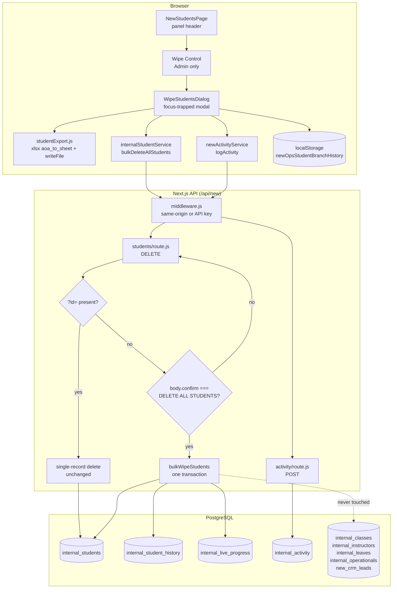
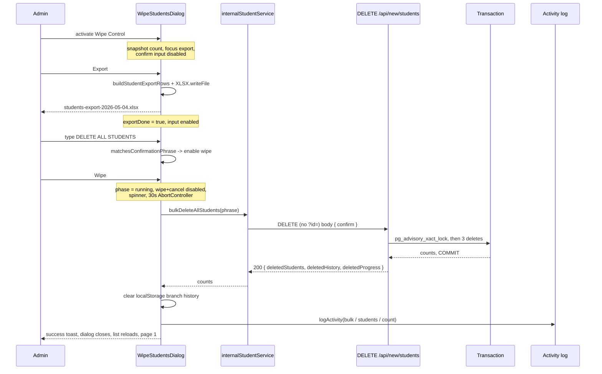
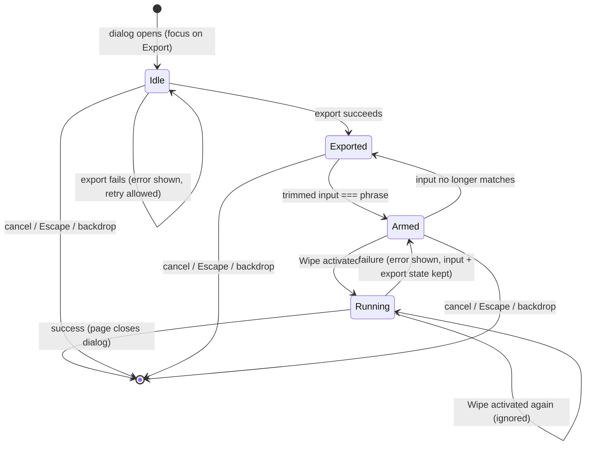

# Design Document

## Overview

The wipe is a single destructive action added to the New Operations **Student Database** page
(`src/views/NewStudentsPage.jsx`). It clears `internal_students` plus the two tables keyed to it —
`internal_student_history` and `internal_live_progress` — in one PostgreSQL transaction, and leaves
`internal_classes`, `internal_instructors`, `internal_leaves`, `internal_operationals` and
`new_crm_leads` untouched.

Because the operation is irreversible and the New Operations API carries no per-user identity, the
design layers five independent safeguards, each of which can stop the wipe on its own:

| Safeguard | Where it lives | What it prevents |
|---|---|---|
| Admin-only control | `NewStudentsPage` header, role read from `ScheduleContext.users` | A non-Admin ever seeing or firing the action |
| Mandatory `.xlsx` export | `WipeStudentsDialog` + `src/lib/studentExport.js` | Unrecoverable data loss |
| Typed `DELETE ALL STUDENTS` | `WipeStudentsDialog` + `src/lib/wipeConfirmation.js` | A mis-click or a stray Enter |
| Confirmation phrase in the request body | `DELETE /api/new/students` | A scripted or agent call emptying the registry |
| One transaction with rollback | `withTransaction` in `src/lib/db.js` | A half-deleted database |

A sixth mechanism is after-the-fact rather than preventive: every attempt, successful or failed,
writes one `internal_activity` row with action `bulk` and source `students`.

Three findings from the existing code shape the design:

1. **`src/lib/db.js` exposes only `query(text, params)` against a pooled connection.** There is no
   transaction helper anywhere in the repo (no `BEGIN`/`COMMIT` outside `ensureSchema`'s PL/pgSQL
   text). Requirement 6 cannot be met with `query`, because each call may land on a different pooled
   connection. A `withTransaction(fn)` helper is new work and is part of this feature.
2. **The existing `DELETE /api/new/students` requires `?id=`** and returns 400 without it. That
   400 branch becomes the branch point for the bulk path, so the single-record delete used by the
   per-row trash button keeps its current behaviour byte for byte.
3. **`internal_live_progress` is keyed by `student_name`, not by student id** (see
   `src/lib/ensureSchema.js` — `UNIQUE (student_name, program_code)`), while
   `internal_student_history` is keyed by `student_id`. The two deletions therefore need different
   matching rules, which is why Requirement 4 states an identifier match for one and a
   trim-and-fold name match for the other.

The known behaviour change stays as the requirements describe it: `internal_classes.student` is a
`VARCHAR`, not a foreign key, so class rows keep their student-name text after a wipe. The dialog
says so before the user commits.

## Architecture



### Request flow for a successful wipe



### Layering decisions

- **Pure logic in `src/lib/`, side effects at the edges.** Phrase matching, name folding, export row
  construction, the audit summary and the toast wording are pure functions in `src/lib/`, imported by
  both the React component and the API route. This is what makes the Correctness Properties below
  executable without a browser or a database.
- **One endpoint, not two.** The bulk path extends `DELETE /api/new/students` rather than adding
  `/api/new/students/wipe`. The `?id=` check already exists in that handler, so a new route would
  duplicate the mapping and error shapes, and would need its own entry in the API guard's mental
  model. Extending the handler also makes Requirement 5.6 (id wins over confirm) a one-line
  precedence rule instead of cross-route coordination.
- **Role gating stays client-side, deliberately.** `middleware.js` admits any `Sec-Fetch-Site:
  same-origin` request with no identity, and roles live in `ScheduleContext.users` (a localStorage
  map of email → role, defaulting to `Instructor`). Server-side per-user authorisation is out of
  scope per the requirements Introduction; the body-confirmation guard is what protects the endpoint.
- **The advisory lock, not row locks, serialises wipes.** Requirement 9.6 needs a second concurrent
  bulk request to wait and then report zeros. `SELECT ... FOR UPDATE` cannot do that when the first
  transaction already emptied the table (there are no rows left to lock), so the transaction takes
  `pg_advisory_xact_lock` on a fixed key as its first statement.

## Components and Interfaces

### 1. Wipe Control — `src/views/NewStudentsPage.jsx`

Rendered in the existing `.panel-header`, immediately after the `Add Student` button so it inherits
the header's DOM tab order (Req 1.1, 1.6). Role resolution reuses the pattern already in
`Sidebar.jsx` and `Header.jsx`:

```js
// src/utils/roles.js (new)
export const ADMIN_ROLE = 'Admin';
export const DEFAULT_ROLE = 'Instructor';

/** email -> role, with the same fallback the sidebar and header use. */
export function resolveUserRole(users, email) {
  if (!email) return DEFAULT_ROLE;                 // Req 1.3
  return users?.[String(email).toLowerCase()] || DEFAULT_ROLE;
}
export function isAdmin(users, email) {
  return resolveUserRole(users, email) === ADMIN_ROLE;
}
```

Rendering rules:

| Condition | Rendered output |
|---|---|
| role is `Admin` | `Add Student` + Wipe Control (Req 1.1) |
| any other recorded role | `Add Student` only, Wipe Control absent from the DOM (Req 1.2) |
| no role recorded / no signed-in email | resolved to `Instructor`, `Add Student` only (Req 1.3) |
| `Admin` and `students.length === 0` | Wipe Control rendered `disabled` with a tooltip (Req 7.8) |

Styling copies the per-row delete button verbatim — `border: '1px solid var(--danger-border)'`,
`color: 'var(--danger)'`, transparent background, `<Trash2 size={16} />` — with no extra overrides
(Req 1.5). The accessible name is set explicitly (Req 1.7):

```jsx
<button
  ref={wipeControlRef}
  onClick={() => setWipeOpen(true)}
  disabled={students.length === 0}
  aria-label="Delete all student records. This cannot be undone."
  title={students.length === 0
    ? 'The student list is already empty'
    : 'Delete all student records — cannot be undone'}
  className="btn"
  style={{ /* same tokens as the row delete control */ }}
>
  <Trash2 size={16} /> Delete All
</button>
```

Because it is a real `<button>`, Enter and Space activation and the focus ring come from the
platform (Req 1.6). A `disabled` button performs no action on activation, and `title` surfaces on
hover and on focus (Req 7.8).

An effect closes the dialog if the role stops being `Admin` while it is open (Req 1.4):

```js
useEffect(() => {
  if (wipeOpen && !isAdmin(users, user?.email)) setWipeOpen(false);
}, [wipeOpen, users, user?.email]);
```

`setWipeOpen(false)` unmounts `WipeStudentsDialog`, which discards its local state including the
typed text. The handler also re-checks the role before dispatching, so a defeated client guard still
sends no request and shows an error toast (Req 1.8).

### 2. `WipeStudentsDialog` — `src/components/operations/WipeStudentsDialog.jsx` (new)

```js
/**
 * props:
 *   studentCount:   number   // snapshot taken by the page at open time
 *   filtersActive:  boolean  // search/level/branch/status differ from defaults
 *   students:       Array    // unfiltered registry rows, for the export
 *   onCancel:       () => void
 *   onConfirm:      () => Promise<void>   // resolves on success, rejects on failure
 */
```

Owns a small state machine and nothing else:



Derived enablement, evaluated on every render so any input mechanism — typing, deletion, paste,
autofill, programmatic replacement — is covered by React's `onChange` on a controlled input, well
inside the 300 ms bound (Req 3.6):

```js
const phraseOk = matchesConfirmationPhrase(text);           // Req 3.5
const canType  = exportDone;                                // Req 2.5, 2.8
const canWipe  = exportDone && phraseOk && phase !== 'running'; // Req 2.7, 3.5, 6.6
```

Content and behaviour:

- Snapshot count from props, frozen for the dialog's lifetime; the page's 3-second poll cannot move
  it because the value is captured at open time and the dialog is remounted per open (Req 3.1, 3.10,
  9.5). The dialog also states that the wipe deletes every record held when it runs, which may differ
  from the shown number (Req 9.5, 3.9).
- A "will be deleted" list (student records, branch history, live lesson progress) and a "will be
  kept" list (class schedule, instructors, leave, operational rules, CRM leads), wired as the dialog's
  accessible description (Req 3.2):
  `<div role="dialog" aria-modal="true" aria-labelledby={titleId} aria-describedby={scopeId}>`.
- The class-schedule consequence sentence (Req 3.3) and, when `filtersActive`, the "covers every
  record, not the filtered rows" sentence (Req 3.9).
- The phrase rendered as literal text the user must copy (Req 3.4).
- Initial focus on the Export button via a ref in a mount effect (Req 3.11); a `keydown` handler
  cycles Tab and Shift+Tab across the dialog's focusable controls (Req 3.12); Escape and a backdrop
  `mousedown` on the overlay both call `onCancel` (Req 3.7). The page restores focus to
  `wipeControlRef` after unmount (Req 3.13, 7.4).
- While `phase === 'running'`, wipe and cancel are `disabled` and a `.loading-spinner` shows
  (Req 6.6); repeat activation is a no-op because the handler returns early on `phase === 'running'`
  (Req 6.7).
- On failure the dialog stays mounted with `text` and `exportDone` intact and returns to `Armed`
  (Req 6.4).

### 3. Student export — `src/lib/studentExport.js` (new)

Mirrors `downloadImportTemplate()` in `NewSchedulePage.jsx`, which already uses the bundled
`xlsx@0.18.5` (`XLSX.utils.book_new` → `book_append_sheet` → `XLSX.writeFile`). Rows are built with
`aoa_to_sheet` rather than `json_to_sheet` so the header row and the column order are fixed by the
code rather than inferred from object keys (Req 2.3).

```js
export const STUDENT_EXPORT_HEADERS = [
  'ID', 'Name', 'Level', 'Branch', 'Parent Name', 'Contact', 'Status', 'Remarks',
];

/** Pure: registry rows -> array-of-arrays, header first. Req 2.3, 2.4, 2.9 */
export function buildStudentExportRows(students) {
  const cell = (v) => (v === null || v === undefined ? '' : String(v));
  return [
    [...STUDENT_EXPORT_HEADERS],
    ...(students || []).map((s) => [
      cell(s.id), cell(s.name), cell(s.level), cell(s.branchName),
      cell(s.parentName), cell(s.contact), cell(s.status), cell(s.remarks),
    ]),
  ];
}

/** Pure: "students-export-2026-05-04.xlsx". Req 2.2 */
export function studentExportFileName(date = new Date()) {
  const p = (n) => String(n).padStart(2, '0');
  return `students-export-${date.getFullYear()}-${p(date.getMonth() + 1)}-${p(date.getDate())}.xlsx`;
}

/** Side-effecting shell. Throws on failure; returns elapsed ms on success. */
export function downloadStudentExport(students, date = new Date()) {
  const started = Date.now();
  const wb = XLSX.utils.book_new();
  XLSX.utils.book_append_sheet(wb, XLSX.utils.aoa_to_sheet(buildStudentExportRows(students)), 'Students');
  XLSX.writeFile(wb, studentExportFileName(date));
  return Date.now() - started;
}
```

The dialog exports the page's **unfiltered** `students` array, never the `paged`/`filtered` view, so
every branch and every status is included (Req 2.4). `id` is included as the first column because it
is the join key for `internal_student_history` and the only stable handle for a re-import.

`XLSX.writeFile` is synchronous, so a hard 10-second abort is not possible; the dialog measures
`downloadStudentExport`'s elapsed time and treats an over-budget run as a failure — no
`exportDone`, error message shown, export still retryable with no attempt cap (Req 2.6, 2.10). The
`aoa_to_sheet` path is O(rows) with no per-row formatting, which is what keeps 10,000 records inside
the budget (Req 2.2).

### 4. Confirmation phrase — `src/lib/wipeConfirmation.js` (new)

Shared by the dialog and the route so the two can never disagree:

```js
export const WIPE_CONFIRMATION_PHRASE = 'DELETE ALL STUDENTS';

/** Trim-then-exact, case-sensitive. Req 3.5, 5.1, 5.3 */
export function matchesConfirmationPhrase(value) {
  return typeof value === 'string' && value.trim() === WIPE_CONFIRMATION_PHRASE;
}
```

### 5. Transaction helper — `src/lib/db.js` (extended)

```js
/**
 * Run fn inside one transaction on one pooled client.
 * Commits on resolve, rolls back on reject or on the deadline, always releases.
 */
export async function withTransaction(fn, { timeoutMs = 30000 } = {}) {
  const client = await getPool().connect();
  try {
    await client.query('BEGIN');
    await client.query(`SET LOCAL statement_timeout = ${timeoutMs}`);
    const result = await Promise.race([
      fn(client),
      new Promise((_, reject) =>
        setTimeout(() => reject(new WipeTimeoutError(timeoutMs)), timeoutMs)),
    ]);
    await client.query('COMMIT');
    return result;
  } catch (err) {
    try { await client.query('ROLLBACK'); } catch { /* connection already gone */ }
    throw err;
  } finally {
    client.release();
  }
}
```

Two timeout layers, because neither alone covers Requirement 6.8: `statement_timeout` bounds each
individual statement inside the transaction, and the `Promise.race` deadline bounds the transaction
as a whole (including time spent between statements). Either one firing produces a rollback and a
500 (Req 6.2, 6.8). A lost connection makes `COMMIT` reject, and PostgreSQL discards an uncommitted
transaction on disconnect, so the database is left as it was (Req 6.2, 6.3).

### 6. Bulk wipe service — `src/lib/bulkWipeStudents.js` (new)

```js
const WIPE_LOCK_KEY = 774_120_531; // fixed advisory-lock key for the student wipe

export async function bulkWipeStudents() {
  await ensureTable('internal_student_history');   // outside the transaction
  await ensureTable('internal_live_progress');

  return withTransaction(async (client) => {
    // Serialise concurrent wipes; released automatically at COMMIT/ROLLBACK. Req 9.6
    await client.query('SELECT pg_advisory_xact_lock($1)', [WIPE_LOCK_KEY]);

    // Live progress first: it is matched by name, which only exists while the
    // student rows do. Folded compare, blank names excluded. Req 4.3, 4.4, 4.11, 4.12
    const progress = await client.query(`
      DELETE FROM internal_live_progress
       WHERE lower(btrim(student_name)) IN (
             SELECT lower(btrim(name)) FROM internal_students WHERE btrim(name) <> ''
       )`);

    // Branch history second: exact student_id match, so unmatched rows survive. Req 4.2, 4.13
    const history = await client.query(`
      DELETE FROM internal_student_history
       WHERE student_id IN (SELECT id FROM internal_students)`);

    // Students last. Req 4.1, 4.8, 4.9, 9.2
    const students = await client.query('DELETE FROM internal_students');

    return {
      deletedStudents: students.rowCount,
      deletedHistory: history.rowCount,
      deletedProgress: progress.rowCount,
    };
  });
}
```

`ensureTable` runs on the pool before `BEGIN` — DDL inside the wipe transaction would widen the
rollback surface for no benefit, and both tables are created by `IF NOT EXISTS` statements that are
already idempotent. No statement references any protected table, which is how Requirements 4.5 and
4.10 hold structurally rather than by assertion. Nothing here reads a filter parameter, so
`?search=`, `?branch=` and `?status=` cannot narrow a wipe (Req 4.9).

### 7. `DELETE /api/new/students` — extended handler

```js
export async function DELETE(req) {
  const { searchParams } = new URL(req.url);
  const id = searchParams.get('id');

  // Precedence: an id always means single-record delete, body ignored. Req 5.4, 5.6
  if (id) {
    const res = await query('DELETE FROM internal_students WHERE id = $1 RETURNING *', [id]);
    if (res.rowCount === 0) {                                            // Req 5.7
      return NextResponse.json({ error: 'Student not found' }, { status: 404 });
    }
    return NextResponse.json({ success: true, message: 'Student deleted successfully' });
  }

  // No id: the only remaining legal request is a confirmed bulk wipe.
  let body = null;
  try { body = await req.json(); } catch { body = null; }               // Req 5.2 (unparseable)
  const confirm = body && typeof body === 'object' ? body.confirm : undefined;

  if (confirm === undefined || confirm === null || String(confirm).trim() === '') {
    return NextResponse.json({
      error: 'Provide ?id=<studentId> to delete one student, or send '
           + '{ "confirm": "DELETE ALL STUDENTS" } to delete every student record. '
           + 'The confirmation phrase is required for a bulk delete.',
    }, { status: 400 });                                                 // Req 5.2, 5.5
  }
  if (!matchesConfirmationPhrase(String(confirm))) {
    return NextResponse.json({
      error: 'The confirmation phrase does not match. Send exactly "DELETE ALL STUDENTS" '
           + '(case-sensitive) to delete every student record.',
    }, { status: 400 });                                                 // Req 5.3
  }

  try {
    const counts = await bulkWipeStudents();                             // Req 6.1, 6.5, 9.1
    return NextResponse.json({ success: true, ...counts });              // Req 7.1
  } catch (error) {
    const message = error instanceof WipeTimeoutError
      ? 'The bulk delete exceeded its 30-second time limit and was rolled back. No records were deleted.'
      : error.message;
    return NextResponse.json({ error: message }, { status: 500 });       // Req 6.2, 6.8
  }
}
```

Every branch runs after `middleware.js` has already admitted the request, whether by same-origin or
by API key, so the confirmation requirement applies to both classes of caller (Req 5.8). `PUT` needs
no change: it already returns 404 when the id matches nothing, which is the post-wipe stale-edit
case (Req 9.7).

The 400 for a missing confirmation names both alternatives in one message, satisfying Req 5.2 and
Req 5.5 with a single string — they describe the same input, so two different messages would be
unreachable in one of the two cases.

### 8. Client service — `src/services/internalStudentService.js` (extended)

```js
export async function bulkDeleteAllStudents(confirm, { timeoutMs = 30000 } = {}) {
  const controller = new AbortController();
  const timer = setTimeout(() => controller.abort(), timeoutMs);
  try {
    const res = await fetch(API_PATH, {
      method: 'DELETE',
      headers: { 'Content-Type': 'application/json' },
      body: JSON.stringify({ confirm }),
      signal: controller.signal,
    });
    if (!res.ok) {
      const err = await res.json().catch(() => ({}));
      throw new Error(err.error || 'Failed to delete all students');
    }
    return await res.json();
  } finally {
    clearTimeout(timer);
  }
}
```

An `AbortError` from the 30-second signal is reported as an *unconfirmed outcome*, not a failure and
not a success, with the advice to reload (Req 6.9) — the transaction may well have committed after
the client stopped listening.

### 9. Post-wipe orchestration — `NewStudentsPage.handleWipeConfirm`

Ordered so the user-visible result never waits on best-effort cleanup:

1. `bulkDeleteAllStudents(WIPE_CONFIRMATION_PHRASE)`.
2. Success toast built from the server counts, `duration: 6000` (the Toast default already exceeds
   the 5-second floor) and pluralised by the returned number, never by the dialog snapshot
   (Req 7.2, 7.3). `ToastContainer` is already `aria-live="polite"` with `role="status"`, so it
   announces without stealing focus (Req 7.2).
3. `localStorage.removeItem('newOpsStudentBranchHistory')` in a `try/catch` — a throw is logged to
   the console and the wipe still reports success (Req 4.6, 4.7).
4. `logActivity` with one retry after ~1 second; a second failure is console-only and does not
   change the counts shown (Req 8.1–8.6).
5. Close the dialog and return focus to the Wipe Control (Req 7.4, 3.13).
6. `setPage(1)` (Req 9.3) and leave `search`, `filterLevel`, `filterBranch`, `filterStatus` alone
   (Req 9.4).
7. `getAllInternalStudents()` → `setStudents(...)`; on rejection, keep the success toast and add a
   second toast with a retry `onClick` (Req 7.5, 7.7). The existing empty-state row
   ("No Students Registered") then renders because `students.length === 0` (Req 7.6). The 3-second
   poll in `subscribeToInternalStudents` is a second, independent path to the same refresh.

On failure: error toast carrying the server reason, one `bulk`/`students` activity entry with count
0 and a "wipe attempt failed, no records deleted" summary (Req 8.7), dialog left open and re-armed
(Req 6.4).

### 10. Documentation touch-points

- `src/app/api/new/openapi.json/route.js` — the generic `crud()` helper marks `?id=` as
  `required: true` for every DELETE. The students path needs its `delete` operation overridden after
  the `crud()` spread: `id` optional, plus a `requestBody` describing `{ confirm }`, and a summary
  that spells out the destructive scope for agent callers.
- `docs/new-operations-api.md` — add the bulk form to the students endpoint section and to the
  "Block every DELETE" guidance near the end.

## Data Models

### Bulk delete request

```json
{ "confirm": "DELETE ALL STUDENTS" }
```

`DELETE /api/new/students` with **no** `?id=` query parameter.

### Bulk delete success response (Req 7.1)

```json
{ "success": true, "deletedStudents": 26, "deletedHistory": 14, "deletedProgress": 9 }
```

All three counts are integers ≥ 0 and are always present, including when every one is 0 (Req 6.5,
9.1).

### Error responses

| Status | Condition | `error` mentions |
|---|---|---|
| 400 | no id, no/blank/unparseable confirm | id alternative **and** required phrase (Req 5.2, 5.5) |
| 400 | confirm present but not equal to the phrase | phrase does not match (Req 5.3) |
| 404 | `?id=` matches no row | student not found (Req 5.7) |
| 500 | any deletion fails, connection lost | failure reason, rolled back (Req 6.2) |
| 500 | 30-second deadline exceeded | exceeded its 30-second time limit (Req 6.8) |

### Export sheet

Sheet name `Students`; one workbook, one sheet; file `students-export-YYYY-MM-DD.xlsx`.

| Col | 1 | 2 | 3 | 4 | 5 | 6 | 7 | 8 |
|---|---|---|---|---|---|---|---|---|
| Header | ID | Name | Level | Branch | Parent Name | Contact | Status | Remarks |
| Source | `id` | `name` | `level` | `branchName` | `parentName` | `contact` | `status` | `remarks` |

Absent or null fields become `''`; no value is truncated (Req 2.3). A zero-record registry produces
the header row and nothing else (Req 2.9).

### Activity log entry (Req 8)

| Field | Success | Failure |
|---|---|---|
| `action` | `bulk` | `bulk` |
| `source` | `students` | `students` |
| `count` | `deletedStudents` (0 included) | `0` |
| `userEmail` | signed-in email, unchanged | signed-in email, unchanged |
| `summary` | `Bulk wipe: deleted 26 student records, 14 branch history records, 9 live progress records.` | `Bulk wipe attempt failed — no records were deleted.` |

`userEmail` falls back to the string `Unknown user` when no email is recorded, so the entry is still
written (Req 8.6). `newActivityService.logActivity` maps `count` → `item_count` in
`internal_activity`. The summary is generated by a pure builder that clamps to 500 characters
(Req 8.4).

### Dialog state

```js
{
  studentCount: number,   // frozen snapshot, Req 3.1 / 3.10 / 9.5
  filtersActive: boolean, // Req 3.9
  exportDone: boolean,    // Req 2.5 / 2.7
  exportError: string|null,
  text: string,           // Req 3.5
  phase: 'idle' | 'running',
  wipeError: string|null, // Req 6.4
}
```

### Tables touched

| Table | Effect | Match rule |
|---|---|---|
| `internal_students` | all rows deleted | none — unconditional |
| `internal_student_history` | rows whose `student_id` exists in `internal_students` | exact integer id |
| `internal_live_progress` | rows whose `student_name` folds onto a deleted student name | `lower(btrim(...))`, blank names excluded |
| `internal_classes`, `internal_instructors`, `internal_leaves`, `internal_operationals`, `new_crm_leads` | untouched | never referenced |
| `internal_activity` | one row appended | — |
| `localStorage` `newOpsStudentBranchHistory` | key removed | — |

## Correctness Properties

*A property is a characteristic or behavior that should hold true across all valid executions of a
system — essentially, a formal statement about what the system should do. Properties serve as the
bridge between human-readable specifications and machine-verifiable correctness guarantees.*

This feature suits property-based testing: its safety-critical parts are pure functions
(phrase matching, name folding, export row construction, audit summary, toast wording) plus
one set-valued database transform that can be checked against an in-memory model. The parts that are
not amenable to properties — the 10,000-record performance bound, real concurrent-wipe serialisation,
and the same-origin/API-key admission split — are covered by a benchmark and integration tests in the
Testing Strategy instead.

### Property 1: The confirmation phrase gate opens only for the exact trimmed phrase

*For any* string value, `matchesConfirmationPhrase` returns true if and only if the value is a string
whose leading and trailing whitespace removed equals `DELETE ALL STUDENTS` character for character
with case preserved, so that whitespace-padded phrases pass while case variants, near misses,
inner-whitespace variants, empty strings and non-string values do not.

**Validates: Requirements 3.5, 5.1, 5.3**

### Property 2: The export sheet reproduces the whole registry in the fixed column order

*For any* array of student records — including an empty array, records with absent, null, empty,
very long or non-ASCII field values — `buildStudentExportRows` returns a first row equal to
`['ID','Name','Level','Branch','Parent Name','Contact','Status','Remarks']`, followed by exactly one
row per record in the same order, where each row holds the record's eight corresponding values as
strings with `''` in place of any absent value and no value shortened, and *for any* combination of
search text, level, branch and status filter values the output is unchanged.

**Validates: Requirements 2.3, 2.4, 2.9**

### Property 3: The export file name carries the fixed prefix and the export date

*For any* date, `studentExportFileName` returns `students-export-YYYY-MM-DD.xlsx` with that date's
four-digit year and zero-padded month and day.

**Validates: Requirements 2.2**

### Property 4: The dialog arms only when an export has completed and the phrase matches

*For any* dialog state, the confirmation input is enabled if and only if an export has been recorded
as completed for the current dialog session, and the wipe action is enabled if and only if an export
has completed **and** the trimmed input equals the confirmation phrase **and** no wipe is in
progress.

**Validates: Requirements 2.5, 2.7, 2.8, 3.5, 6.6**

### Property 5: The header exposes the wipe control only to Admin, and only usably when records exist

*For any* user-to-role map, any signed-in email (including none, an email absent from the map, and
differing letter case), and any registry size, the Student Database panel header renders the wipe
control in the DOM if and only if the resolved role is `Admin`, always renders the `Add Student`
control, and renders the wipe control in a disabled state exactly when the registry holds zero
records.

**Validates: Requirements 1.1, 1.2, 1.3, 7.8**

### Property 6: The delete endpoint dispatches by identifier first and by confirmation second

*For any* deletion request, the handler performs a single-record delete when the query string carries
an identifier — whatever the body holds, including a matching confirmation phrase, a mismatched one
or no body at all — and performs a bulk wipe only when no identifier is present and the body carries
a confirmation value matching the phrase; every other request returns status 400, deletes no record,
and leaves the student registry, branch history and live progress records unchanged.

**Validates: Requirements 5.2, 5.4, 5.5, 5.6**

### Property 7: A wipe deletes the registry and exactly its keyed side data

*For any* database state — students across arbitrary branches and statuses with names including
empty, whitespace-only, duplicate, case-varying and padded values; branch history rows with matching
and non-matching student identifiers; live progress rows with matching, folded-matching and unmatched
student names; and arbitrary class, instructor, leave, operational and CRM lead rows — a committed
wipe leaves zero student records, removes exactly those branch history rows whose student identifier
matched a student record, removes exactly those live progress rows whose student name equals a
non-blank student name after trimming and case folding (all of them when several share a name), and
leaves every other row in every table unchanged in count and in field values, independent of any
filter arguments passed alongside the request.

**Validates: Requirements 4.1, 4.2, 4.3, 4.4, 4.5, 4.8, 4.9, 4.10, 4.11, 4.13, 9.2**

### Property 8: A failed wipe changes nothing

*For any* database state and *for any* point of failure among the three deletions, the wipe rolls
back, returns status 500 carrying the failure reason, and leaves the student registry, branch history
and live progress records holding the record counts and field values they held before the wipe
started.

**Validates: Requirements 6.2, 6.3**

### Property 9: Wiping is idempotent

*For any* database state, running a confirmed wipe twice in sequence leaves the same final state as
running it once, and the second run returns a success response reporting zero deleted student
records, zero deleted branch history records and zero deleted live progress records.

**Validates: Requirements 6.5, 9.1**

### Property 10: Every success response carries three non-negative integer counts

*For any* wipe that commits, the response holds a deleted-student count, a deleted-branch-history
count and a deleted-live-progress count, each present as an integer of 0 or greater even when its
value is 0.

**Validates: Requirements 7.1**

### Property 11: The success message reports the server's count, correctly numbered

*For any* pair of a server-reported deleted-student count and a dialog snapshot count, the success
message contains the server-reported number, uses singular wording when that number equals 1 and
plural wording for every other value, and contains no other deleted-record count when the two
numbers differ.

**Validates: Requirements 7.2, 7.3**

### Property 12: One audit entry describes the wipe completely

*For any* triple of deleted counts and any recorded user email (including none), a successful wipe
produces exactly one activity entry whose action is `bulk`, whose source is `students`, whose
affected-record count equals the deleted student count including when that count is 0, whose user
value is the recorded email unchanged or an unidentified-user placeholder when no email is recorded,
and whose summary is at most 500 characters and names the student registry, branch history and live
progress records together with their reported counts.

**Validates: Requirements 8.1, 8.2, 8.3, 8.4, 8.6**

### Property 13: The dialog's record count is frozen at open time

*For any* registry size at the moment the dialog opens and *for any* sequence of subsequent list
refreshes and filter changes while the dialog stays open, the count displayed in the dialog remains
the total registry size read when the dialog opened, as a whole number of 0 or greater.

**Validates: Requirements 3.1, 3.10, 9.5**

### Property 14: A cancelled dialog reopens clean

*For any* text typed into the confirmation input and *for any* cancel route — the cancel control, the
Escape key, or a click outside the dialog — reopening the dialog presents an empty confirmation input
and a disabled wipe action.

**Validates: Requirements 3.8**

### Property 15: Keyboard focus cannot leave an open dialog

*For any* sequence of forward and backward tab movements while the dialog is open, keyboard focus
stays on a control inside the dialog, moving from the last control to the first and from the first to
the last.

**Validates: Requirements 3.12**

### Property 16: Filters survive a wipe, and a narrowed view is disclosed

*For any* combination of search text, level filter, branch filter and status filter, those four
values are unchanged after a successful wipe, and the dialog states that the wipe covers every
student record rather than the rows on screen exactly when at least one of the four differs from its
unfiltered default.

**Validates: Requirements 3.9, 9.4**

## Error Handling

### Client

| Failure | Handling | Requirement |
|---|---|---|
| Export throws | Error message in the dialog naming the cause; `exportDone` stays false; input and wipe stay disabled; export stays enabled for unlimited retries | 2.6, 2.10 |
| Export exceeds 10 s | Treated as a failure with a timeout message (generation is synchronous and cannot be aborted mid-write, so the elapsed time is measured and reported) | 2.6 |
| Wipe request returns 4xx/5xx | Error toast carrying the server `error` string; dialog stays open with typed text and export state; wipe re-enabled; one failure audit entry | 6.4, 8.7 |
| No response in 30 s (`AbortError`) | Warning toast: outcome unconfirmed, reload the page to see the current count. Neither a success nor a failure toast | 6.9 |
| `localStorage.removeItem` throws | `console.error`, entries left in place, wipe still reported successful | 4.7 |
| `logActivity` fails | One retry after ~1 s; a second failure is `console.warn` only (`logActivity` already swallows its own errors and returns `null`, which is the retry signal) | 8.5 |
| Reload after success fails | Success toast retained, second toast with a retry action, wipe still reported successful | 7.7 |
| Role no longer Admin at dispatch | No request sent, error toast naming the required role | 1.8 |

### Server

| Failure | Handling | Requirement |
|---|---|---|
| Unparseable or non-object body with no `?id=` | Treated as a missing confirmation → 400 | 5.2 |
| Blank or mismatched confirmation | 400 with the respective message; no database call is made at all | 5.2, 5.3 |
| `?id=` matching no row | 404, existing behaviour preserved | 5.7 |
| Any deletion statement throws | `ROLLBACK`, 500 with `error.message` | 6.2 |
| Connection lost before commit | `ROLLBACK` attempt is itself wrapped in `try/catch`; PostgreSQL discards the uncommitted transaction; 500 | 6.2, 6.3 |
| Statement or transaction exceeds 30 s | `statement_timeout` or the race deadline fires → `ROLLBACK`, 500 naming the 30-second limit | 6.8 |
| `ensureTable` fails | Error propagates before `BEGIN`; 500 with the schema error; nothing deleted | 6.3 |
| `DATABASE_URL` unset | Existing `getPool()` error message propagates as a 500 | — |

The client is stopped at three independent points (role check, export gate, phrase gate) and the
server at one (body confirmation). No single failure of a client guard can produce a wipe, because
the request itself must carry the phrase.

## Testing Strategy

No test tooling exists in the repository today (`package.json` has `dev`, `build`, `start`, `lint`
only). This feature introduces it, because a destructive irreversible operation should not ship on
manual verification alone:

- **Runner**: `vitest` with `jsdom`, which needs no Babel config for a Next.js + React 19 project.
- **Property library**: `fast-check` — the standard choice for JS/TS. Properties are **not**
  hand-rolled with loops.
- **Component testing**: `@testing-library/react` plus `@testing-library/user-event` for the header
  gating, the dialog state machine and the focus trap.
- **Script**: `"test": "vitest --run"` so CI and local runs are single-execution, never watch mode.

### Property tests

- One property-based test per property above — sixteen tests, no more, no fewer.
- Minimum **100 iterations** each (`fc.assert(..., { numRuns: 100 })`).
- Each test carries a tag comment referencing the design property, in the form:
  `// Feature: student-data-bulk-wipe, Property 7: A wipe deletes the registry and exactly its keyed side data`
- Test files:
  - `src/lib/__tests__/wipeConfirmation.property.test.js` — Property 1
  - `src/lib/__tests__/studentExport.property.test.js` — Properties 2, 3
  - `src/lib/__tests__/bulkWipeStudents.property.test.js` — Properties 7, 8, 9, 10
  - `src/lib/__tests__/wipeReporting.property.test.js` — Properties 11, 12
  - `src/app/api/new/students/__tests__/delete.property.test.js` — Property 6
  - `src/components/operations/__tests__/WipeStudentsDialog.property.test.jsx` — Properties 4, 13, 14, 15, 16
  - `src/views/__tests__/NewStudentsPage.wipe.property.test.jsx` — Property 5
- **Database properties use a model, not a real database.** Properties 7–10 run `bulkWipeStudents`
  against a fake `pg` client that holds the seven tables as in-memory arrays and applies the same
  predicates the SQL expresses (`lower(btrim(...))` membership, `student_id IN (...)`). This is what
  makes 100 iterations affordable, and it is deliberately paired with a small number of integration
  tests below so the model itself cannot drift from PostgreSQL unnoticed.
- Generators that must include the awkward inputs: names that are empty, whitespace-only, duplicated,
  case-varying and padded (Req 4.11, 4.12); registries of size 0 (Req 2.9, 6.5); counts of 0 and 1
  and very large values (Req 7.2, 8.2, 8.4); bodies that are `undefined`, `null`, `''`, whitespace,
  non-objects and invalid JSON (Req 5.2).

### Unit and edge-case tests

Deliberately few, focused on branches a property cannot express:

- Wipe control styling matches the row delete control; accessible name wording (Req 1.5, 1.7).
- DOM order after `Add Student`; Enter and Space activation (Req 1.6).
- Role change while the dialog is open closes it and discards the typed text (Req 1.4).
- Non-Admin dispatch sends no request and shows an error (Req 1.8).
- Dialog content: deleted/kept lists wired to `aria-describedby`, the class-schedule consequence
  sentence, the literal phrase, initial focus on Export, focus return on close (Req 3.2, 3.3, 3.4,
  3.11, 3.13).
- Export failure and over-budget messaging; three consecutive failures keep the export enabled
  (Req 2.6, 2.10).
- Paste and programmatic value replacement update enablement (Req 3.6).
- Each of the three cancel routes closes the dialog and sends nothing (Req 3.7).
- Statement ordering `BEGIN → advisory lock → progress → history → students → COMMIT`, with no
  `COMMIT` on a failure path (Req 6.1).
- 30-second transaction deadline with fake timers; 30-second client abort producing the unconfirmed
  message (Req 6.8, 6.9).
- Repeated wipe activation while running issues one request (Req 6.7).
- `localStorage` cleared on success; a throwing `removeItem` still reports success (Req 4.6, 4.7).
- Activity log: retry once then give up; a failed wipe writes one entry with count 0 (Req 8.5, 8.7).
- Post-success sequence: dialog closes, list reloads, empty state renders, page resets to 1, reload
  failure adds a retry toast (Req 7.4, 7.5, 7.6, 7.7, 9.3).
- Stale `PUT` after a wipe returns 404 (Req 9.7).
- Unknown `?id=` returns 404 (Req 5.7).

### Integration tests (against a disposable PostgreSQL database, not the model)

Run separately from the unit suite, 1–3 examples each, never 100 iterations:

- A confirmed wipe on a seeded database: registry empty, keyed side data gone, orphan history and
  unmatched progress intact, all five protected tables byte-identical (validates the model used by
  Property 7 against real SQL).
- Two concurrent confirmed wipes: the second starts only after the first transaction ends, the deleted
  student counts sum to the initial registry size, and the later response reports zero (Req 9.6).
- The same unconfirmed request admitted as `Sec-Fetch-Site: same-origin` and as `x-api-key`, both
  returning 400 (Req 5.8).
- A forced mid-transaction failure leaving the three tables at their pre-wipe counts and values
  (Req 6.2, 6.3 against real rollback semantics).

### Performance check

One test, not a property: generate 10,000 student records, call `downloadStudentExport` with
`XLSX.writeFile` stubbed to a no-op writer, and assert the row-building plus sheet construction
completes within 10 seconds (Req 2.2).
