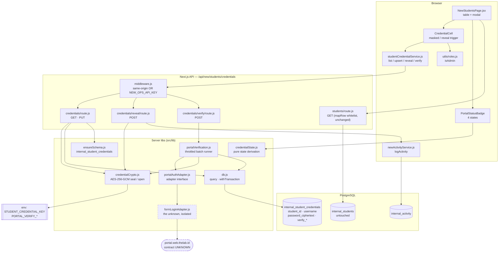
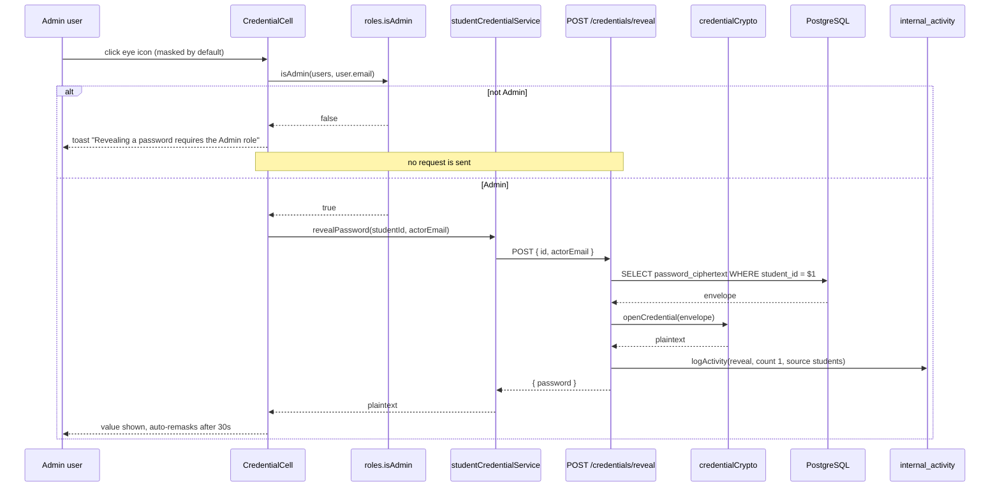
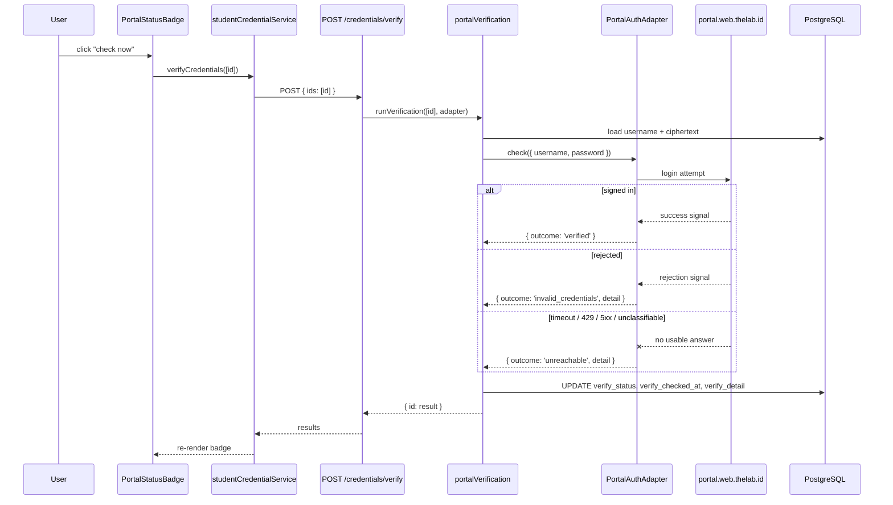
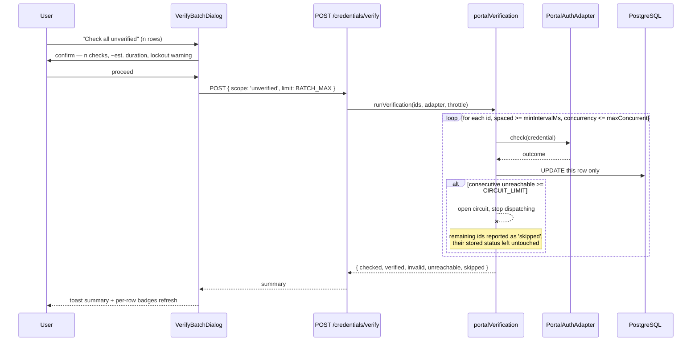

# Design Document

## Overview

Three new columns appear on the New Operations **Student Database** table (`src/views/NewStudentsPage.jsx`):
**Username**, **Password** (masked, with a per-row show/hide trigger), and **Portal** — a verification
cell that shows a verified badge when the account can sign in to `portal.web.thelab.id`, and an
exclamation mark when it cannot.

Passwords are stored **encrypted but recoverable**, not hashed. This is a deliberate decision: the
operator needs to read a student's password back, and verification needs to replay it against the
portal. Both require the plaintext, so a one-way hash is off the table. The design compensates with
four layers that each narrow exposure without reducing the visibility that was asked for:
AES-256-GCM at rest with the key supplied from the environment, credentials excluded from the
routine student list payload, reveal gated on the Admin role and recorded in the activity log, and
verification throttled so a bulk run cannot hammer the portal or lock student accounts out.

Credentials arrive mainly by **bulk import** (a separate future feature), so every write path in this
design is array-shaped first and single-row second, and verification is a throttled batch runner
rather than a per-save side effect.

The one thing this design cannot pin down is how verification actually talks to the portal. There is
no existing integration with `thelab.id` anywhere in the repo, so the portal's auth contract is
**unknown**. Verification is therefore built against a small adapter interface with a documented
default guess and an explicit list of questions for the portal owner. See
[Unknown: the portal auth contract](#unknown-the-portal-auth-contract).

## Findings from the existing code that shape this design

Each of these was read, not assumed.

| Finding | Where | Consequence |
|---|---|---|
| **The app's DB user does not own the original tables.** `ALTER TABLE` on them is refused with "must be owner of table" | `src/lib/ensureSchema.js` (the `internal_class_sessions` note), corroborated by `.kiro/specs/instructor-availability-slot-planner/design.md` | Credentials **cannot** be columns on `internal_students`. They go in a new companion table, `internal_student_credentials`, keyed by `student_id` — the same move `internal_class_sessions` made |
| `mapRow` is an explicit whitelist | `src/app/api/new/students/route.js` | New storage is invisible to `GET /api/new/students` by construction. `mapRow` is left **untouched**, and that omission is the enforcement point, not a convention |
| `ensureTable(name)` provisions later tables idempotently, cached per process | `src/lib/ensureSchema.js` | The new table is a new `DEFINITIONS` key; no migration script to run by hand |
| `query()` and `withTransaction()` both exist | `src/lib/db.js` | A bulk credential upsert can be one transaction with a real rollback and a 30s deadline |
| `logActivity({ action, summary, count, userEmail, source })`, `count` → `item_count` | `src/services/newActivityService.js`, `internal_activity` | Reveal and verification audit entries need no schema work |
| `middleware.js` admits **any** same-origin request, and otherwise one shared `NEW_OPS_API_KEY`. No per-user identity reaches a route | `src/middleware.js` | Server-side "Admin only" is **advisory**, not enforceable today. Documented as a residual risk, not papered over |
| Roles are client-side only, via `ScheduleContext.users` | `src/utils/roles.js` (`isAdmin`, `resolveUserRole`) | Reuse `isAdmin` for the reveal gate. No new role machinery |
| `.gitignore` ignores `.env*.local` but **not** `.env` | `.gitignore` | The encryption key must live in `.env.local` (and the host's env), never `.env` |
| Vitest + fast-check, tests in `__tests__/*.property.test.js` with a header comment naming the property and the requirements | `vitest.config.mjs`, `src/lib/__tests__/` | Follow that layout exactly |
| The table already renders 7 columns and a paged 5-row body; toasts come from `useToast()` | `src/views/NewStudentsPage.jsx` | Three more columns take the header to 10; the credential cells must stay narrow |

Code in this document is JavaScript, matching the repo (Next.js 16, React 19, plain JS with JSDoc, no
TypeScript).

## Decisions on the open questions

| Question | Decision | Why |
|---|---|---|
| How does verification reach the portal? | **Unknown.** Build a `PortalAuthAdapter` interface with a form-post adapter as the default implementation and a documented question list | No `thelab.id` integration exists to copy. An adapter keeps the unknown in one 60-line file |
| When does verification run? | **On demand per row** and **as a throttled batch**. Never automatically on save | Bulk import lands hundreds of rows; an on-save check would fire hundreds of portal logins inside one import transaction |
| What are the visual states? | **Four**: `verified`, `invalid_credentials`, `unreachable`, `unverified`. Plus a derived *stale* flavour of `verified` | The user specified two. A never-checked row and a network failure both need an appearance that does not lie |
| Does a failure distinguish bad credentials from an unreachable portal? | **Yes** — and this is a recommendation against the literal ask. Both still render an exclamation mark, so the requested visual holds, but the colour and hover text differ | A timeout is not a wrong password. Reporting it as one sends an operator to re-key a credential that was always correct, and on a bulk run it would mislabel every row at once. The distinction is free to store and free to render |
| Where does the result live, and how is staleness treated? | `verify_status` + `verify_checked_at` + `verify_detail` on the companion table. **Staleness is derived at render time**, never stored | A stored `isStale` boolean would be wrong the moment the clock moved, and changing the threshold would need a data migration |

### Unknown: the portal auth contract

Searched the repo for `thelab.id`: the only hits are an example email in
`src/services/newActivityService.js` and sample data in `src/views/NewApiDocsPage.jsx`. There is **no
HTTP client, no base URL, no credential flow** for `portal.web.thelab.id`.

The design assumes the most likely case — a session-cookie login form — and isolates it:

```
FormLoginAdapter  →  POST {PORTAL_VERIFY_URL} with username/password as form fields,
                     redirect: 'manual', then classify by status + Set-Cookie + body markers.
```

**To confirm with the portal owner before implementing the adapter body:**

1. Is there a JSON auth endpoint (`POST /api/login` or similar) returning a token or a clear
   `{ success: false }`? If so the adapter collapses to a status-code check and the guesswork goes away.
2. If it is a form post: what is the exact path, the field names, and does it require a CSRF token or
   a prior `GET` to seed a session cookie?
3. What does a **wrong password** look like versus a **valid login** — status code, redirect
   `Location`, or a body string? Many portals answer `200` to both, in which case classification
   needs a body marker string, which belongs in config rather than in code.
4. Is there a **lockout policy** (N failed attempts locks the account)? This sets the batch cap and
   whether repeated verification of an already-failing row is safe at all.
5. Is there **rate limiting**, and what response does it give (`429`? a challenge page)? A `429` must
   classify as `unreachable`, never as `invalid_credentials`.
6. Does a successful login have a **side effect** on the student's session (kicking out an active
   session, writing a login audit the parents can see)? If yes, on-demand verification needs a warning
   in the UI.

Until 1–5 are answered, `FormLoginAdapter` classification is a best guess, and anything it cannot
confidently place is classified `unreachable` — the state that tells the operator "unknown", not the
state that accuses the credential.

## Architecture



Two things to read out of that diagram. First, `students/route.js` and `internal_students` sit on
their own branch: the routine list call never touches the credential libs, so a password cannot leak
into it by accident. Second, the two dashed nodes are the whole of the unknown — `formLoginAdapter.js`
and the portal itself. Everything else is testable today.

## Sequence diagrams

### Reveal a password



### Verify one row on demand



### Throttled batch verification (the bulk-import path)



## Components and Interfaces

### 1. `src/lib/credentialCrypto.js` (new, server-only)

**Purpose**: turn a plaintext password into a storable envelope and back, using AES-256-GCM from
`node:crypto`. No new dependency.

```js
/** @typedef {{ v: 1, iv: string, tag: string, ct: string }} CredentialEnvelope */

/** Seal a plaintext password. Throws CredentialKeyError if the key is absent or malformed. */
export function sealCredential(plaintext /* string */) /* : CredentialEnvelope */ {}

/** Open an envelope. Throws CredentialDecryptError on any tampering or key mismatch. */
export function openCredential(envelope /* CredentialEnvelope|string */) /* : string */ {}

/** True when STUDENT_CREDENTIAL_KEY is present and decodes to exactly 32 bytes. */
export function isCryptoConfigured() /* : boolean */ {}

export class CredentialKeyError extends Error {}     // name: 'CredentialKeyError'
export class CredentialDecryptError extends Error {} // name: 'CredentialDecryptError'
```

**Responsibilities**
- Read `process.env.STUDENT_CREDENTIAL_KEY` (base64, 32 bytes) lazily, never at import time — the same
  pattern `db.js` uses for `DATABASE_URL`, so a missing key produces an actionable 500 on the credential
  routes rather than crashing unrelated ones.
- Generate a fresh 12-byte IV per seal. Never reuse an IV; GCM's security depends on it.
- Store `{ v, iv, tag, ct }` so the format can be versioned later without a guessing game.
- Never log plaintext, never include plaintext in an error message.

### 2. `src/lib/portalAuthAdapter.js` + `src/lib/formLoginAdapter.js` (new, server-only)

**Purpose**: the single seam where the unknown portal contract lives.

```js
/** @typedef {'verified'|'invalid_credentials'|'unreachable'} VerifyOutcome */
/** @typedef {{ outcome: VerifyOutcome, detail: string }} VerifyResult */

/**
 * @typedef {Object} PortalAuthAdapter
 * @property {string} name
 * @property {(cred: { username: string, password: string }, opts?: { timeoutMs?: number }) => Promise<VerifyResult>} check
 */

/** The configured adapter, or a NullAdapter that returns 'unreachable' when unconfigured. */
export function getPortalAdapter() /* : PortalAuthAdapter */ {}
```

**Responsibilities**
- `check` **never throws**. Every failure — DNS, TLS, timeout, 429, 5xx, an unrecognisable body —
  becomes `{ outcome: 'unreachable', detail }`. A throwing adapter would abort a batch mid-flight and
  leave rows in disagreement with reality.
- Only a positive, recognised success signal yields `verified`. Only a positive, recognised rejection
  signal yields `invalid_credentials`. **Ambiguity resolves to `unreachable`**, which is the
  conservative direction: it says "we do not know" instead of accusing a credential.
- `detail` is a short operator-facing string (`"HTTP 429 from portal"`, `"timeout after 8000ms"`). It
  must never contain the password.
- When `PORTAL_VERIFY_URL` is unset, `getPortalAdapter()` returns a Null adapter whose every answer is
  `unreachable` with detail `"portal verification is not configured"`. The feature ships and degrades
  visibly instead of failing loudly.

### 3. `src/lib/portalVerification.js` (new, server-only)

**Purpose**: the throttled runner. Owns spacing, concurrency, the circuit breaker, and the per-row write.

```js
export const VERIFY_DEFAULTS = {
  minIntervalMs: 1500,   // PORTAL_VERIFY_MIN_INTERVAL_MS
  maxConcurrent: 1,      // PORTAL_VERIFY_CONCURRENCY
  batchMax: 100,         // PORTAL_VERIFY_BATCH_MAX
  timeoutMs: 8000,       // PORTAL_VERIFY_TIMEOUT_MS
  circuitLimit: 5,       // consecutive 'unreachable' before the batch stops
};

/** @typedef {{ checked: number, verified: number, invalid: number, unreachable: number, skipped: number }} BatchSummary */

export async function runVerification(ids, { adapter, throttle, now } = {})
  /* : Promise<{ results: Record<string, VerifyResult|'skipped'>, summary: BatchSummary }> */ {}
```

**Responsibilities**
- Dedupe `ids`, preserve input order, cap at `batchMax`, and report the overflow as `skipped`.
- Space dispatches at least `minIntervalMs` apart, with at most `maxConcurrent` in flight.
- Open the circuit after `circuitLimit` consecutive `unreachable` results and stop dispatching. Every
  remaining id is `skipped`, and a skipped row's **stored status is not modified** — a portal outage
  must not rewrite yesterday's good result.
- Write each row's outcome as it lands, one `UPDATE` per row, **not** in one big transaction. A batch
  that dies halfway should keep the results it earned.
- An `unreachable` outcome updates `verify_status`, `verify_checked_at` and `verify_detail` but
  **preserves `last_verified_at`**, so "this worked at some point, and here is when" survives an outage.

### 4. `src/lib/credentialState.js` (new, shared client + server)

**Purpose**: one pure function deciding what the Portal cell looks like. Pure so it can be property-tested
and so the badge and any future export cannot disagree.

```js
export const PORTAL_STATE = {
  VERIFIED: 'verified',
  VERIFIED_STALE: 'verified_stale',
  INVALID: 'invalid_credentials',
  UNREACHABLE: 'unreachable',
  UNVERIFIED: 'unverified',
};

export const STALE_AFTER_MS = 30 * 24 * 60 * 60 * 1000;

/** @typedef {{ state: string, glyph: 'check'|'bang'|'dash', tone: 'success'|'danger'|'warning'|'muted', label: string, tooltip: string }} PortalPresentation */

export function derivePortalState(record, now = Date.now()) /* : string */ {}
export function presentPortalState(record, now = Date.now()) /* : PortalPresentation */ {}
export function isStale(checkedAt, now = Date.now(), staleAfterMs = STALE_AFTER_MS) /* : boolean */ {}
```

**The five presentations**

| State | Glyph | Tone | Hover text |
|---|---|---|---|
| `verified` | ✓ badge | success | "Signed in to portal.web.thelab.id successfully on 3 Mar 2026, 14:20." |
| `verified_stale` | ✓ badge, muted | muted | "Last signed in successfully on 2 Jan 2026 — 61 days ago. Re-check to confirm it still works." |
| `invalid_credentials` | **!** | danger | "The portal rejected these credentials on 3 Mar 2026. The username or the password is wrong." |
| `unreachable` | **!** | warning | "Could not reach portal.web.thelab.id on 3 Mar 2026 (timeout after 8000 ms). This is **not** a wrong password — the check could not be completed." |
| `unverified` | – | muted | "Not checked yet. Click to verify this account against the portal." |

Both failure states render the exclamation mark the user asked for. The tone and the hover text carry
the difference, so an operator triaging a bulk run can tell "re-key this" from "try again later"
without a second screen.

### 5. `src/services/studentCredentialService.js` (new, client)

Mirrors `internalStudentService.js` in shape: `fetch`, `res.ok` check, `errData.error` rethrow.

```js
/** Usernames + verification state for the table. Never carries a password. */
export async function getCredentialSummaries() {}

/** Upsert one or many. Array-shaped so bulk import needs no new endpoint. */
export async function upsertCredentials(entries /* Array<{ studentId, username, password? }> */) {}

/** Plaintext for exactly one row. Admin-gated, audited. */
export async function revealPassword(studentId, actorEmail) {}

/** On-demand or batch verification. */
export async function verifyCredentials({ ids, scope, actorEmail }) {}

export class CredentialForbiddenError extends Error {} // name: 'CredentialForbiddenError'
```

### 6. UI components in `src/views/NewStudentsPage.jsx`

**`CredentialCell`** (new, `src/components/operations/CredentialCell.jsx`)
- Renders `••••••••` by default — masked on **every** mount and on every data refresh. The 3-second
  poll must never un-mask a row.
- Eye / eye-off trigger, a real `<button>` with `aria-label` and `aria-pressed`, so it gets keyboard
  activation and the platform focus ring for free.
- Absent from the DOM for non-Admins (following the `Delete All` precedent), and the click handler
  re-checks `isAdmin` before dispatching, so a defeated client-side guard still sends no request.
- Auto-remasks after 30 seconds, and immediately on page/tab blur. Plaintext is held in component
  state only — never in `localStorage`, never in a ref that outlives the row.

**`PortalStatusBadge`** (new, `src/components/operations/PortalStatusBadge.jsx`)
- Pure presentation of `presentPortalState(record)`. Icons from `lucide-react`, already a dependency:
  `CheckCircle`, `AlertCircle`, `Minus`.
- Hover text via `title` **and** a `role="tooltip"`-linked element, so it is reachable by keyboard and
  by a screen reader rather than mouse-only.
- Clicking triggers a single-row verify, with a spinner while in flight.

## Data Models

### `internal_student_credentials` (new table)

A companion table, not columns on `internal_students`, because the app's DB user cannot `ALTER` that
table. Added to `DEFINITIONS` in `src/lib/ensureSchema.js` so it provisions itself, and mirrored into
`init_db.sql` for a fresh install.

```sql
CREATE TABLE IF NOT EXISTS internal_student_credentials (
    id SERIAL PRIMARY KEY,
    student_id INTEGER NOT NULL,
    username VARCHAR(255),
    -- AES-256-GCM envelope as JSON: { v, iv, tag, ct }. Never plaintext.
    password_ciphertext JSONB,
    -- verified | invalid_credentials | unreachable | unverified
    verify_status VARCHAR(32) DEFAULT 'unverified' NOT NULL,
    -- when the last check ran, whatever its outcome
    verify_checked_at TIMESTAMP WITH TIME ZONE,
    -- when the last *successful* check ran; survives a later outage
    last_verified_at TIMESTAMP WITH TIME ZONE,
    -- short operator-facing reason. Never contains the password.
    verify_detail TEXT,
    created_at TIMESTAMP WITH TIME ZONE DEFAULT CURRENT_TIMESTAMP,
    updated_at TIMESTAMP WITH TIME ZONE DEFAULT CURRENT_TIMESTAMP,
    CONSTRAINT internal_student_credentials_student_key UNIQUE (student_id)
);

CREATE INDEX IF NOT EXISTS internal_student_credentials_status_idx
    ON internal_student_credentials (verify_status);
```

**Why these choices**

- `UNIQUE (student_id)` makes the bulk import an `ON CONFLICT ... DO UPDATE` upsert, which is what makes
  re-running an import idempotent.
- `student_id` is a plain integer, not a foreign key, matching `internal_student_history` — and for the
  same reason: the app cannot add a constraint referencing a table it does not own. Orphan rows are
  therefore possible after a single-student delete. The credential routes join through `internal_students`
  and ignore orphans, and the existing bulk wipe should delete from this table too (a small addition to
  `src/lib/bulkWipeStudents.js`).
- `password_ciphertext` is `JSONB` rather than `TEXT` so the envelope's shape is queryable and a future
  `v: 2` re-wrap can find `v: 1` rows with a plain `WHERE password_ciphertext->>'v' = '1'`.
- `verify_checked_at` and `last_verified_at` are separate on purpose. One answers "when did we last try",
  the other "when did it last work". Collapsing them loses the ability to say "it worked in January and
  the portal has been down since".
- No stored staleness. Derived from `last_verified_at` at render time.

**Validation rules**
- `student_id` must be a positive integer that exists in `internal_students`.
- `username`: trimmed; empty string normalises to `NULL`; max 255 characters.
- `password_ciphertext`: either `NULL` or a well-formed envelope. A plaintext string here is a bug and
  the write path rejects it rather than storing it.
- `verify_status` ∈ the four literals. Anything else read from the DB presents as `unverified`.
- **A username or password change resets** `verify_status` to `unverified` and clears `verify_checked_at`
  and `verify_detail`. A verification result belongs to the credential pair that produced it; keeping a
  green badge against a freshly changed password would be a lie.

### API payloads

`GET /api/new/students` — **unchanged**. `mapRow` stays exactly as it is. This is the point.

```js
// GET /api/new/students/credentials  → summaries, no passwords
[
  {
    studentId: 42,
    username: 'nadia.p',
    hasPassword: true,          // boolean, not the value
    verifyStatus: 'verified',
    verifyCheckedAt: '2026-03-03T07:20:11.412Z',
    lastVerifiedAt: '2026-03-03T07:20:11.412Z',
    verifyDetail: null
  }
]

// PUT /api/new/students/credentials  → upsert one or many
{ entries: [ { studentId: 42, username: 'nadia.p', password: 'plaintext' } ] }
// → { success: true, upserted: 1, skipped: 0, errors: [] }

// POST /api/new/students/credentials/reveal
{ id: 42, actorEmail: 'admin@thelab.id' }
// → { studentId: 42, username: 'nadia.p', password: 'plaintext' }
// → 403 { error: 'Revealing a stored password requires the Admin role.' }

// POST /api/new/students/credentials/verify
{ ids: [42, 43], actorEmail: 'admin@thelab.id' }        // explicit rows
{ scope: 'unverified', limit: 100, actorEmail: '...' }  // batch
// → { results: { '42': { outcome: 'verified', detail: '' },
//                '43': { outcome: 'unreachable', detail: 'timeout after 8000ms' } },
//     summary: { checked: 2, verified: 1, invalid: 0, unreachable: 1, skipped: 0 } }
```

`POST` is used for reveal rather than `GET` deliberately: a `GET /credentials/42/password` would put an
identifier for a secret into browser history, referrer headers, proxy logs and Next.js route caches. A
`POST` with the id in the body avoids all four.

### Environment variables

| Variable | Required | Purpose |
|---|---|---|
| `STUDENT_CREDENTIAL_KEY` | yes, for any credential write or reveal | base64 32-byte AES-256 key. **`.env.local` or the host env only** — `.gitignore` covers `.env*.local` but **not** `.env` |
| `PORTAL_VERIFY_URL` | for verification | The portal login endpoint. Unset ⇒ Null adapter ⇒ every check is `unreachable` |
| `PORTAL_VERIFY_MODE` | no | `form` (default) or `json`, selecting the adapter once the contract is known |
| `PORTAL_VERIFY_SUCCESS_MARKER` / `_FAILURE_MARKER` | no | Body strings for classification when the portal answers `200` to both outcomes |
| `PORTAL_VERIFY_MIN_INTERVAL_MS` | no | Default `1500` |
| `PORTAL_VERIFY_CONCURRENCY` | no | Default `1` |
| `PORTAL_VERIFY_BATCH_MAX` | no | Default `100` |
| `PORTAL_VERIFY_TIMEOUT_MS` | no | Default `8000` |

Generate the key with `node -e "console.log(require('crypto').randomBytes(32).toString('base64'))"`.
Rotating it makes every stored ciphertext undecryptable, so rotation needs a re-wrap script — noted as
out of scope, and called out in the residual-risk section rather than left as a surprise.

## Algorithmic Pseudocode

### Seal and open

```pascal
ALGORITHM sealCredential(plaintext)
INPUT: plaintext : String
OUTPUT: envelope : { v, iv, tag, ct }

BEGIN
  ASSERT typeOf(plaintext) = String

  key ← decodeBase64(env.STUDENT_CREDENTIAL_KEY)
  IF key = NULL OR length(key) ≠ 32 THEN
    RAISE CredentialKeyError("STUDENT_CREDENTIAL_KEY must be 32 base64-encoded bytes")
  END IF

  iv ← randomBytes(12)                       // fresh per call, never reused
  cipher ← AES_256_GCM_encryptor(key, iv)
  ct ← cipher.update(plaintext, "utf8") ‖ cipher.final()
  tag ← cipher.authTag()

  RETURN { v: 1, iv: base64(iv), tag: base64(tag), ct: base64(ct) }
END
```

**Preconditions**: `plaintext` is a string (empty allowed); `STUDENT_CREDENTIAL_KEY` decodes to 32 bytes.
**Postconditions**: `openCredential(result) = plaintext`; `result.iv` differs across calls with
probability `1 - 2^-96`; no field of `result` contains `plaintext` as a substring.
**Loop invariants**: none.

```pascal
ALGORITHM openCredential(envelope)
INPUT: envelope : { v, iv, tag, ct } OR its JSON string form
OUTPUT: plaintext : String

BEGIN
  e ← IF typeOf(envelope) = String THEN parseJson(envelope) ELSE envelope
  IF e = NULL OR e.v ≠ 1 OR e.iv = NULL OR e.tag = NULL OR e.ct = NULL THEN
    RAISE CredentialDecryptError("stored credential is not a recognised envelope")
  END IF

  key ← decodeBase64(env.STUDENT_CREDENTIAL_KEY)
  IF length(key) ≠ 32 THEN RAISE CredentialKeyError(...) END IF

  decipher ← AES_256_GCM_decryptor(key, decodeBase64(e.iv))
  decipher.setAuthTag(decodeBase64(e.tag))
  TRY
    plaintext ← decipher.update(decodeBase64(e.ct), "utf8") ‖ decipher.final()
  CATCH
    // GCM tag mismatch: tampered ciphertext, or the wrong key.
    RAISE CredentialDecryptError("stored credential could not be decrypted")
  END TRY

  RETURN plaintext
END
```

**Preconditions**: `envelope` is a well-formed `v: 1` envelope sealed with the current key.
**Postconditions**: returns the exact original plaintext, **or** raises. It never returns a corrupted
string — GCM authentication makes "wrong but plausible plaintext" unreachable.
**Loop invariants**: none.

### Upsert a batch of credentials

```pascal
ALGORITHM upsertCredentials(entries)
INPUT: entries : List of { studentId, username?, password? }
OUTPUT: { upserted, skipped, errors }

BEGIN
  ASSERT isList(entries)

  valid ← []
  errors ← []

  FOR each entry IN entries DO
    ASSERT length(valid) + length(errors) = indexOf(entry)   // invariant: every seen entry accounted for

    IF NOT isPositiveInteger(entry.studentId) THEN
      errors.append({ entry, reason: "studentId must be a positive integer" })
      CONTINUE
    END IF

    username ← trim(entry.username OR "")
    IF username = "" THEN username ← NULL END IF

    IF entry.password IS PRESENT THEN
      IF entry.password = "" THEN
        errors.append({ entry, reason: "password may be omitted, but not empty" })
        CONTINUE
      END IF
      envelope ← sealCredential(entry.password)     // may RAISE CredentialKeyError → abort whole batch
    ELSE
      envelope ← UNCHANGED                          // sentinel: leave the stored value alone
    END IF

    valid.append({ studentId: entry.studentId, username, envelope })
  END FOR

  // One transaction, so a bulk import is all-or-nothing across rows.
  result ← withTransaction(client ⇒
    BEGIN
      count ← 0
      FOR each v IN valid DO
        ASSERT count = indexOf(v)                   // invariant: one write per validated entry

        // Any change to either half of the pair invalidates the old verdict.
        resets ← (v.username changed) OR (v.envelope ≠ UNCHANGED)

        client.query(
          "INSERT INTO internal_student_credentials
             (student_id, username, password_ciphertext, verify_status)
           VALUES ($1, $2, $3, 'unverified')
           ON CONFLICT (student_id) DO UPDATE SET
             username = COALESCE($2, internal_student_credentials.username),
             password_ciphertext = COALESCE($3, internal_student_credentials.password_ciphertext),
             verify_status = CASE WHEN {resets} THEN 'unverified'
                                  ELSE internal_student_credentials.verify_status END,
             verify_checked_at = CASE WHEN {resets} THEN NULL
                                  ELSE internal_student_credentials.verify_checked_at END,
             verify_detail = CASE WHEN {resets} THEN NULL
                                  ELSE internal_student_credentials.verify_detail END,
             updated_at = now()",
          [v.studentId, v.username, v.envelope])
        count ← count + 1
      END FOR
      RETURN count
    END, { timeoutMs: 30000 })

  ASSERT result + length(errors) = length(entries)

  RETURN { upserted: result, skipped: length(errors), errors }
END
```

**Preconditions**: `entries` is an array; the crypto key is configured if any entry carries a password.
**Postconditions**: `upserted + skipped = |entries|`; every rejected entry appears in `errors` with a
reason; applying the same `entries` twice leaves identical stored state; any entry that changed either
half of the credential pair has `verify_status = 'unverified'`.
**Loop invariants**: every entry examined so far is in exactly one of `valid` or `errors`; inside the
transaction, `count` equals the number of validated entries already written.

### Throttled batch verification

```pascal
ALGORITHM runVerification(ids, adapter, throttle)
INPUT: ids : List of Integer; adapter : PortalAuthAdapter; throttle : { minIntervalMs, maxConcurrent, batchMax, circuitLimit }
OUTPUT: { results : Map<Integer, VerifyResult | 'skipped'>, summary }

BEGIN
  unique ← dedupePreservingOrder(ids)
  accepted ← first(unique, throttle.batchMax)
  overflow ← rest(unique)

  results ← {}
  FOR each id IN overflow DO results[id] ← 'skipped' END FOR

  consecutiveUnreachable ← 0
  circuitOpen ← FALSE
  lastDispatchAt ← −∞
  inFlight ← 0

  FOR each id IN accepted DO
    // Invariants, checked at the top of every iteration:
    ASSERT inFlight ≤ throttle.maxConcurrent
    ASSERT domainOf(results) = processedSoFar
    ASSERT consecutiveUnreachable ≤ throttle.circuitLimit

    IF circuitOpen THEN
      results[id] ← 'skipped'                       // stored status deliberately untouched
      CONTINUE
    END IF

    record ← loadCredential(id)
    IF record = NULL OR record.username = NULL OR record.password_ciphertext = NULL THEN
      results[id] ← { outcome: 'unreachable', detail: "no credential stored" }
      CONTINUE                                       // nothing to check, nothing written
    END IF

    // Spacing: wait out the remainder of the minimum interval.
    WAIT UNTIL now() − lastDispatchAt ≥ throttle.minIntervalMs
    WAIT UNTIL inFlight < throttle.maxConcurrent

    lastDispatchAt ← now()
    inFlight ← inFlight + 1

    password ← openCredential(record.password_ciphertext)
    outcome ← adapter.check({ username: record.username, password })   // never throws
    inFlight ← inFlight − 1

    results[id] ← outcome
    persistOutcome(id, outcome)                      // one UPDATE, committed immediately

    IF outcome.outcome = 'unreachable' THEN
      consecutiveUnreachable ← consecutiveUnreachable + 1
      IF consecutiveUnreachable ≥ throttle.circuitLimit THEN circuitOpen ← TRUE END IF
    ELSE
      consecutiveUnreachable ← 0
    END IF
  END FOR

  ASSERT domainOf(results) = unique
  RETURN { results, summary: tally(results) }
END
```

**Preconditions**: `ids` is a list of integers; `adapter.check` resolves rather than rejects.
**Postconditions**: `domain(results) = dedupe(ids)`; each accepted, credential-bearing id is checked at
most once; dispatch timestamps are at least `minIntervalMs` apart; `summary.checked + summary.skipped =
|dedupe(ids)|`; a `skipped` id's stored row is byte-identical to before the run.
**Loop invariants**: in-flight count never exceeds `maxConcurrent`; the results map's domain is exactly
the ids processed so far plus the overflow; `consecutiveUnreachable` never exceeds `circuitLimit`.

```pascal
ALGORITHM persistOutcome(id, outcome)
BEGIN
  now ← currentTimestamp()
  IF outcome.outcome = 'verified' THEN
    UPDATE internal_student_credentials
      SET verify_status = 'verified', verify_checked_at = now,
          last_verified_at = now, verify_detail = NULL
      WHERE student_id = id
  ELSE
    // An outage must not erase the memory of a past success.
    UPDATE internal_student_credentials
      SET verify_status = outcome.outcome, verify_checked_at = now,
          verify_detail = outcome.detail
      WHERE student_id = id
  END IF
END
```

**Postconditions**: `verify_checked_at` always advances; `last_verified_at` advances **only** on
`verified` and is never cleared by a failure.

### Derive the badge

```pascal
ALGORITHM derivePortalState(record, now)
INPUT: record : credential summary OR NULL; now : Timestamp
OUTPUT: one of { verified, verified_stale, invalid_credentials, unreachable, unverified }

BEGIN
  IF record = NULL THEN RETURN unverified END IF
  IF record.username = NULL OR record.hasPassword = FALSE THEN RETURN unverified END IF

  CASE record.verifyStatus OF
    'verified':
      IF record.lastVerifiedAt = NULL THEN RETURN unverified END IF   // inconsistent row, do not claim success
      IF now − record.lastVerifiedAt > STALE_AFTER_MS THEN RETURN verified_stale
      ELSE RETURN verified END IF
    'invalid_credentials': RETURN invalid_credentials
    'unreachable':         RETURN unreachable
    OTHERWISE:             RETURN unverified          // includes 'unverified', NULL, and junk
  END CASE
END
```

**Preconditions**: none. Any input, including `NULL`, junk statuses and future timestamps, is acceptable.
**Postconditions**: returns exactly one of the five literals; total, deterministic for a fixed `now`,
never throws.
**Loop invariants**: none.

### Mask and reveal

```pascal
ALGORITHM maskPassword(hasPassword)
BEGIN
  IF hasPassword = FALSE THEN RETURN "—" END IF
  RETURN repeat("•", 8)          // fixed width: the real length is itself information
END

ALGORITHM handleRevealClick(student, users, actorEmail)
BEGIN
  // Re-checked here, not only at render, so a defeated render guard sends nothing.
  IF NOT isAdmin(users, actorEmail) THEN
    showToast("Revealing a stored password requires the Admin role", error)
    RETURN
  END IF

  IF revealedIds CONTAINS student.id THEN
    remask(student.id)             // toggle off, no request
    RETURN
  END IF

  TRY
    plaintext ← revealPassword(student.id, actorEmail)   // POST, server audits it
    holdInComponentState(student.id, plaintext)
    scheduleRemask(student.id, 30 seconds)
    onWindowBlur ⇒ remask(student.id)
  CATCH CredentialForbiddenError
    showToast("Revealing a stored password requires the Admin role", error)
  CATCH other
    showToast("Could not reveal the password", error)
  END TRY
END
```

**Postconditions**: plaintext exists only in component state; it is discarded on toggle-off, after 30
seconds, on window blur, and on unmount; a non-Admin path issues no request and displays no plaintext.

## Key Functions with Formal Specifications

Consolidated, for the functions not already specified above.

### `isCryptoConfigured()`

```js
function isCryptoConfigured(): boolean
```
**Preconditions**: none.
**Postconditions**: `true` iff `STUDENT_CREDENTIAL_KEY` is set and base64-decodes to exactly 32 bytes.
Never throws — the credential routes call it to produce a clear 503 instead of a stack trace.
**Loop invariants**: N/A.

### `getPortalAdapter()`

```js
function getPortalAdapter(): PortalAuthAdapter
```
**Preconditions**: none.
**Postconditions**: always returns an object with a `name` and a `check` that resolves within
`timeoutMs + ε`; returns the Null adapter when `PORTAL_VERIFY_URL` is unset. Never throws.
**Loop invariants**: N/A.

### `adapter.check(cred, opts)`

```js
async function check({ username, password }, { timeoutMs }): Promise<VerifyResult>
```
**Preconditions**: `username` and `password` are non-empty strings.
**Postconditions**: resolves — never rejects — with `outcome` in the three-literal set; `detail` never
contains `password`; resolves within `timeoutMs` plus a small margin; performs at most one login attempt
per call.
**Loop invariants**: N/A.

### `isStale(checkedAt, now, staleAfterMs)`

```js
function isStale(checkedAt, now, staleAfterMs): boolean
```
**Preconditions**: none. `checkedAt` may be `null`, a `Date`, an ISO string or junk.
**Postconditions**: `false` for a null or unparseable `checkedAt`; otherwise `now - checkedAt >
staleAfterMs`. Monotone in `now`: once true for some `now`, true for every later `now` with the same
inputs.
**Loop invariants**: N/A.

### `mapCredentialRow(row)`

```js
function mapCredentialRow(row): CredentialSummary
```
**Preconditions**: `row` is a `internal_student_credentials` row, possibly with a joined student name.
**Postconditions**: the returned object's keys are **exactly** `studentId`, `username`, `hasPassword`,
`verifyStatus`, `verifyCheckedAt`, `lastVerifiedAt`, `verifyDetail`; no returned value is or contains
the ciphertext envelope or the plaintext; `hasPassword` is a boolean.
**Loop invariants**: N/A.

## Example Usage

```js
// ── Server: seal on write, open on reveal ────────────────────────────────────
import { sealCredential, openCredential } from '@/lib/credentialCrypto';

const envelope = sealCredential('n4dia!2026');
// → { v: 1, iv: 'ptG3…', tag: 'xQ1…', ct: 'Zm9v…' }
openCredential(envelope); // → 'n4dia!2026'

// ── Server: bulk import lands 300 rows, one transaction ──────────────────────
const { upserted, skipped, errors } = await upsertCredentials(rowsFromSpreadsheet);
// verify_status is 'unverified' for every row whose credential pair changed

// ── Server: throttled batch verification ────────────────────────────────────
import { runVerification, VERIFY_DEFAULTS } from '@/lib/portalVerification';
import { getPortalAdapter } from '@/lib/portalAuthAdapter';

const { results, summary } = await runVerification(unverifiedIds, {
  adapter: getPortalAdapter(),
  throttle: { ...VERIFY_DEFAULTS, minIntervalMs: 2000 },
});
// summary → { checked: 100, verified: 71, invalid: 24, unreachable: 5, skipped: 200 }

// ── Client: the three new cells ─────────────────────────────────────────────
<td>{cred?.username || '—'}</td>

<td>
  <CredentialCell
    studentId={st.id}
    hasPassword={cred?.hasPassword}
    canReveal={isAdmin(users, user?.email)}
    actorEmail={user?.email}
  />
</td>

<td style={{ textAlign: 'center' }}>
  <PortalStatusBadge record={cred} onVerify={() => verifyOne(st.id)} />
</td>

// ── Client: what the badge resolves to ──────────────────────────────────────
import { presentPortalState, PORTAL_STATE } from '@/lib/credentialState';

presentPortalState({ verifyStatus: 'unreachable', verifyCheckedAt: '2026-03-03T07:20:00Z',
                     verifyDetail: 'timeout after 8000ms', username: 'nadia.p', hasPassword: true });
// → { state: 'unreachable', glyph: 'bang', tone: 'warning',
//     label: 'Check failed',
//     tooltip: 'Could not reach portal.web.thelab.id on 3 Mar 2026 (timeout after 8000ms).
//               This is not a wrong password — the check could not be completed.' }

presentPortalState(undefined);
// → { state: 'unverified', glyph: 'dash', tone: 'muted', label: 'Not checked', … }

// ── The routine list call is unchanged and carries nothing ───────────────────
const students = await getAllInternalStudents();
Object.keys(students[0]);
// → ['id','name','level','branchName','parentName','contact','status','remarks','createdAt','updatedAt']
//   no username, no password, no verify fields
```

## Correctness Properties

Universally quantified statements, each written to be checkable with `fast-check`.

This is a design-first spec, so the requirement references below point at the requirement structure the
requirements phase will derive from this document:

| Req | Subject |
|---|---|
| 1 | The three new table columns, masking, and the show/hide trigger |
| 2 | Password storage: encryption at rest, key from the environment |
| 3 | Reveal gating and the audit entry |
| 4 | Credential population, single and bulk |
| 5 | Portal verification and its outcome taxonomy |
| 6 | Verification throttling, batching and the circuit breaker |
| 7 | The verification cell's visual states and staleness |
| 8 | Keeping credentials out of the routine student payload |

The sub-numbers are provisional and get reconciled when `requirements.md` is written.

### Property 1: Encryption round-trips

∀ plaintext `p` (any Unicode string, 0–1024 chars, including empty, emoji, newlines, NUL):
`openCredential(sealCredential(p)) === p`.

**Validates: Requirements 2.1, 2.2**

### Property 2: Ciphertext never leaks the plaintext, and never repeats

∀ non-empty `p`: `sealCredential(p)` produces an envelope whose every field, and whose JSON
serialisation, contains `p` as a substring for no `p` of length ≥ 2; and for any two calls
`sealCredential(p)` twice, the two `iv` values differ and the two `ct` values differ.

**Validates: Requirements 2.2, 2.5**

### Property 3: Tampering is detected, never silently mistranslated

∀ `p`, ∀ single-character mutation `m` of any base64 field of `sealCredential(p)`:
`openCredential(m)` throws `CredentialDecryptError` — it never returns a string, and in particular never
returns a string other than `p`.

**Validates: Requirements 2.3**

### Property 4: The student list payload cannot carry a credential

∀ database row `r` (arbitrary keys, including `username`, `password_ciphertext`, `verify_status` and any
plaintext-looking value): `Object.keys(mapRow(r))` equals the fixed ten-key whitelist exactly, and no
value in `mapRow(r)` equals `r.username`, `r.password_ciphertext`, or any credential field.

**Validates: Requirements 8.1, 8.2**

### Property 5: The credential summary payload cannot carry a password

∀ credential row `r`: `mapCredentialRow(r)` has exactly the seven documented keys; `hasPassword` is a
boolean; and no value in the result, at any nesting depth, equals the plaintext or the envelope.

**Validates: Requirements 8.3**

### Property 6: State derivation is total, deterministic and single-valued

∀ `record` (including `null`, `undefined`, unknown status strings, `NaN`/future/pre-epoch timestamps) and
∀ `now`: `derivePortalState(record, now)` returns exactly one of the five state literals, never throws,
and two calls with the same arguments return the same value.

**Validates: Requirements 7.1, 7.2, 7.3, 7.4**

### Property 7: Staleness is monotone in time and never invents a success

∀ `checkedAt`, ∀ `now₁ ≤ now₂`: `isStale(checkedAt, now₁) ⟹ isStale(checkedAt, now₂)`. And ∀ `record`
with `verifyStatus === 'verified'` but `lastVerifiedAt == null`: `derivePortalState(record) ===
'unverified'` — never `verified` or `verified_stale`.

**Validates: Requirements 7.5, 7.6**

### Property 8: Outcome classification is a partition

∀ adapter response shape (status code 100–599 × arbitrary headers × arbitrary body × thrown network
error): the classifier yields exactly one of `verified`, `invalid_credentials`, `unreachable`; and every
input that is not a recognised success or a recognised rejection yields `unreachable`.

**Validates: Requirements 5.4, 5.5**

### Property 9: Throttle spacing and concurrency hold for any input size

∀ id list `ids` (0–200 ids, with duplicates), ∀ `minIntervalMs ≥ 0`, ∀ `maxConcurrent ≥ 1`: consecutive
dispatch timestamps differ by at least `minIntervalMs`; the in-flight count never exceeds
`maxConcurrent`; and `adapter.check` is called at most once per unique id.

**Validates: Requirements 6.1, 6.2**

### Property 10: Batch results are complete and conserved

∀ `ids`: `domain(results) === dedupe(ids)`, and
`summary.verified + summary.invalid + summary.unreachable + summary.skipped === |dedupe(ids)|`, and
`summary.checked === |dedupe(ids)| - summary.skipped`. Holds when the adapter fails for every id, for
none, or for an arbitrary subset.

**Validates: Requirements 6.4, 6.5**

### Property 11: An outage never rewrites a good result

∀ stored row `r` with `last_verified_at = t ≠ null`, ∀ non-`verified` outcome `o`: after
`persistOutcome(r.student_id, o)`, `last_verified_at` still equals `t`. And ∀ id reported `skipped`: the
stored row is unchanged in every column.

**Validates: Requirements 5.7, 6.6**

### Property 12: Upsert is idempotent, and a credential change invalidates the verdict

∀ entry list `E`: applying `upsertCredentials(E)` twice yields the same stored usernames and the same
decrypted passwords as applying it once. ∀ row with an existing `verify_status`, ∀ entry changing its
username or password: the resulting `verify_status` is `unverified` and `verify_checked_at` is `null`. ∀
entry changing neither: the stored verification state is unchanged.

**Validates: Requirements 4.2, 4.4**

### Property 13: Validation partitions the batch

∀ entry list `E` (mixed valid and invalid): `upserted + skipped === |E|`, `errors.length === skipped`,
every error names its offending entry and a non-empty reason, and no invalid entry produces a write.

**Validates: Requirements 4.3, 4.5**

### Property 14: Masking reveals nothing

∀ plaintext `p`: `maskPassword(true)` is independent of `p` — same string for every `p`, so neither the
value nor its **length** is inferable from the masked cell.

**Validates: Requirements 1.3**

### Property 15: The reveal gate is closed for every non-Admin role

∀ `users` maps and ∀ emails where `isAdmin(users, email) === false`, including absent emails, mixed-case
keys and unknown roles: the reveal handler dispatches no request and renders no plaintext.

**Validates: Requirements 3.1, 3.2**

### Property 16: Detail strings never carry the secret

∀ `password` `p`, ∀ adapter failure mode: the resulting `detail` string, and every string written to
`verify_detail` or to `internal_activity.summary`, contains no substring of `p` of length ≥ 4.

**Validates: Requirements 2.6, 3.5**

## Error Handling

| Scenario | Condition | Response | Recovery |
|---|---|---|---|
| Crypto key missing or wrong length | `isCryptoConfigured()` false on a write or reveal | `503` with "Password storage is not configured. Set STUDENT_CREDENTIAL_KEY (32 base64-encoded bytes) in the server environment." | Operator sets the key. Existing rows are unaffected; usernames and verification state still render |
| Stored envelope will not decrypt | `CredentialDecryptError` — tampered row, or the key was rotated | Reveal returns `422` "This stored password could not be decrypted. It may have been saved under a different encryption key." Verification records `unreachable` with detail `"credential could not be decrypted"` and does **not** contact the portal | Re-enter or re-import that password. A key rotation needs a re-wrap script (out of scope, flagged below) |
| Reveal by a non-Admin | `isAdmin` false client-side, or `actorEmail` not Admin server-side | Client shows a toast and sends nothing. Server returns `403` "Revealing a stored password requires the Admin role." A denied attempt is still audited | None needed. The audit entry is the trail |
| Portal unreachable — DNS, TLS, timeout, `5xx` | adapter cannot complete | `unreachable` + detail. Badge shows an amber `!` reading "not a wrong password" | Re-run the check. Stored `last_verified_at` is preserved |
| Portal rate-limits — `429` or a challenge page | adapter sees `429`/`503`/CAPTCHA marker | `unreachable`, **never** `invalid_credentials`. Counts toward the circuit breaker | Raise `PORTAL_VERIFY_MIN_INTERVAL_MS`, re-run later |
| Circuit opens mid-batch | `circuitLimit` consecutive `unreachable` | Batch stops. Remaining ids are `skipped`, their stored rows untouched. Summary toast: "Stopped after 5 consecutive failures to reach the portal. 43 of 100 rows were checked." | Fix connectivity, re-run. Already-checked rows are not re-checked if the scope is `unverified` |
| Portal answers ambiguously | `200` with no recognised marker | `unreachable`, detail `"response could not be classified"` | Configure `PORTAL_VERIFY_SUCCESS_MARKER` once the contract is confirmed |
| No credential stored for an id | `username` or ciphertext is null | Result `unreachable`, detail `"no credential stored"`, **no row write**, no portal call | Add the credential |
| Bulk upsert exceeds 30s | `withTransaction` deadline | `500`, transaction rolled back, **no rows written**. Message states nothing was saved | Split the import into smaller batches |
| Partial validation failure in a batch | some entries malformed | `200` with `{ upserted, skipped, errors[] }`. Valid entries are written; invalid ones are listed with reasons | Fix the listed rows and resubmit only those |
| Student deleted, credential row orphaned | no matching `internal_students` row | The summary query inner-joins, so orphans never render. Delete paths should clear them | Add `internal_student_credentials` to `bulkWipeStudents` and to the single-delete path |
| Audit write fails | `logActivity` returns null | The reveal still succeeds. Retry once after ~1s, then log to console only — matching the wipe feature's precedent | Nothing user-facing. Logging must never block the action it describes |
| Two operators verify the same row at once | concurrent `UPDATE`s | Last write wins. The two writes differ only in timestamp and outcome; no invariant depends on ordering | None needed |
| The 3-second student poll refreshes while a password is revealed | list re-render | Reveal state is keyed by student id in component state and survives a data refresh, but a **new** mount always starts masked | None needed |

## Testing Strategy

`npm run test` (`vitest --run`). Tests live beside the code in `__tests__/`, property tests named
`*.property.test.js` with the header comment convention already in use: the feature name, the property
number and text, a note on what the test deliberately does not restate from the implementation, and a
`**Validates: Requirements X.Y**` line.

### Unit testing

| Target | Key cases |
|---|---|
| `credentialCrypto.js` | round-trip; empty string; 1 KB value; multi-byte UTF-8; missing key → `CredentialKeyError`; 31-byte key → `CredentialKeyError`; flipped tag byte → `CredentialDecryptError`; `v: 2` envelope → `CredentialDecryptError` |
| `credentialState.js` | all five states; `verified` with a null `lastVerifiedAt`; exactly-at-threshold timestamp; future timestamp; junk status; `null` record |
| `formLoginAdapter.js` | a table of fixture responses → expected outcome. `200` + success marker; `200` + failure marker; `200` bare; `302` to dashboard; `302` to login; `401`; `429`; `500`; thrown `TypeError` from `fetch`; `AbortError` |
| `portalVerification.js` | empty ids; single id; duplicates; over `batchMax`; circuit opens; missing credential; adapter always `unreachable` |
| Route handlers | mock `@/lib/db` and `@/lib/credentialCrypto`, following the existing pattern in `src/app/api/new/students/__tests__/`. Assert status codes, `mapCredentialRow` shape, and that no response body ever contains the plaintext |

Timing is tested with `vi.useFakeTimers()` and an advancing clock injected as `now`, so a spacing test
takes milliseconds rather than the `n × 1500 ms` a real wait would cost.

### Property-based testing

**Library**: `fast-check` 4.9.0 — already a devDependency.

| Property | File | Notes on the generator |
|---|---|---|
| P1, P2, P3 | `src/lib/__tests__/credentialCrypto.property.test.js` | `fc.string()` plus `fc.fullUnicodeString()`; a fixed test key set in `beforeEach`. P3 mutates a randomly chosen index of a randomly chosen field |
| P4 | `src/app/api/new/students/__tests__/mapRow.property.test.js` | `fc.dictionary` of arbitrary keys **merged over** a realistic row, so the generator actively tries to smuggle credential keys through |
| P5 | `src/lib/__tests__/mapCredentialRow.property.test.js` | Deep-walks the result comparing every string against the plaintext |
| P6, P7 | `src/lib/__tests__/credentialState.property.test.js` | Status from `fc.oneof(fc.constantFrom(...known), fc.string())`; timestamps from `fc.date()` widened past the epoch and into the future, plus `fc.constantFrom(null, undefined, 'not-a-date', NaN)` |
| P8 | `src/lib/__tests__/formLoginAdapter.property.test.js` | `fc.integer({ min: 100, max: 599 })` × `fc.dictionary` headers × `fc.string()` body × an `fc.boolean()` "throws" flag |
| P9, P10, P11 | `src/lib/__tests__/portalVerification.property.test.js` | `fc.array(fc.integer({ min: 1, max: 50 }), { maxLength: 200 })` so duplicates are common; a fake clock records dispatch timestamps; a stub adapter whose outcome per id comes from `fc.constantFrom` |
| P12, P13 | `src/lib/__tests__/credentialUpsert.property.test.js` | An in-memory fake `client` recording SQL + params, so idempotence is asserted on the resulting state map rather than against a live database |
| P14, P15 | `src/components/operations/__tests__/CredentialCell.property.test.js` | React Testing Library + `fc`. Role maps from `fc.dictionary(fc.emailAddress(), fc.constantFrom('Admin','Instructor','Manager','', 'admin'))`; asserts `fetch` was not called for every non-Admin case |
| P16 | covered in the `formLoginAdapter` and `portalVerification` property files | Asserts no length-4 substring of the generated password appears in `detail` |

Two conventions carried over from `wipeConfirmation.property.test.js`: expected outcomes are derived from
**how the input was constructed**, never by calling the function under test a second time; and both
directions of an if-and-only-if property get their own generator.

### Integration testing

`vitest.integration.config.mjs` already exists for tests that touch a real database. Add:
- `ensureTable('internal_student_credentials')` twice in a row, asserting no error and no data change —
  the idempotence claim.
- An upsert → reveal → verify → re-upsert cycle against a real PostgreSQL instance, asserting the
  `verify_status` reset on a password change.

**Not automated**: the portal itself. Until the contract in
[Unknown: the portal auth contract](#unknown-the-portal-auth-contract) is confirmed, there is one manual
test — a known-good and a known-bad credential checked against the real portal, with the two observed
responses recorded in the adapter's fixture table. That fixture table is what converts the manual test
into the permanent unit test above.

## Security Posture and Residual Risks

### What is enforced

| Control | Enforced where | Strength |
|---|---|---|
| AES-256-GCM at rest | `credentialCrypto.js`, key from env | **Strong.** A database dump alone yields nothing. Authenticated encryption means a tampered row fails loudly |
| Key never in git | `.env.local` + host env; `.gitignore` covers `.env*.local` | **Strong, with a sharp edge**: `.env` is **not** ignored. Putting the key there would commit it. The setup docs must say `.env.local` |
| Credentials absent from the routine list | `mapRow` whitelist in `students/route.js`, left untouched | **Strong and structural.** The default payload cannot carry a password because the code that builds it never reads one |
| Reveal is a `POST`, not a `GET` | `credentials/reveal/route.js` | **Strong.** Keeps the secret's identifier out of history, referrers, proxy logs and route caches |
| Reveal is audited | `logActivity` → `internal_activity` | **Moderate.** Records the *claimed* actor, which is as good as the claim |
| Verification is throttled | `portalVerification.js` | **Moderate.** Protects the portal and the students' accounts from a bulk run, assuming callers go through the route |

### Residual risks, stated plainly

1. **"Admin only" is advisory, not enforced.** `src/middleware.js` admits *any* same-origin request with
   no per-user identity, and otherwise one shared `NEW_OPS_API_KEY`. Roles live in
   `ScheduleContext.users` in the browser. So the reveal route can only trust an `actorEmail` the client
   supplied. **Anyone who can open the app in a browser, or who holds the API key, can `POST` to the
   reveal route with any `actorEmail` and read every student password.** The Admin gate stops an
   accidental reveal by a logged-in Instructor; it does not stop a deliberate one. The audit entry
   records whatever email was claimed.
   *The only real fix is per-user server-side authentication, which is a larger change than this feature
   and is not attempted here.* Interim reductions worth taking: keep `NEW_OPS_API_KEY` set (the gate is
   open when it is unset), rotate it if it has ever been shared, and treat the activity log as the
   detection mechanism rather than the prevention mechanism.

2. **Passwords are recoverable by design, so the blast radius of an app compromise is every student
   portal account.** This follows directly from the requirement to display them. Encryption at rest moves
   the risk from "a database leak is a credential leak" to "an application-server compromise is a
   credential leak" — a real improvement, not a solution. Anyone with the ability to run code on the
   server can read `STUDENT_CREDENTIAL_KEY` and decrypt everything.

3. **Verification transmits plaintext passwords to a third party by design.** That third party is the
   students' own portal, over HTTPS, which is what a normal login does. Two conditions must hold:
   `PORTAL_VERIFY_URL` must be `https://`, and the adapter must refuse to follow a redirect to a
   different origin. Both are cheap to enforce and both are in the design.

4. **Bulk verification can lock student accounts out** if the portal has a failed-attempt lockout. This
   is the reason for the circuit breaker, the batch cap and the confirmation dialog, but none of those
   help if the *first* run is against 300 rows with wrong passwords. Question 4 in the portal question
   list must be answered before the first bulk run.

5. **Key rotation is not implemented.** Changing `STUDENT_CREDENTIAL_KEY` makes every stored ciphertext
   undecryptable, and the failure surfaces as a `422` per row rather than as anything obviously
   key-related. A re-wrap script (decrypt with the old key, seal with the new) is out of scope, and the
   `v` field in the envelope exists so it can be added without ambiguity.

6. **Plaintext exists briefly in server memory and in one response body** during a reveal and during each
   verification. Mitigated only by keeping the window small: no caching headers on the reveal response,
   no plaintext in logs or error messages, no plaintext in `verify_detail`, and a 30-second auto-remask in
   the UI. It is not eliminated.

7. **A screenshot defeats every control above.** Passwords are on screen because that was the
   requirement. Worth saying out loud so nobody mistakes the encryption for confidentiality from the
   people using the tool.

## Performance Considerations

- **The table's three new columns** need one extra request per page load: `GET /credentials` returns one
  small row per student. At the current scale (hundreds of students) this is a single indexed scan and a
  few KB. It is fetched **once alongside** the student list, not per row, and it is **not** put on the
  existing 3-second poll — verification state does not change on its own, so re-fetching it every three
  seconds would be pure waste. It refreshes after an upsert or a verify.
- **Verification is deliberately slow.** At `minIntervalMs: 1500` and `maxConcurrent: 1`, 100 rows take
  about 2.5 minutes. That is the point, and the batch dialog must state the estimate up front so nobody
  assumes the request hung. If a route timeout becomes the binding constraint, the follow-up is a
  resumable batch (verify `scope: 'unverified'` with a `limit`, called repeatedly) rather than raising the
  rate.
- **Encryption cost is negligible**: AES-GCM on a ~20-byte payload is microseconds. A 300-row import does
  300 seals inside one transaction, well under the 30-second deadline.
- **`verify_status` is indexed** so the `scope: 'unverified'` batch query stays a cheap index scan as the
  table grows.

## Dependencies

**No new packages.**

| Dependency | Status | Used for |
|---|---|---|
| `node:crypto` | Node built-in | AES-256-GCM |
| `pg` ^8.22.0 | existing | `query`, `withTransaction` |
| `lucide-react` ^0.468.0 | existing | `Eye`, `EyeOff`, `CheckCircle`, `AlertCircle`, `Minus`, `RefreshCw` |
| `next` 16.2.5 / `react` 19.2.4 | existing | Routes and UI |
| `fast-check` 4.9.0 | existing devDep | Property tests |
| `vitest` 4.1.10, RTL | existing devDep | Test runner and component tests |

**Internal dependencies**: `src/lib/db.js`, `src/lib/ensureSchema.js`, `src/utils/roles.js`,
`src/services/newActivityService.js`, `src/views/NewStudentsPage.jsx`, `src/middleware.js`.

**External service**: `portal.web.thelab.id` — contract unconfirmed. The feature ships and degrades to
`unreachable` on every check until `PORTAL_VERIFY_URL` and the classification rules are configured, which
means the username, password and masking work can land and be used before the portal questions are
answered.
