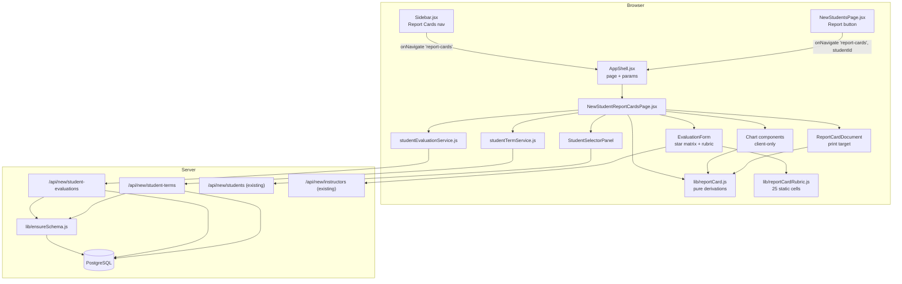
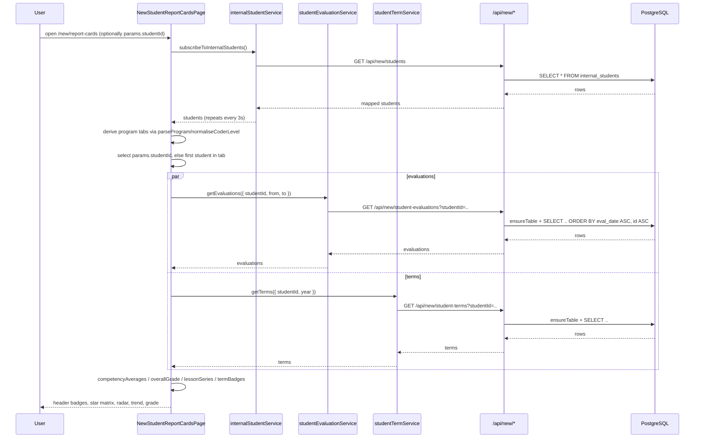
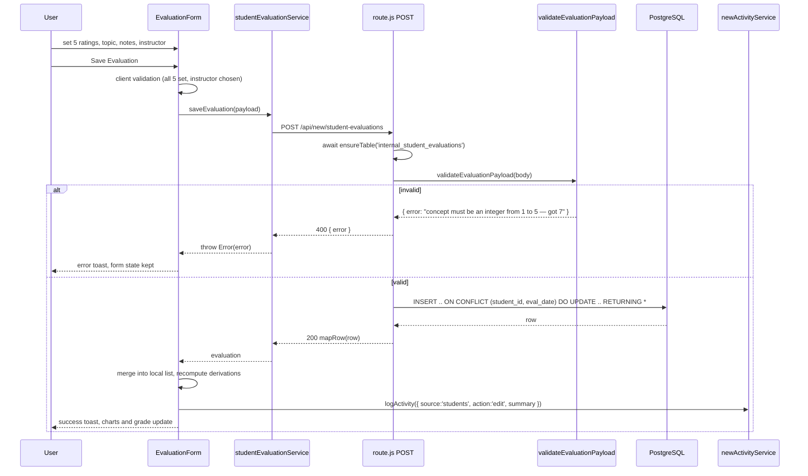
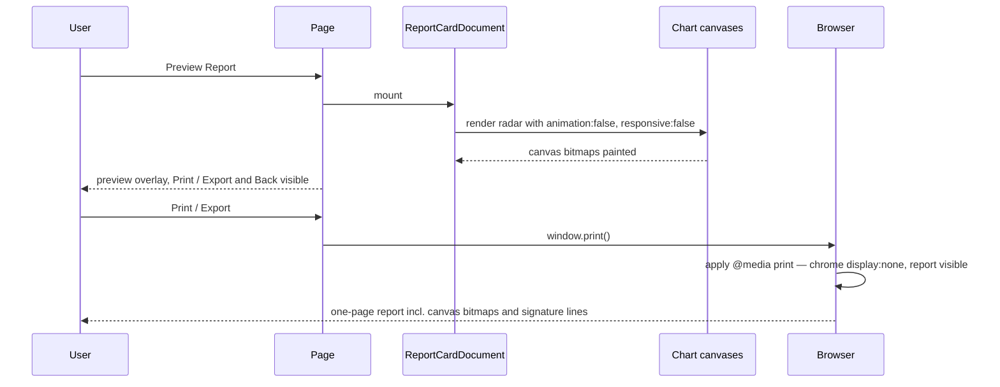

# Design Document: Student Report Cards / Learning Journey Evaluator

## Overview

A new New-Operations page at `/new/report-cards` that records a daily five-competency
evaluation for a student, charts the history, and prints a one-page Student Learning
Journey Report. Two new tables carry the data: `internal_student_evaluations` (one row
per student per day) and `internal_student_terms` (one row per student per term per
year, driving the T1–T4 badges on the student header).

The page is a left sidebar (Kinder / Junior / Coder program tabs plus a filtered
student list, reusing the filter behaviour of `NewStudentsPage`) and a right panel
holding the evaluator form, a Competency Map radar, an Average Progress Trend line
chart, a rubric reference, a Preview Report mode and a Print / Export action. All
derived numbers — competency averages, the overall grade band, the L1…Ln lesson
labels, the term badge states — come from one pure module, `src/lib/reportCard.js`,
so the on-screen charts and the printed report can never disagree.

Everything here follows the shapes already in the repository: `ensureTable()`
self-provisioning, the `mapRow` whitelist route style of
`src/app/api/new/students/route.js`, the polling client service of
`src/services/internalStudentService.js`, and Vitest + fast-check property tests under
`__tests__/`.

---

## Grounding: what was read, and what was verified

| File read | Fact this design relies on |
| --- | --- |
| `src/lib/ensureSchema.js` | `DEFINITIONS` maps a table name to an ordered list of steps; a step is either a SQL string or `{ trigger, table }`. `ensureTable(name)` is cached per process in an `inFlight` map and un-caches on failure so the next request retries. The file's own comment states the app's DB user does **not** own the original tables — `ALTER TABLE` is refused with "must be owner of table" — which is why new companion tables are the only option. |
| `src/lib/db.js` | `query(text, params)` and `withTransaction(fn, { timeoutMs })` (default 30 000 ms, `SET LOCAL statement_timeout`, advisory-lock friendly). A missing `DATABASE_URL` throws a descriptive error rather than an `ECONNREFUSED`. |
| `src/lib/listQuery.js` | `buildListQuery(searchParams, { searchColumns, filters, arrayFilters })` returns `{ clause, params, limit }` where `clause` already includes the `WHERE` keyword; `limit` is clamped to 500. `withLimit(sql, params, limit)` appends `LIMIT $n`. **There is no range-comparison support** — confirmed by reading; only `ILIKE` search, `=` filters and `= ANY(array)` filters exist. The date range therefore needs a small local extension (see §"GET query construction"). |
| `src/app/api/new/students/route.js` | Canonical route shape: a module-level `mapRow` whitelist, `GET/POST/PUT/DELETE` exported, `NextResponse.json`, `400` for missing required fields, `404` when `rowCount === 0`, and `catch (error) → { error: error.message }` with `500`. Single-student `DELETE ?id=` deletes only the student row. |
| `src/app/api/new/live-progress/route.js` | The precedent for `ensureTable` in a route (`const ready = () => ensureTable('internal_live_progress')`), for `ON CONFLICT … DO UPDATE` upserts, and for **rejecting** rather than coercing bad payloads ("a silently missing tick is worse than a failed save"). |
| `src/lib/bulkWipeStudents.js` | The wipe deletes `internal_live_progress`, `internal_student_history` and `internal_students` inside one transaction behind `pg_advisory_xact_lock(774120531)`, and returns exactly three counts. |
| `src/views/NewStudentsPage.jsx` | Four filter controls (`search`, `filterLevel`, `filterBranch`, `filterStatus`), `normaliseCoderLevel` applied when comparing levels, `Pagination`, `useToast()`, `subscribeToInternalStudents` polling every 3 s, `logActivity` usage, and the ACTIONS cell — a centred flex row of two icon buttons (`Pencil`, `Trash2`) with `gap: 0.5rem` — where the third "Report" button goes. Also: the page currently takes **no props** (`export default function NewStudentsPage()`), so it must be given `{ onNavigate }` to navigate. |
| `src/lib/programRules.js` | `STUDENT_LEVELS` (7 levels), `CODER_LEVELS`, `CATEGORIES = ['Kinder','Junior','Coder']`, `CATEGORY_LEVELS`, `LESSONS_PER_LEVEL = 10`, `parseProgram()` (returns `category`), `normaliseCoderLevel()`. `STUDENT_LEVELS` lives here, **not** in `src/utils/constants.js` — the brief's pointer was wrong; `constants.js` holds branches, days and meeting-tag parsing only. |
| `src/components/layout/Sidebar.jsx` | `NEW_OPS_PAGES` array, and the new-ops nav is a hand-written list of `<button>` elements (not a `.map`) with `Students` then `Instructors`. `ClipboardList` and `FileText` are **already imported** from `lucide-react` at the top of the file. |
| `src/components/layout/AppShell.jsx` | Registration is an `if/else if` chain on `currentPage` inside `opsMode === 'new'`, with an unknown page falling through to `NewSchedulePage`. `handleNavigate(page, params)` stores `params` in state and pushes `/new/{page}` via `history.pushState`; the active page receives `onNavigate` and `params` as props. |
| `src/views/NewLeavePage.jsx`, `src/views/LeavePage.jsx` | The params precedent: `useState(params?.instructor || '')` plus an effect `if (params?.instructor) setName(params.instructor)` keyed on `[params?.instructor]`. |
| `src/services/internalStudentService.js` | Client service pattern: a `const API_PATH`, one `fetch` per verb, `if (!res.ok) throw new Error(errData.error || …)`, and `subscribeToX(callback)` that polls every 3 000 ms and returns an unsubscribe. |
| `src/services/newActivityService.js` | `logActivity({ action, summary, count, userEmail, source })` never throws — it returns `null` on failure. |
| `package.json` | Next `16.2.5`, React/React-DOM `19.2.4`, `pg ^8.22.0`, `lucide-react ^0.468.0`, no TypeScript, no chart library yet. `npm run test` is `vitest --run`; `npm run test:integration` uses `vitest.integration.config.mjs`. |
| `src/lib/__tests__/wipeReporting.property.test.js` | Test convention: `import fc from 'fast-check'`, `describe(...)`, and a comment immediately above each `it` reading `// Feature: <spec-name>, Property N: <statement>`, with `Req x.y` references inside the assertions. |
| `src/app/api/new/openapi.json/route.js` | A `crud({ tag, path, schemaName, listDescription, createDescription, extraListParams })` helper generates the four operations; per-path overrides are spread in afterwards. New endpoints slot in through `crud()`. |
| `docs/new-operations-api.md` | Numbered sections; §4 has the endpoint table, §6 has one `### Record shape` block per endpoint. Two new blocks and two new table rows are needed. |
| Whole repo grep for `@media print` | **No print stylesheet exists anywhere.** The print rules are entirely new. `src/app/globals.css` is the live stylesheet (`.dashboard-container`, `.dashboard-views`, `.sidebar`, `.panel`); the root `styles.css` is the legacy standalone file and is not what Next serves. |

Flagged as **not verified**:

- The academy's real academic-director name, and whether the printed academy header
  text is exactly `STEM & CODING ACADEMY` / `STUDENT LEARNING JOURNEY REPORT`. Taken
  from the brief's transcription of the screenshots; needs confirming before print
  layout is signed off.
- Canvas print fidelity. Chart.js draws to `<canvas>`; how a given browser rasterises
  that canvas into a print job cannot be verified by reading code. §"Printing" states
  the constraints and the manual check that must be run.
- `chart.js@4.5.0` and `react-chartjs-2@5.3.1` are chosen from published release notes
  ([react-chartjs-2 changelog](https://github.com/reactchartjs/react-chartjs-2/blob/master/CHANGELOG.md) — 5.3.0 added React 19 support, 5.3.1 is the current patch; chart.js 4.5.0 is the current 4.x). Neither is installed in this repo yet, so the resolved tree is unverified until `npm install` runs. Content was rephrased for compliance with licensing restrictions.
- Whether the DB user may create `UNIQUE` constraints and `SERIAL` sequences in this
  database. Every other table in `ensureSchema.js` does both, so this is near-certain,
  but it has not been executed against production.

---

## Resolved design questions

| # | Question | Decision |
| --- | --- | --- |
| D1 | Two evaluations for the same student on the same date? | **No.** `UNIQUE (student_id, eval_date)`. `POST` is an upsert (`ON CONFLICT … DO UPDATE`), so re-saving a day edits that day rather than duplicating it. Precedent: `internal_live_progress` upserts on `(student_name, program_code)`, `internal_operationals` on `(branch_name, day)`. |
| D2 | Can a partially filled evaluation be saved? | **No.** All five scores are `NOT NULL` and `CHECK (… BETWEEN 1 AND 5)`. A missing score is a `400` naming the competency; a non-integer or out-of-range score is a `400` naming the competency and the received value. Nothing is coerced or defaulted — an evaluation with an invented 3 is worse than a refused save. `lessonTopic`, `instructorNotes` and `instructorName` stay optional. |
| D3 | Column named `date`? | Renamed to **`eval_date`**. `date` is a type name; leaving it as a column forces quoting in every `ORDER BY` and is a standing trip hazard. The API JSON key stays `date`, translated by `mapRow`. |
| D4 | How does a date-ordered list become L1…L10? | Sort ascending by `(eval_date, id)` — `id` breaks same-day ties deterministically, though D1 makes ties impossible for one student. The *i*-th evaluation (0-based) is labelled `L{i+1}`. With more than 10 evaluations the chart shows the **last 10 points with their true ordinals** (e.g. `L7`…`L16`), so a label always identifies the same lesson for the life of the record. The window size is `LESSONS_PER_LEVEL` from `programRules.js`, not a new literal. |
| D5 | Overall grade banding | Applied to the overall score **after** rounding to one decimal, so the printed number and the printed label can never contradict each other. `≥ 4.5 EXCELLENT`, `≥ 3.5 VERY GOOD`, `≥ 2.5 GOOD`, `≥ 1.5 DEVELOPING`, `≥ 1.0 BEGINNING`. Zero evaluations → `NOT YET ASSESSED` with **no** numeric score rendered anywhere (not `0.0/5` — a zero would read as a failing grade). |
| D6 | Radar: latest evaluation or average? | **Average over the evaluations currently in range.** "Competency Map" on screen and "Performance Breakdown" on the report are the same dataset from the same function, and "Competency Mastery Summary" prints those same five numbers as `x.x / 5.0`. With exactly one evaluation the average *is* that evaluation, which is why the screenshots look like a single-day radar. The latest single evaluation is still visible — it is what the star matrix shows while editing. |
| D7 | Printing | A `@media print` block hides app chrome (`.sidebar`, `.dashboard-header`/`Header`, `.panel-header` actions, nav, toasts) and prints only `#report-card-print`. Chrome is hidden by `display: none` on the chrome, **never** on an ancestor of the report or its canvases. Charts are configured `animation: false`, `responsive: false`, fixed CSS pixel size, `devicePixelRatio: 2`. The report node is mounted and laid out on screen (Preview Report mode) before printing, so the canvas already holds a rendered bitmap. `print-color-adjust: exact` keeps badge and star colours. See §"Printing" for the full reasoning and the manual check. |
| D8 | Term subscription model | `internal_student_terms`: one row per `(student_id, term_year, term_number 1..4)` with a `paid` boolean. **Start term** = the earliest row by `(term_year, term_number)`. **Current term** = the latest **paid** row; with no paid rows there is no current term and the header shows `—`. Both are derived, never stored, so "one current term per student" holds by construction. Badge states: `paid` (filled), `unpaid` (a row exists, `paid = false` → outline), `absent` (no row → dashed/muted). The current term additionally carries a ring. |
| D9 | Instructor name: free text or constrained? | Stored as `VARCHAR(255)` with **no** FK (same ownership constraint as `student_id`), so a renamed or departed instructor never breaks history. The UI renders a `<select>` over `/api/new/instructors` names **plus** the value already on the record if it is not in that list, so old rows stay editable. Default, in order: the instructor on this student's most recent evaluation → the signed-in user's matching instructor name (trim + case-fold compare) → empty. The form requires a selection before Save; the API accepts `null` so imports and back-fills are possible. |
| D10 | Orphan evaluations when a student is deleted | Same as `internal_student_history`: `DELETE /api/new/students?id=` removes only the student row, so evaluation and term rows survive as orphans. They are unreachable through the UI, which only lists students returned by `/api/new/students`. Documented in `docs/new-operations-api.md` as a known limitation. **Flagged for the requirements phase:** extending `bulkWipeStudents()` to also clear these two tables would change its three-count return contract, which `wipeReporting.js` labels and the `student-data-bulk-wipe` property tests assert. That is a deliberate cross-spec change, not something to slip in here. |

---

## Architecture



Two rules the diagram encodes. First, every derived number flows through
`lib/reportCard.js`, so the radar, the trend line, the grade badge and the printed
Competency Mastery Summary are one computation with several renderers. Second, the
chart components are the only modules that import `chart.js`, and they are loaded
through `next/dynamic` with `ssr: false`, so nothing that touches `window` is ever
evaluated during server rendering.

---

## Sequence diagrams

### Load a student's report card



### Save a daily evaluation (upsert)



### Preview and print



---

## Data Models

### `internal_student_evaluations`

Added to `DEFINITIONS` in `src/lib/ensureSchema.js` so a fresh database heals itself,
exactly as `internal_live_progress` does. No hand-run script.

```javascript
internal_student_evaluations: [
  `CREATE TABLE IF NOT EXISTS internal_student_evaluations (
      id SERIAL PRIMARY KEY,
      student_id INTEGER NOT NULL,
      eval_date DATE NOT NULL DEFAULT CURRENT_DATE,
      lesson_topic TEXT,
      concept INTEGER NOT NULL CHECK (concept BETWEEN 1 AND 5),
      building INTEGER NOT NULL CHECK (building BETWEEN 1 AND 5),
      problem_solving INTEGER NOT NULL CHECK (problem_solving BETWEEN 1 AND 5),
      focus INTEGER NOT NULL CHECK (focus BETWEEN 1 AND 5),
      attitude INTEGER NOT NULL CHECK (attitude BETWEEN 1 AND 5),
      instructor_notes TEXT,
      instructor_name VARCHAR(255),
      created_at TIMESTAMP WITH TIME ZONE DEFAULT CURRENT_TIMESTAMP,
      updated_at TIMESTAMP WITH TIME ZONE DEFAULT CURRENT_TIMESTAMP,
      CONSTRAINT internal_student_evaluations_student_date_key
          UNIQUE (student_id, eval_date)
  )`,
  `CREATE INDEX IF NOT EXISTS internal_student_evaluations_student_date_idx
      ON internal_student_evaluations (student_id, eval_date)`,
  { trigger: 'update_internal_student_evaluations_changetimestamp',
    table: 'internal_student_evaluations' },
]
```

Notes. No FK on `student_id` — the app's DB user does not own `internal_students`,
so a referencing constraint cannot be created (`ensureSchema.js` documents the
refusal); `internal_student_history` sets the precedent. `NOT NULL` on the five
scores is the schema half of D2, the `CHECK`s are the range half, and the database
therefore refuses a bad row even if a future caller bypasses the route validator.
The trigger step is best-effort — `provision()` catches trigger failures and warns —
so `updated_at` may stay at its default on PostgreSQL below 14; nothing in this
feature reads `updated_at`.

### `internal_student_terms`

```javascript
internal_student_terms: [
  `CREATE TABLE IF NOT EXISTS internal_student_terms (
      id SERIAL PRIMARY KEY,
      student_id INTEGER NOT NULL,
      term_year INTEGER NOT NULL CHECK (term_year BETWEEN 2000 AND 2100),
      term_number INTEGER NOT NULL CHECK (term_number BETWEEN 1 AND 4),
      paid BOOLEAN NOT NULL DEFAULT FALSE,
      paid_at DATE,
      note TEXT,
      created_at TIMESTAMP WITH TIME ZONE DEFAULT CURRENT_TIMESTAMP,
      updated_at TIMESTAMP WITH TIME ZONE DEFAULT CURRENT_TIMESTAMP,
      CONSTRAINT internal_student_terms_student_term_key
          UNIQUE (student_id, term_year, term_number)
  )`,
  `CREATE INDEX IF NOT EXISTS internal_student_terms_student_idx
      ON internal_student_terms (student_id, term_year, term_number)`,
  { trigger: 'update_internal_student_terms_changetimestamp',
    table: 'internal_student_terms' },
]
```

`term_year` rather than `year` for the same reason as `eval_date`. There is no
`is_current` column: "current" is derived (D8), which makes a second current term
unrepresentable rather than merely discouraged.

### API record shapes

```javascript
/**
 * @typedef {Object} Evaluation
 * @property {number} id
 * @property {number} studentId
 * @property {string} date            ISO 'YYYY-MM-DD' (column eval_date)
 * @property {string|null} lessonTopic
 * @property {number} concept         integer 1..5
 * @property {number} building        integer 1..5
 * @property {number} problemSolving  integer 1..5
 * @property {number} focus           integer 1..5
 * @property {number} attitude        integer 1..5
 * @property {string|null} instructorNotes
 * @property {string|null} instructorName
 * @property {string} createdAt
 * @property {string} updatedAt
 */

/**
 * @typedef {Object} StudentTerm
 * @property {number} id
 * @property {number} studentId
 * @property {number} year          term_year
 * @property {number} termNumber    1..4
 * @property {boolean} paid
 * @property {string|null} paidAt
 * @property {string|null} note
 * @property {string} createdAt
 * @property {string} updatedAt
 */
```

Both routes expose a `mapRow` whitelist, matching `students/route.js`, so no column
added later leaks into the API surface by accident.

### Derived view models

```javascript
/** @typedef {'concept'|'building'|'problemSolving'|'focus'|'attitude'} CompetencyKey */

/** @typedef {Record<CompetencyKey, number>} CompetencyAverages   each in [1,5] */

/**
 * @typedef {Object} OverallGrade
 * @property {number|null} score  mean of the five averages, 1dp, or null when n === 0
 * @property {string} label       EXCELLENT | VERY GOOD | GOOD | DEVELOPING | BEGINNING | NOT YET ASSESSED
 * @property {number} rank        0 for NOT YET ASSESSED, then 1..5 ascending
 */

/**
 * @typedef {Object} LessonSeries
 * @property {string[]} labels   e.g. ['L1',..,'L10'] or ['L7',..,'L16']
 * @property {number[]} values   per-evaluation mean of the five scores, same length
 * @property {string[]} dates    ISO date behind each point, for tooltips
 */

/**
 * @typedef {Object} TermBadge
 * @property {number} termNumber        1..4
 * @property {'paid'|'unpaid'|'absent'} state
 * @property {boolean} current          at most one badge is true
 * @property {string} label             'T1'..'T4'
 */

/**
 * @typedef {Object} TermSummary
 * @property {{year:number, termNumber:number}|null} startTerm
 * @property {{year:number, termNumber:number}|null} currentTerm
 * @property {TermBadge[]} badges       always length 4, ordered T1..T4
 */
```

### Rubric — `src/lib/reportCardRubric.js`

All 25 cells, static and hardcoded, keyed so a lookup is total over
`competency × 1..5`. The brief supplies levels 1 and 5 verbatim; levels 2–4 below are
the graduated wording implied by the screenshots' full five-level table and are
marked for review by whoever owns the rubric text.

```javascript
export const COMPETENCIES = [
  { key: 'concept',        column: 'concept',         label: 'Concept',         color: '#3b82f6' },
  { key: 'building',       column: 'building',        label: 'Building',        color: '#f97316' },
  { key: 'problemSolving', column: 'problem_solving', label: 'Problem Solving', color: '#10b981' },
  { key: 'focus',          column: 'focus',           label: 'Focus',           color: '#8b5cf6' },
  { key: 'attitude',       column: 'attitude',        label: 'Attitude',        color: '#ec4899' },
];

/** competency key -> rating 1..5 -> descriptor. 5 x 5 = 25 cells, none empty. */
export const RUBRIC_LEVELS = {
  concept: {
    5: 'Excellent independent understanding',
    4: 'Good understanding with minimal prompting',
    3: 'Understands with some guidance',
    2: 'Developing understanding, needs frequent guidance',
    1: 'Beginning with support',
  },
  building: {
    5: 'Builds independently',
    4: 'Builds with minimal help',
    3: 'Builds with regular help',
    2: 'Builds only with step-by-step guidance',
    1: 'Early stage',
  },
  problemSolving: {
    5: 'Solves independently',
    4: 'Solves with minor hints',
    3: 'Solves with guided questions',
    2: 'Solves with substantial help',
    1: 'Needs significant support',
  },
  focus: {
    5: 'Follows perfectly',
    4: 'Follows well with occasional reminders',
    3: 'Follows with regular reminders',
    2: 'Often distracted, needs redirection',
    1: 'Needs extra guidance',
  },
  attitude: {
    5: 'Very positive & enthusiastic',
    4: 'Positive and willing',
    3: 'Generally cooperative',
    2: 'Inconsistent engagement',
    1: 'Needs guidance',
  },
};

/** Total over the domain: any competency key, any rating 1..5. */
export function descriptorFor(competencyKey, rating) { /* see §Key functions */ }
```

The Standardized Scoring Table Guidelines view renders `RUBRIC_LEVELS` directly as a
5 × 5 grid, so the reference panel, the italic descriptor under each star row, and the
full-page guidelines can never drift apart.

---

## Components and Interfaces

### `src/views/NewStudentReportCardsPage.jsx`

**Purpose**: the page. Owns selection, data loading, mode (`evaluate` | `preview` |
`rubric`) and nothing else derivable.

```javascript
/**
 * @param {Object} props
 * @param {(page: string, params?: object) => void} props.onNavigate
 * @param {{ studentId?: number|string, studentName?: string }|null} props.params
 */
export default function NewStudentReportCardsPage({ onNavigate, params })
```

Responsibilities: subscribe to students (3 s poll, same helper as
`NewStudentsPage`); derive the three program tabs from each student's level via
`parseProgram(...).category` with `normaliseCoderLevel` folding; honour
`params?.studentId` on mount and on change, following the `LeavePage` precedent;
load evaluations and terms for the selected student; hold the optional date range;
pass derived view models down; switch modes.

### `StudentSelectorPanel`

**Purpose**: left sidebar. Program tabs plus the searchable, filterable student list.

```javascript
/**
 * @param {Object} props
 * @param {Array<Student>} props.students
 * @param {'Kinder'|'Junior'|'Coder'} props.category
 * @param {(c: string) => void} props.onCategoryChange
 * @param {number|null} props.selectedStudentId
 * @param {(id: number) => void} props.onSelectStudent
 */
```

Reuses `NewStudentsPage`'s filter semantics: a case-insensitive `search` across name,
parent name and contact; a branch select built from `enabledBranches`/`branches` in
`useSchedule()`; a status select. Level filtering is replaced by the category tab,
which is the same comparison one step coarser. The filter predicate is extracted to
`src/lib/studentFilter.js` and imported by both pages, so "reusing the
NewStudentsPage filter" is literal reuse rather than a copy.

### `EvaluationForm`

**Purpose**: date, lesson topic, instructor, five coloured star rows with a live
italic descriptor, instructor remarks, Save.

```javascript
/**
 * @param {Object} props
 * @param {Evaluation|null} props.evaluation      the row for the chosen date, if any
 * @param {string} props.date                     ISO 'YYYY-MM-DD'
 * @param {string[]} props.instructorNames
 * @param {(payload: EvaluationInput) => Promise<void>} props.onSave
 */
```

Each row is a `radiogroup` of five buttons with `aria-label` carrying the descriptor,
so the rating is reachable by keyboard and announced with its meaning rather than as
"star 4". The descriptor line reads `descriptorFor(key, value)`.

### `CompetencyRadarChart`, `ProgressTrendChart`

**Purpose**: the only modules importing `chart.js`.

```javascript
'use client';
import { Chart as ChartJS, RadialLinearScale, PointElement, LineElement,
         Filler, Tooltip, Legend } from 'chart.js';
import { Radar } from 'react-chartjs-2';
ChartJS.register(RadialLinearScale, PointElement, LineElement, Filler, Tooltip, Legend);

/**
 * @param {Object} props
 * @param {CompetencyAverages|null} props.averages
 * @param {{ width?: number, height?: number }} [props.size]
 */
export default function CompetencyRadarChart({ averages, size })
```

Loaded by the page as
`const CompetencyRadarChart = dynamic(() => import('@/components/reportcards/CompetencyRadarChart'), { ssr: false })`.
Both accept `null` data and render an explicit empty state ("No evaluations yet")
instead of an axis with no plot.

**Why `react-chartjs-2` rather than a bare canvas ref** (decision D). The wrapper's
job is exactly the part that is tedious to get right by hand: creating the chart after
mount, calling `chart.update()` when `data`/`options` change identity, and — the one
that actually bites — `chart.destroy()` on unmount. This page swaps students on every
click and unmounts charts when entering the rubric view, so a missed `destroy()` leaks
a Chart.js instance and its resize observer per selection, and React 19 Strict Mode
double-invokes effects, which is precisely where hand-rolled canvas code leaves a
second chart bound to the same canvas ("Canvas is already in use"). 6 kB of wrapper
against reimplementing that is a clear trade. The SSR concern is orthogonal: both
approaches touch `window` through Chart.js itself, so both need the same
`ssr: false` boundary, and the wrapper does not make it worse.

### `ReportCardDocument`

**Purpose**: the printable report. The only element visible under `@media print`.

```javascript
/**
 * @param {Object} props
 * @param {Student} props.student
 * @param {CompetencyAverages|null} props.averages
 * @param {OverallGrade} props.grade
 * @param {TermSummary} props.terms
 * @param {Evaluation|null} props.latest        remarks + lead instructor come from here
 * @param {{ leadInstructor: string, academicDirector: string }} props.signatories
 */
```

Layout, top to bottom: academy header; a student row (name / instructor / current term
/ overall grade); Performance Breakdown (the radar); Competency Mastery Summary (five
`label — x.x / 5.0` lines); Instructor Remarks; two signature lines, `Lead Instructor`
and `Academic Director`, with names printed beneath. Root id `report-card-print`.

### `ScoringGuidelinesPanel`

**Purpose**: both the compact rubric reference beside the form and the full-page
Standardized Scoring Table Guidelines view — one component, a `variant` prop.

### Existing files touched

| File | Change |
| --- | --- |
| `src/lib/ensureSchema.js` | Two new `DEFINITIONS` entries. |
| `src/components/layout/Sidebar.jsx` | `'report-cards'` added to `NEW_OPS_PAGES`; a nav `<button>` with `<ClipboardList size={20} />` inserted **between** the Students and Instructors buttons, matching the surrounding markup exactly. `ClipboardList` is already imported. |
| `src/components/layout/AppShell.jsx` | Import `NewStudentReportCardsPage`; add `else if (currentPage === 'report-cards')` to the new-ops chain, before the `api` branch. |
| `src/views/NewStudentsPage.jsx` | Accept `{ onNavigate }`; add a third icon button (`FileText`, title "Report Card") to the ACTIONS cell calling `onNavigate('report-cards', { studentId: st.id, studentName: st.name })`. Widen the Actions column from `100px` to `140px`. |
| `src/app/globals.css` | New `@media print` block and report-card styles. |
| `src/app/api/new/openapi.json/route.js` | Two `crud()` spreads plus `extraListParams` for `studentId`, `from`, `to`, `year`. |
| `docs/new-operations-api.md` | Two rows in the §4 endpoint table; two `### Record shape` blocks in §6; the orphan-row limitation in §7. |
| `package.json` | `chart.js` and `react-chartjs-2`, pinned exactly. |

---

## Key Functions with Formal Specifications

All in `src/lib/reportCard.js` unless stated. Pure, no imports from React or `pg`,
so every one is directly testable with fast-check.

### `competencyAverages(evaluations)`

```javascript
/**
 * @param {Evaluation[]} evaluations
 * @returns {CompetencyAverages|null}
 */
export function competencyAverages(evaluations)
```

**Preconditions**: `evaluations` is an array; every element has the five competency
keys as integers in `[1,5]` (guaranteed by the route validator and the DB `CHECK`s).

**Postconditions**: returns `null` when the array is empty. Otherwise returns an
object with exactly the five `COMPETENCIES` keys, each value the arithmetic mean of
that column over all elements, unrounded, in `[1,5]`. Independent of input order. No
mutation of the input.

**Loop invariants**: the running sum for competency *k* after *i* elements equals the
sum of `evaluations[0..i-1][k]`; every partial sum is in `[i, 5i]`.

### `overallGrade(averages)`

```javascript
/**
 * @param {CompetencyAverages|null} averages
 * @returns {OverallGrade}
 */
export function overallGrade(averages)
```

**Preconditions**: `averages` is `null`, or holds the five keys with values in `[1,5]`.

**Postconditions**: for `null`, returns `{ score: null, label: 'NOT YET ASSESSED', rank: 0 }`.
Otherwise `score` is the mean of the five values rounded to one decimal and lies in
`[1.0, 5.0]`; `label` is the band of that **rounded** score under D5; `rank` rises
with the band. Total: never throws, never returns an empty label.

**Loop invariants**: N/A.

### `lessonSeries(evaluations, { window = LESSONS_PER_LEVEL })`

```javascript
/**
 * @param {Evaluation[]} evaluations
 * @param {{ window?: number }} [options]
 * @returns {LessonSeries}
 */
export function lessonSeries(evaluations, options)
```

**Preconditions**: `evaluations` is an array of rows for **one** student; each `date`
is an ISO `YYYY-MM-DD`; `window` is a positive integer.

**Postconditions**: `labels`, `values` and `dates` have equal length
`min(n, window)`. Ordering is ascending by `(date, id)`. Label at output index *j* is
`'L' + (n - min(n, window) + j + 1)`, so with `n ≤ window` the labels are exactly
`L1…Ln` and with `n > window` they are the last `window` true ordinals. `values[j]` is
the mean of the five scores of that evaluation and lies in `[1,5]`. Input not mutated.

**Loop invariants**: the emitted labels are strictly increasing by 1; `dates` is
non-decreasing.

### `termSummary(terms, { year })`

```javascript
/**
 * @param {StudentTerm[]} terms
 * @param {{ year?: number }} [options]
 * @returns {TermSummary}
 */
export function termSummary(terms, options)
```

**Preconditions**: `terms` is an array of rows for one student; each has integer
`year` and `termNumber` in `[1,4]` and a boolean `paid`. `year` defaults to the
greatest `year` present, else the current calendar year.

**Postconditions**: `badges` has length 4, ordered `T1…T4`, each state `paid` /
`unpaid` / `absent` derived only from rows in the selected year. `startTerm` is the
`(year, termNumber)`-minimum over **all** rows, or `null` when there are none.
`currentTerm` is the `(year, termNumber)`-maximum over rows with `paid === true`, or
`null`. When `currentTerm` exists it is not less than `startTerm`. At most one badge
has `current === true`, and only when `currentTerm.year` is the selected year.

**Loop invariants**: the running minimum and maximum are each equal to the min/max of
the prefix scanned so far.

### `descriptorFor(competencyKey, rating)` — `reportCardRubric.js`

```javascript
/**
 * @param {CompetencyKey} competencyKey
 * @param {number} rating
 * @returns {string}
 */
export function descriptorFor(competencyKey, rating)
```

**Preconditions**: none — the function is defensive because it is called from render.

**Postconditions**: for a known key and an integer rating in `[1,5]`, returns the
non-empty descriptor from `RUBRIC_LEVELS`. For anything else returns `''`, never
`undefined` and never throws, so a bad value renders as an empty descriptor line
rather than crashing the page.

### `validateEvaluationPayload(body)` — `src/lib/evaluationValidation.js`

```javascript
/**
 * @param {any} body
 * @returns {{ value: EvaluationInput } | { error: string }}
 */
export function validateEvaluationPayload(body)
```

**Preconditions**: none; `body` is untrusted request JSON.

**Postconditions**: exactly one of `value` or `error` is present. `error` is a single
non-empty sentence naming the offending field and, where relevant, the received
value. On success, `value.studentId` is a positive integer, `value.date` matches
`/^\d{4}-\d{2}-\d{2}$/` and is a real calendar date, each of the five scores is an
integer in `[1,5]`, and `lessonTopic` / `instructorNotes` / `instructorName` are
strings or `null` with `instructorName` at most 255 characters. Nothing is coerced
into range — out-of-range is an error, never a clamp. `body` is not mutated.

**Loop invariants**: over the five competencies, all previously checked scores were
valid whenever the loop continues.

### `buildEvaluationListQuery(searchParams)` — inside the route module

```javascript
/**
 * @param {URLSearchParams} searchParams
 * @returns {{ clause: string, params: any[], limit: number|null }}
 */
function buildEvaluationListQuery(searchParams)
```

**Preconditions**: `searchParams` is a `URLSearchParams`.

**Postconditions**: delegates to `buildListQuery` for `search`, the equality filters
and `limit`, then appends `eval_date >= $n` and/or `eval_date <= $n` for `from`/`to`.
The number of `$n` placeholders in `clause` equals `params.length`; no value from
`searchParams` appears as literal text in `clause`. An invalid `from`/`to` is rejected
upstream by the route with a `400` rather than silently dropped.

---

## Algorithmic pseudocode

Plain JavaScript, per decision E (JS + JSDoc, no TypeScript).

### Competency averages

```javascript
export function competencyAverages(evaluations) {
  const rows = Array.isArray(evaluations) ? evaluations : [];
  if (rows.length === 0) return null;                    // n === 0 -> null (D6, D5)

  const sums = { concept: 0, building: 0, problemSolving: 0, focus: 0, attitude: 0 };

  for (const row of rows) {
    // INVARIANT: each sums[k] is the sum of the prefix scanned so far, in [i, 5i].
    for (const { key } of COMPETENCIES) {
      sums[key] += Number(row[key]);
    }
  }

  const out = {};
  for (const { key } of COMPETENCIES) out[key] = sums[key] / rows.length;
  return out;                                            // each value in [1,5]
}
```

### Overall grade and banding

```javascript
/** Descending thresholds. First match wins, so the table is the single source. */
const GRADE_BANDS = [
  { min: 4.5, label: 'EXCELLENT',  rank: 5 },
  { min: 3.5, label: 'VERY GOOD',  rank: 4 },
  { min: 2.5, label: 'GOOD',       rank: 3 },
  { min: 1.5, label: 'DEVELOPING', rank: 2 },
  { min: 1.0, label: 'BEGINNING',  rank: 1 },
];

export const NOT_ASSESSED = { score: null, label: 'NOT YET ASSESSED', rank: 0 };

export function overallGrade(averages) {
  if (!averages) return NOT_ASSESSED;                    // zero evaluations (D5)

  let total = 0;
  for (const { key } of COMPETENCIES) total += Number(averages[key]);
  const mean = total / COMPETENCIES.length;

  // Rounded FIRST, then banded. Banding the raw mean would let 4.46 print as
  // "4.5" under the VERY GOOD label — a contradiction on a document parents keep.
  const score = Math.round(mean * 10) / 10;

  const band = GRADE_BANDS.find((b) => score >= b.min) || GRADE_BANDS[GRADE_BANDS.length - 1];
  return { score, label: band.label, rank: band.rank };
}
```

### Lesson labels from dates

```javascript
export function lessonSeries(evaluations, { window = LESSONS_PER_LEVEL } = {}) {
  const rows = (Array.isArray(evaluations) ? evaluations : []).slice();

  // Date first, id second. D1 makes same-day ties impossible for one student, so
  // the id tiebreak exists only to make the order total for imported data.
  rows.sort((a, b) => String(a.date).localeCompare(String(b.date)) || (a.id - b.id));

  const n = rows.length;
  const start = Math.max(0, n - window);                 // sliding window (D4)
  const labels = [];
  const values = [];
  const dates = [];

  for (let i = start; i < n; i += 1) {
    // INVARIANT: labels are strictly increasing by 1; dates are non-decreasing.
    labels.push(`L${i + 1}`);                            // true ordinal, not 1..10
    let total = 0;
    for (const { key } of COMPETENCIES) total += Number(rows[i][key]);
    values.push(total / COMPETENCIES.length);
    dates.push(rows[i].date);
  }

  return { labels, values, dates };
}
```

### Term badges, start term and current term

```javascript
const TERM_NUMBERS = [1, 2, 3, 4];
const before = (a, b) => a.year !== b.year ? a.year < b.year : a.termNumber < b.termNumber;

export function termSummary(terms, { year } = {}) {
  const rows = (Array.isArray(terms) ? terms : []).filter(
    (t) => Number.isInteger(t?.termNumber) && t.termNumber >= 1 && t.termNumber <= 4
  );

  const selectedYear = Number.isInteger(year)
    ? year
    : rows.reduce((max, t) => Math.max(max, t.year), 0) || new Date().getFullYear();

  let startTerm = null;
  let currentTerm = null;
  for (const t of rows) {
    // INVARIANT: startTerm is the min, currentTerm the max over paid rows, of the
    // prefix scanned so far.
    const point = { year: t.year, termNumber: t.termNumber };
    if (startTerm === null || before(point, startTerm)) startTerm = point;
    if (t.paid && (currentTerm === null || before(currentTerm, point))) currentTerm = point;
  }

  const inYear = new Map(rows.filter((t) => t.year === selectedYear).map((t) => [t.termNumber, t]));
  const badges = TERM_NUMBERS.map((termNumber) => {
    const row = inYear.get(termNumber);
    return {
      termNumber,
      label: `T${termNumber}`,
      state: !row ? 'absent' : (row.paid ? 'paid' : 'unpaid'),
      // Current is derived, so two current badges are unrepresentable (D8).
      current: Boolean(currentTerm
        && currentTerm.year === selectedYear
        && currentTerm.termNumber === termNumber),
    };
  });

  return { startTerm, currentTerm, badges, year: selectedYear };
}
```

### Payload validation

```javascript
const ISO_DATE = /^\d{4}-\d{2}-\d{2}$/;

function isRealDate(iso) {
  const d = new Date(`${iso}T00:00:00Z`);
  return !Number.isNaN(d.getTime()) && d.toISOString().slice(0, 10) === iso;
}

export function validateEvaluationPayload(body) {
  if (!body || typeof body !== 'object' || Array.isArray(body)) {
    return { error: 'Request body must be a JSON object' };
  }

  const studentId = Number(body.studentId);
  if (!Number.isInteger(studentId) || studentId <= 0) {
    return { error: `studentId must be a positive integer — got ${JSON.stringify(body.studentId)}` };
  }

  const date = body.date == null || String(body.date).trim() === ''
    ? todayIso()                                          // server-side default
    : String(body.date).trim();
  if (!ISO_DATE.test(date) || !isRealDate(date)) {
    return { error: `date must be "YYYY-MM-DD" — got ${JSON.stringify(body.date)}` };
  }

  const scores = {};
  for (const { key, label } of COMPETENCIES) {
    const raw = body[key];
    if (raw == null || raw === '') {
      return { error: `${label} is required — every competency must be rated from 1 to 5` };
    }
    const n = Number(raw);
    if (!Number.isInteger(n) || n < 1 || n > 5) {
      // Rejected, not clamped: an invented score on a report card parents keep is
      // worse than a refused save.
      return { error: `${label} must be an integer from 1 to 5 — got ${JSON.stringify(raw)}` };
    }
    scores[key] = n;
  }

  const instructorName = body.instructorName == null ? null : String(body.instructorName).trim() || null;
  if (instructorName && instructorName.length > 255) {
    return { error: 'instructorName must be 255 characters or fewer' };
  }

  return {
    value: {
      studentId,
      date,
      ...scores,
      lessonTopic: body.lessonTopic == null ? null : String(body.lessonTopic),
      instructorNotes: body.instructorNotes == null ? null : String(body.instructorNotes),
      instructorName,
    },
  };
}
```

### The upsert, and the GET clause

```javascript
// POST — one row per student per day (D1). Re-saving a day edits it.
const res = await query(
  `INSERT INTO internal_student_evaluations
     (student_id, eval_date, lesson_topic, concept, building, problem_solving,
      focus, attitude, instructor_notes, instructor_name)
   VALUES ($1, $2::date, $3, $4, $5, $6, $7, $8, $9, $10)
   ON CONFLICT (student_id, eval_date) DO UPDATE SET
     lesson_topic = EXCLUDED.lesson_topic,
     concept = EXCLUDED.concept,
     building = EXCLUDED.building,
     problem_solving = EXCLUDED.problem_solving,
     focus = EXCLUDED.focus,
     attitude = EXCLUDED.attitude,
     instructor_notes = EXCLUDED.instructor_notes,
     instructor_name = EXCLUDED.instructor_name
   RETURNING *`,
  [v.studentId, v.date, v.lessonTopic, v.concept, v.building, v.problemSolving,
   v.focus, v.attitude, v.instructorNotes, v.instructorName]
);
```

```javascript
// GET — buildListQuery for search/filters/limit, then the date range it cannot express.
function buildEvaluationListQuery(searchParams) {
  const { clause, params, limit } = buildListQuery(searchParams, {
    searchColumns: ['lesson_topic', 'instructor_notes', 'instructor_name'],
    filters: { studentId: 'student_id', instructorName: 'instructor_name' },
  });

  const extra = [];
  const all = [...params];
  for (const [key, op] of [['from', '>='], ['to', '<=']]) {
    const value = searchParams.get(key);
    if (!value) continue;
    all.push(value);
    extra.push(`eval_date ${op} $${all.length}::date`);   // still parameterised
  }
  if (extra.length === 0) return { clause, params: all, limit };

  return {
    clause: clause ? `${clause} AND ${extra.join(' AND ')}` : `WHERE ${extra.join(' AND ')}`,
    params: all,
    limit,
  };
}
```

---

## Example Usage

```javascript
// 1. Save today's evaluation from the form.
import { saveEvaluation } from '@/services/studentEvaluationService';

const saved = await saveEvaluation({
  studentId: 42,
  date: '2026-03-04',
  lessonTopic: 'Loops and repetition',
  concept: 5, building: 5, problemSolving: 4, focus: 5, attitude: 5,
  instructorNotes: 'Grasped the repeat block immediately.',
  instructorName: 'Helen',
});
// Saving 2026-03-04 again for student 42 updates this row — no duplicate (D1).

// 2. Derive everything the page and the report render.
import { competencyAverages, overallGrade, lessonSeries, termSummary } from '@/lib/reportCard';

const averages = competencyAverages(evaluations);   // null when the list is empty
const grade = overallGrade(averages);               // { score: 4.8, label: 'EXCELLENT', rank: 5 }
const trend = lessonSeries(evaluations);            // { labels: ['L1'..'L10'], values, dates }
const terms = termSummary(termRows, { year: 2026 });// badges T1..T4, one possibly current

// 3. Empty student — nothing invents a zero.
overallGrade(competencyAverages([]));
// { score: null, label: 'NOT YET ASSESSED', rank: 0 }

// 4. Eleven evaluations — the window keeps true ordinals.
lessonSeries(elevenEvaluations).labels;
// ['L2','L3','L4','L5','L6','L7','L8','L9','L10','L11']

// 5. Mark Term 2 of 2026 paid.
import { saveTerm } from '@/services/studentTermService';
await saveTerm({ studentId: 42, year: 2026, termNumber: 2, paid: true, paidAt: '2026-03-01' });

// 6. Charts, client-only.
const CompetencyRadarChart = dynamic(
  () => import('@/components/reportcards/CompetencyRadarChart'),
  { ssr: false }
);

// 7. Report button in the students table.
onNavigate('report-cards', { studentId: st.id, studentName: st.name });
```

---

## Printing

Three separate problems, each with its own mechanism.

**Hiding the chrome.** A new `@media print` block in `src/app/globals.css` sets
`display: none` on `.sidebar`, the header, `.panel-header` action rows, the nav, the
toast container and every `.no-print` element, and clears `overflow`/`height` on
`.dashboard-container` and `.dashboard-views` so the report is not trapped in a
scroll box. `#report-card-print` gets `position: static; width: 100%; margin: 0`,
`@page { size: A4; margin: 12mm; }` and `break-inside: avoid` on each report block.
There is no existing print stylesheet in the repo, so nothing conflicts.

**Keeping the canvases.** A `<canvas>` prints as the bitmap it currently holds. Two
things blank it: an ancestor that is `display: none` when the print job is laid out
(the canvas is never sized, so there is nothing to rasterise), and a Chart.js
`responsive: true` resize triggered by the print media change, which can rebuild the
canvas at a different size mid-print. So: chrome is hidden, never an ancestor of the
report; the report is mounted and laid out on screen in Preview mode before
`window.print()` is reachable; and the charts run `responsive: false`,
`animation: false`, `devicePixelRatio: 2` with explicit width and height. Colours need
`print-color-adjust: exact` (plus `-webkit-` prefix) on the report root, since browsers
strip backgrounds by default and the star rows and term badges are colour-coded.
**This is the part of the design that must be checked in a real browser** — Chrome,
Edge and Firefox differ, and no amount of reading settles it.

**Preview versus Print / Export.** Preview Report is an in-app mode: it renders
`ReportCardDocument` at print proportions inside the page, with a Back control, so a
teacher can check the document without spending paper or opening the OS dialog.
Print / Export calls `window.print()`, which is also the browser's Save-as-PDF path,
so a single action covers both. Preview does not require printing and printing does
not require Preview, but Print / Export from evaluate mode mounts the document
off-screen-but-laid-out first (`position: absolute; left: -10000px`, never
`display: none`) for one frame so the canvases exist.

---

## Correctness Properties

Suitable for fast-check. Each becomes one `it` in a `*.property.test.js` file with a
`// Feature: student-report-cards, Property N: …` header comment, the convention
`wipeReporting.property.test.js` already uses.

The `Validates: Requirements` references below are **resolved**. `requirements.md` was
derived from this document and adopted the grouping below unchanged, so no renumbering
was needed; the references now point at specific acceptance criteria in that file:

| Group | Requirement | Scope |
| --- | --- | --- |
| 1.x | Requirement 1 | Evaluation record, scores, rubric and validation rules |
| 2.x | Requirement 2 | Evaluation and term API contracts (shapes, upsert, filters) |
| 3.x | Requirement 3 | Derived numbers: averages, overall grade, charts |
| 4.x | Requirement 4 | Term subscriptions and the T1–T4 badges |
| 5.x | Requirement 5 | Report layout, preview and printing |
| 6.x | Requirement 6 | Navigation, student selection and the Report button |

Requirements phase note: the four open items at the end of this document are closed in
`requirements.md`. Branding and signatory names are configuration (Req 5.2, 5.3);
rubric levels 1 and 5 are verbatim and 2–4 are provisional pending the rubric owner,
held in one module (Req 1.15, 1.16); `bulkWipeStudents()` is unchanged and the orphan
rows are a documented limitation (Req 2.15, 2.16); and a term row carries `paid`,
`paid_at` and a note only, with no price or invoice reference (Req 4.10).

### Property 1: Averages are in range and total
 For any non-empty list of valid
evaluations, `competencyAverages` returns all five keys with every value in `[1,5]`;
for the empty list it returns `null`.

**Validates: Requirements 3.1, 3.4**

### Property 2: Averages are order-independent
 For any list and any permutation of
it, the two results are equal within floating-point tolerance.

**Validates: Requirements 3.1**

### Property 3: The overall score is the grand mean
 For any non-empty list, the mean
of the five competency averages equals the mean of all `5n` individual scores (equal
counts per competency), within tolerance.

**Validates: Requirements 3.2**

### Property 4: Banding is total and monotone
 For any score in `[1.0, 5.0]`,
`overallGrade` returns a non-empty label with `rank` in `1..5`; and for any two scores
`a ≤ b`, `rank(a) ≤ rank(b)`.

**Validates: Requirements 3.3**

### Property 5: The printed number and the printed label agree
 For any non-empty
list, the band recomputed from the rounded `grade.score` equals `grade.label` — the
rounding can never straddle a threshold away from its label.

**Validates: Requirements 3.3, 3.7**

### Property 6: No evaluations means no number
 For an empty list, `grade.score` is
`null`, `grade.label` is `NOT YET ASSESSED`, and the rendered report contains no digit
followed by `/5`.

**Validates: Requirements 3.4, 5.12**

### Property 7: Lesson labels are contiguous true ordinals
 For any list of size `n`
and window `w`, `labels.length === min(n, w)`, the labels parse to consecutive integers
increasing by 1, and the last label is `L{n}`. For `n ≤ w` the first label is `L1`.

**Validates: Requirements 3.5, 3.6**

### Property 8: Series order is date order
 For any list and any permutation of it,
`lessonSeries` returns identical `labels`, `values` and `dates`, and `dates` is
non-decreasing.

**Validates: Requirements 2.7, 3.5**

### Property 9: Validation accepts exactly the valid payloads
 For arbitrary payload
objects, `validateEvaluationPayload` returns `value` if and only if `studentId` is a
positive integer, `date` is a real ISO date and all five scores are integers in
`[1,5]`; every rejection is a non-empty message naming the offending field, and no
score is ever clamped into range.

**Validates: Requirements 1.2, 1.3, 1.4, 1.5, 1.8, 1.9**

### Property 10: Upsert is idempotent in row count
 For any two valid payloads sharing
`(studentId, date)`, applying both leaves exactly one row whose values equal the second
payload. (Integration test, against a real database.)

**Validates: Requirements 1.1, 2.2, 2.3**

### Property 11: `mapRow` is a whitelist
 For any row object carrying arbitrary extra
columns, `mapRow` returns exactly the documented keys — no `snake_case` key and no
unknown key appears in the output.

**Validates: Requirements 2.1, 4.10**

### Property 12: Four badges, at most one current
 For any set of term rows and any
selected year, `termSummary` returns exactly four badges labelled `T1`…`T4` in order,
each state one of `paid`/`unpaid`/`absent`, and at most one badge with
`current === true`.

**Validates: Requirements 4.1, 4.2, 4.6, 4.8**

### Property 13: The current term never precedes the start term
 For any set of term
rows, if both are non-null then `startTerm ≤ currentTerm` under `(year, termNumber)`
ordering; and `currentTerm` is non-null if and only if at least one row is paid.

**Validates: Requirements 4.3, 4.4, 4.7**

### Property 14: The rubric is complete and lookup is total
 `RUBRIC_LEVELS` holds 5
competencies × ratings 1–5 = 25 non-empty descriptors, distinct within a competency;
and for any input at all, `descriptorFor` returns a string, non-empty exactly when the
key is known and the rating is an integer in `[1,5]`.

**Validates: Requirements 1.14, 1.16, 1.17**

### Property 15: The list query stays parameterised
 For arbitrary `studentId`,
`search`, `from`, `to` and `limit` values — including SQL fragments and quotes —
`buildEvaluationListQuery` produces a clause whose `$n` placeholder count equals
`params.length`, and no supplied value appears as literal text in the clause.

**Validates: Requirements 2.4, 2.5**

The five properties below were added during the requirements phase: deriving the
acceptance criteria surfaced universally quantified claims this document had left as
prose. They join the release set.

### Property 16: The chart and the printed summary carry the same numbers
 For any set
of evaluations, each of the five values printed in the Competency Mastery Summary
equals the corresponding value handed to the radar chart, rounded to one decimal.

**Validates: Requirements 3.7**

### Property 17: Saving merges without duplicating a day
 For any local set of
evaluations and any saved evaluation, the merged set holds exactly one record per date,
and every derived value over the merged set equals a derivation recomputed from
scratch over that same set.

**Validates: Requirements 3.11**

### Property 18: Free text is rendered as text
 For any lesson topic and any
instructor remark, including strings containing markup and script fragments, the
rendered report contains that string as text content and creates no element from it.

**Validates: Requirements 5.13**

### Property 19: The program tabs partition the student list
 For any list of students,
the three category tab lists are pairwise disjoint and their union is the input list,
so every student appears under exactly one tab.

**Validates: Requirements 6.7**

### Property 20: The shared filter predicate is a filter
 For any list of students and
any search text, branch value and status value, the retained students are exactly those
matching all active criteria, with the search compared case-insensitively against name,
parent name and contact; the result is a subset of the input in the input's order.

**Validates: Requirements 6.8**

---

## Error Handling

| Scenario | Condition | Response | Recovery |
| --- | --- | --- | --- |
| Missing student | `POST`/`PUT` with no or non-positive `studentId` | `400 { error: 'studentId must be a positive integer — got …' }` | Service throws with that message; page shows an error toast and keeps the form state. |
| Missing competency | any of the five absent or blank | `400` naming the competency ("Focus is required — every competency must be rated from 1 to 5") | Client validation normally prevents it; the star row for that competency is highlighted. |
| Out-of-range score | integer outside `1..5`, or non-integer | `400` naming the competency and the received value | Never clamped (D2). If a caller bypasses the route, the DB `CHECK` still refuses the row. |
| Bad date | `date` not a real `YYYY-MM-DD` | `400 { error: 'date must be "YYYY-MM-DD" — got …' }` | Form uses `<input type="date">`, so this is an API-caller path. |
| Duplicate day via `PUT` | changing `eval_date` onto a date the student already has (`23505`) | `409 { error: 'This student already has an evaluation on 2026-03-04. Open that day to edit it.' }` | Page offers to load the conflicting day. |
| Row not found | `PUT`/`DELETE` with an id that matches nothing (`rowCount === 0`) | `404 { error: 'Evaluation not found' }` | Page reloads the list; a concurrent delete is the usual cause. |
| Invalid term number | `termNumber` outside `1..4`, or `year` outside `2000..2100` | `400` naming the field and bound | UI only offers T1–T4 and a bounded year. |
| Table missing on a fresh DB | first query would hit `relation … does not exist` | `ensureTable()` creates it before the first query; a failed provision is not cached, so the next request retries | Same mechanism as `internal_live_progress`. |
| Database unreachable / no `DATABASE_URL` | `getPool()` or `query()` throws | `500 { error: error.message }` — the `db.js` message already says what to set and where | Page keeps the last successfully loaded data and shows a retry toast; the 3 s poll retries on its own. |
| No evaluations for a student | selected student has zero rows | Charts render an explicit "No evaluations yet" panel; grade shows `NOT YET ASSESSED` with no number; Preview and Print stay available and print the empty-state report | Nothing to recover — this is a valid state for a new student. |
| No term rows for a student | zero rows in `internal_student_terms` | All four badges `absent`; header shows `Start: —` and `Current: —` | Terms are recorded from the header's term editor. |
| Orphan evaluation | its student was deleted (no FK, D10) | Rows persist and are unreachable through the UI; `GET ?studentId=` still returns them for an API caller | Documented limitation; cleanup deferred to the bulk-wipe decision in D10. |
| Chart module fails to load | dynamic import rejects (offline, chunk error) | The chart slot renders a bordered fallback with the numeric Competency Mastery Summary instead | The numbers are never only in a canvas, so a failed chart never hides the assessment. |
| Print with chrome visible | user hits `Ctrl+P` outside Preview mode | The `@media print` rules apply regardless of mode, so the report still prints alone | If no student is selected, the print stylesheet shows a "Select a student" notice rather than a blank page. |
| Activity log write fails | `logActivity` returns `null` | Ignored — saving must never fail because auditing did | Matches the existing contract of `newActivityService`. |

---

## Testing Strategy

### Unit tests (Vitest, `npm run test`)

- `src/lib/__tests__/reportCard.test.js` — worked examples: the screenshot's
  `EXCELLENT (4.8/5)`, each band boundary at `4.5 / 3.5 / 2.5 / 1.5`, `n = 0`,
  `n = 1`, `n = 10`, `n = 11`.
- `src/lib/__tests__/evaluationValidation.test.js` — one case per `400` in the error
  table, asserting the message names the field.
- `src/lib/__tests__/reportCardRubric.test.js` — 25 cells present; brief-supplied
  level 1 and 5 wording matches verbatim.
- `src/views/__tests__/NewStudentReportCardsPage.test.jsx` — Testing Library:
  `params.studentId` pre-selects; program tabs partition the student list; saving
  calls the service once; the empty state renders for a student with no evaluations.
  Chart components are mocked, so no canvas is needed in jsdom.

### Property-based tests (fast-check 4.9.0)

Convention taken from `src/lib/__tests__/wipeReporting.property.test.js`: a header
comment above each `it` reading
`// Feature: student-report-cards, Property N: <statement>`, with `Req x.y` references
inside the assertions once requirements exist.

| File | Properties |
| --- | --- |
| `src/lib/__tests__/reportCard.property.test.js` | 1–8, 12, 13 |
| `src/lib/__tests__/evaluationValidation.property.test.js` | 9 |
| `src/lib/__tests__/reportCardRubric.property.test.js` | 14 |
| `src/app/api/new/student-evaluations/__tests__/route.property.test.js` | 11, 15 |
| `src/lib/__tests__/studentFilter.property.test.js` | 19, 20 |
| `src/views/__tests__/NewStudentReportCardsPage.property.test.jsx` | 16, 17, 18 |

Shared arbitraries in `src/lib/__tests__/helpers/reportCardArbitraries.js`: a valid
evaluation (`fc.integer({ min: 1, max: 5 })` per competency plus a date from
`fc.date()` formatted ISO), a deliberately invalid score
(`fc.oneof(fc.double(), fc.integer({ min: -50, max: 0 }), fc.integer({ min: 6, max: 99 }), fc.string(), fc.constant(null))`),
and a term row (`year` 2024–2030, `termNumber` 1–4, `paid` boolean).

### Integration tests (`npm run test:integration`)

Against a real PostgreSQL, following the existing integration config: Property 10
(upsert leaves one row, second write wins), the `23505 → 409` path on `PUT`, the
`(student_id, eval_date)` unique constraint rejecting a direct duplicate insert, the
`CHECK` constraints rejecting `0` and `6`, and `ensureTable` being idempotent across
two calls.

### Manual verification (cannot be automated here)

1. Print preview in Chrome, Edge and Firefox: sidebar and header absent, both charts
   present as images, colours retained, one A4 page, signature lines not orphaned.
2. Save-as-PDF from the same dialog produces the same page.
3. The report card of a student with 11+ evaluations shows `L2…L12` on the trend axis.
4. Switching students 20 times leaves no console warning about a canvas already in use
   (the `destroy()` path).

---

## Performance Considerations

Reads are per-student and small: ten to a few dozen evaluation rows and at most a
handful of term rows, both served by the `(student_id, eval_date)` and
`(student_id, term_year, term_number)` indexes. The student list poll already runs
every 3 s for `NewStudentsPage`; evaluations and terms are **not** polled — they change
only through this page's own save, so the local list is updated from the `RETURNING`
row instead. That keeps the added request load to one pair of GETs per student
selection.

Chart cost is bounded by `animation: false` (no per-frame work) and
`responsive: false` (no resize observer churn), and by memoising the chart `data` and
`options` objects on the derived arrays so `chart.update()` is not called on every
keystroke in the remarks textarea.

---

## Security Considerations

- Both routes sit under `/api/new/`, so they inherit the existing `middleware.js`
  admission (same-origin or API key) that the students route documents. No new
  auth surface, and no new public endpoint.
- Every value reaching SQL is a bind parameter, including the date bounds
  (Property 15). The only interpolated identifiers are the fixed column names in
  `buildEvaluationListQuery`, which come from a literal array in the module.
- `instructor_notes` and `lesson_topic` are free text rendered as React children, so
  they are escaped by default. Nothing uses `dangerouslySetInnerHTML`, including in
  the print path.
- Evaluations are pastoral records about children. They are exposed only through the
  authenticated New Operations surface, and the report has no share link or public
  route — printing and Save-as-PDF are the only export paths, both user-initiated.
- `DELETE` takes `?id=` only. There is deliberately no bulk delete on either new
  endpoint, so the `students` route stays the only place in this API where a bodied
  destructive form exists.

---

## Dependencies

### New npm packages, pinned exactly

| Package | Version | Why |
| --- | --- | --- |
| `chart.js` | `4.5.0` | The radar and line charts. Current 4.x line. |
| `react-chartjs-2` | `5.3.1` | React lifecycle wrapper. 5.3.0 added React 19 support; 5.3.1 is the current patch. Peer-depends on `chart.js` 4.x. |

Pinned without `^`, matching how the devDependencies in this repo are already written
(`fast-check: 4.9.0`, `vitest: 4.1.10`, `next: 16.2.5`). **From npm, never a CDN** — a
CDN tag would make builds non-reproducible, break offline development, and put a
third-party script in the page. Confirm the resolved versions at install time; they
were chosen from published release notes, not from an installed tree.

### Existing internal dependencies

`src/lib/db.js` (`query`), `src/lib/ensureSchema.js` (`ensureTable`, plus two new
`DEFINITIONS` entries), `src/lib/listQuery.js` (`buildListQuery`, `withLimit`),
`src/lib/programRules.js` (`CATEGORIES`, `LESSONS_PER_LEVEL`, `parseProgram`,
`normaliseCoderLevel`, `STUDENT_LEVELS`), `src/services/internalStudentService.js`,
`src/services/internalInstructorService.js`, `src/services/newActivityService.js`
(`logActivity`), `src/components/ui/Toast` (`useToast`),
`src/components/ui/Pagination`, `src/contexts/ScheduleContext` (`useSchedule` for
branches), `src/contexts/AuthContext` (`useAuth` for the instructor default),
`lucide-react` (`ClipboardList`, `FileText`, `Star`, `Printer`, `Eye`, `BookOpen` —
all from the version already installed).

### Documentation that must be updated

`src/app/api/new/openapi.json/route.js` (two `crud()` entries) and
`docs/new-operations-api.md` (§4 endpoint rows, §6 record shapes, §7 the orphan-row
limitation).

### Open items — closed in the requirements phase

1. **Academy header text and signatory names.** Resolved as configuration, not
   component text. The academy header, the report title, the Academic Director name and
   the default Lead Instructor name come from a `Report_Branding_Constants` module; the
   `Lead Instructor` line defaults to the instructor recorded on the evaluation and
   falls back to the configured name. The prototype's `STEM & CODING ACADEMY`,
   `Ms. Sarah Jenkins` and `Dr. Robert Vance` are placeholder values from a mock and
   live only in that module. See Req 5.2 and 5.3.
2. **Rubric levels 2–4.** The inferred wording above is kept. Levels 1 and 5 are fixed
   verbatim from the brief; levels 2–4 are provisional pending the rubric owner's
   sign-off. All 25 descriptors stay in `reportCardRubric.js`, so a wording change is
   one edit in one file. See Req 1.15 and 1.16.
3. **`bulkWipeStudents()`.** Not extended by this spec. Evaluation and term rows survive
   a student delete as orphans; that is a documented limitation. Changing the wipe's
   three-count return contract is out of scope here because the
   `student-data-bulk-wipe` property tests assert it. See Req 2.15 and 2.16.
4. **Term record scope.** `paid`, `paid_at` and a free-text `note` are the whole
   requirement. No price, no currency, no invoice reference — billing is out of scope.
   See Req 4.10.
